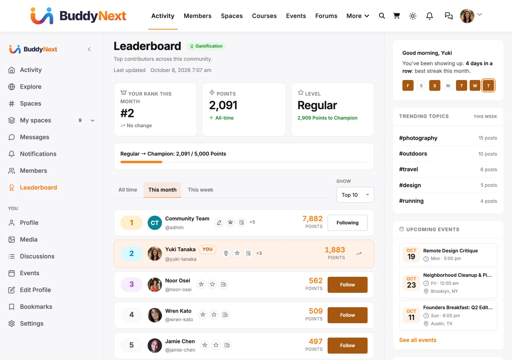

# WB Gamification

WB Gamification is the companion plugin that rewards your members for taking part. Turn it on alongside BuddyNext, and the everyday things members already do - following people, posting, joining spaces, finishing their profile - start earning them points, badges, and levels automatically. It is an easy way to make participation feel rewarding and to keep your community coming back.

This page covers connecting the two plugins and where the rewards show up. For the member-facing detail (how the Achievements tab, badges, points, levels, and leaderboard look and behave), see the Gamification page under Engagement.

## Why use it

A community grows when members keep coming back and keep contributing. Gamification gives them a reason to. Earning a badge for a milestone, watching a points total climb, or moving up a leaderboard turns ordinary participation into something members can see and take pride in.

You enable it when you want to:

- Reward early contributors so the community has activity from day one.
- Recognize the people who post, comment, and welcome new members - the ones who set the tone.
- Give quiet members a visible nudge toward their first post, first connection, or a completed profile.
- Surface credibility, so members can tell at a glance who the experienced, trusted people are.

BuddyNext does not contain any gamification logic of its own. WB Gamification watches community activity and decides what each action is worth, so the points and rules live in one place that you fully control.

## How it works (for members)

Members do not have to opt in or learn anything new. They use the community as usual, and rewards accumulate in the background.

WB Gamification can award points for community activity like these, and you set what each one is worth:

| Action | Suggested points |
|---|---|
| Followed by another member | 5 |
| Connection accepted | 10 |
| Post created | 5 |
| Joined a space | 5 |
| Profile updated | 2 |
| Profile completed | 25 |
| Reaction received on your content | 2 |
| Comment created | 3 |
| Space created | 10 |
| Onboarding completed | 20 |
| First follow | 5 |
| Post shared | 5 |
| Poll vote | 1 |
| Post bookmarked | 1 |
| Direct message sent | 1 |
| Connection requested | 1 |

These are starting values. The actual points for each action, and any daily cap or cooldown, are set in WB Gamification, and you can change any of them. Content another plugin already rewarded (for example a photo upload or a forum reply copied onto a feed card) never pays twice.

Where members see their rewards:

- **Achievements tab on their profile.** Once a member has earned a badge or any points, an Achievements tab appears on their profile. It shows their badges as a grid (credential badges first) and a standing strip with points, level, and streak. The tab stays hidden for brand-new members who have not earned anything yet, so nobody sees an empty tab.
- **Points and Kudos tabs.** The Achievements tab holds up to three sub-tabs. **Points** (named with your site's own word for points) is a private history and earning guide that only the member sees on their own profile. **Kudos** is peer recognition: members give and receive kudos, and it shows on every profile while the Kudos module is on in WB Gamification. After you give kudos the tab shows "You gave X kudos" instead of the form, and the form is not offered once you hit the daily ceiling.
- **Badge share pages.** Each badge links to its public share page so members can show off a credential outside the community.
- **The activity feed.** Badges are private until the member presses **Share**. When a member shares a credential badge, BuddyNext posts an "earned the badge" feed activity, so the whole community sees the achievement; unsharing withdraws the card and sharing again brings back the same one. Everyday participation badges do not post to the feed, so the feed never fills up with badge spam.
- **The bell.** WB Gamification's notifications (badge earned, level up, challenge completed, expired credential, streak milestone, kudos received, personal record) appear in the BuddyNext bell and open the right profile tab. Members can switch each type in their notification settings under **Achievements**.
- **The leaderboard.** A **Leaderboard** link appears in the BuddyNext left navigation rail, taking members to the community leaderboard page where they can see how they rank. Member privacy applies: a member's points, badges, rank and kudos are hidden from people who cannot see their profile, including on the leaderboard.

> **Note:** Points, badges, and levels are owned by WB Gamification. BuddyNext reads and displays them but never changes them.

## Setting it up (for owners)

1. Install and activate WB Gamification alongside BuddyNext.
2. In WB Gamification, configure the point value for each BuddyNext action you want to reward (the actions come from WB Gamification's own BuddyNext manifest, which is where the list is maintained). Set the badges and levels you want to offer.

That is the whole connection. Once both plugins are active and the actions have points, members start earning the moment they participate.

This integration has no settings of its own beyond the two switches below. BuddyNext hosts its own community leaderboard page automatically, and links to it from the **Leaderboard** item in the left navigation rail - there is no leaderboard page to create or select. On the **Gamification** card of **Integration Settings**:

| Setting | What it does | Default |
|---|---|---|
| Show in navigation | Shows the Leaderboard link, the Achievements, Points and Kudos profile tabs and space leaderboards. Turning it off also stops Gamification notifications reaching the bell. | On |
| Post to the activity feed | Whether a shared credential badge posts a feed activity. | On |

BuddyNext shows the site's own name for points (for example "Points" or "Coins") everywhere, as set in WB Gamification. If WB Gamification hands its leaderboard to Jetonomy, BuddyNext hides its own Leaderboard link and the leaderboard address goes to Jetonomy's board, so members see one ranking.

### A leaderboard for a space

A space can have its own **Leaderboard** tab, ranking only that space's members. It is off by default; the space owner turns it on under **Manage space -> Integrations -> Leaderboard tab**. Members are ranked by the points they have earned across the whole community, so a space board never disagrees with the site leaderboard; the space only decides who appears on it. A space board is visible to whoever can see the space's member list, so a private space's board is for its members only.

## Good to know

- **Inert when WB Gamification is not active.** Without the companion plugin, the integration does nothing - no Achievements tab, no leaderboard link, no badge feed activity. BuddyNext checks for WB Gamification before wiring anything in, so there is no error or empty surface on a site that does not run it.
- **The Achievements tab is data-gated.** It only appears for members who have earned a badge or any points. New members never see an empty Achievements tab.
- **Shared credential badges post to the feed; participation badges do not.** The member chooses to share. This keeps real milestones visible without flooding the feed with routine awards.
- **Newer WB Gamification, newer features.** Kudos, ranks, shared badges and space leaderboards need WB Gamification 1.6.5 or later. On an older version those features stay hidden instead of causing errors.
- **You control every value.** All point amounts, badge definitions, and levels live in WB Gamification. BuddyNext supplies the list of community actions; you decide what each is worth.

## Free vs Pro

The WB Gamification integration ships in BuddyNext free. You need the WB Gamification plugin installed and active for any of it to appear. No BuddyNext Pro features are required for this integration.

## Related

- [Integrations Overview](01-overview.md) - how every companion plugin connects.
- [Gamification](../engagement/01-gamification.md) - the member-facing badges, points, and levels.
- [Kudos](../engagement/05-kudos.md) - peer recognition members give each other, which also awards points.
- [Leaderboard](../engagement/02-leaderboard.md) - the community ranking this integration links to.
- [Activity Feed](../community/01-activity-feed.md) - where credential badges are announced.
