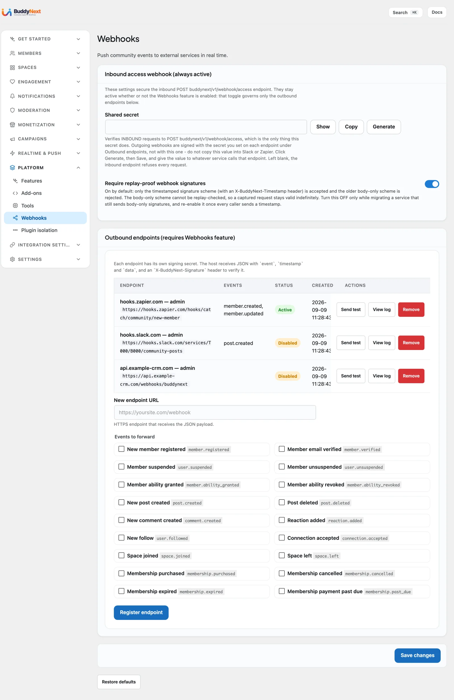

# Outbound Webhooks

Outbound webhooks are how BuddyNext tells the rest of your tools when something happens in your community. You give BuddyNext a web address to notify, pick the events you care about, and from then on BuddyNext sends a secure message to that address shortly after each event - no plugin to build, no code to write.

## Why use it

Your community is busy all day: a member registers, someone follows another member, a post goes up, a member joins a space. On their own, those moments stay inside BuddyNext. Webhooks let you carry them out to the other tools you already run, as soon as they happen, so those tools can do something useful with them.

This is the easiest way to connect BuddyNext to your wider setup without any development work. Common things owners do with it:

- Kick off a Zapier, Make, or n8n automation the moment a new member registers.
- Add new members to a CRM or email list automatically.
- Post a note in Slack or Discord when someone publishes a post or comment.
- Trigger any custom workflow on a system you run yourself.

The payoff for you as the owner: your community data flows into the systems you already rely on instead of sitting in a silo. You set up the connection once, and every event you subscribed to is delivered for you - kept in a log, and retried automatically if a delivery does not get through, rather than quietly lost.

## How it works (for owners)

Webhooks are managed inside BuddyNext and are available to administrators only. You add one or more destinations, and BuddyNext takes care of securing each message, delivering it, retrying if needed, and keeping a record.

### Turn webhooks on

Outbound webhooks are an opt-in feature and are off by default. Go to **BuddyNext > Platform > Features** and switch on **Outbound webhooks**. Until you do, the **Outbound endpoints** section of **Platform > Webhooks** shows only a pointer back to Features, and no events are sent.

### Add a destination

Go to **BuddyNext > Platform > Webhooks**, find **Outbound endpoints**, and fill in the form. You provide:

- **New endpoint URL.** This is where BuddyNext sends each event. It has to be a secure (https) address - plain, unsecured addresses are not accepted.
- **Events to forward.** Tick the events this destination should receive. The screen asks for at least one event.

Then select **Register endpoint**. The page reloads and the destination appears in the table.

BuddyNext creates a signing secret for each destination. This is a private key that lets the receiving tool confirm each message really came from your site. The Webhooks screen does not display it. A developer who needs the secret should register the destination through the REST API instead: that call returns the generated secret once, accepts a secret you choose, and a later update can replace it (see the Developer Guide). The shared secret field at the top of the Webhooks screen is a different thing, described under Inbound access webhook below.

### Events you can subscribe to

You can subscribe a destination to any of the community events below. The list shows the label on the Webhooks screen and the event name each message carries. A destination registered through the API with no events chosen receives all of them, including any new event types added in future versions.

| Event (screen label) | Event name | Sent when |
|---|---|---|
| New member registered | `member.registered` | A new member registers. |
| Member email verified | `member.verified` | A member's account is verified. |
| Member ability granted | `member.ability_granted` | A capability is granted to a member. |
| Member ability revoked | `member.ability_revoked` | A capability is removed from a member. |
| New post created | `post.created` | A member creates a post. |
| Post deleted | `post.deleted` | A post is deleted. |
| New comment created | `comment.created` | A comment is added. |
| Reaction added | `reaction.added` | A member reacts to a post. |
| New follow | `user.followed` | One member follows another. |
| Connection accepted | `connection.accepted` | A connection request is accepted. |
| Space joined | `space.joined` | A member joins a space. |
| Space left | `space.left` | A member leaves a space. |
| Member suspended | `user.suspended` | A member is suspended. |
| Member unsuspended | `user.unsuspended` | A member's suspension is lifted. |

With BuddyNext Pro, four membership events are added to the same list: Membership purchased (`membership.purchased`), Membership cancelled (`membership.cancelled`), Membership expired (`membership.expired`) and Membership payment past due (`membership.past_due`).

A separate test event (`ping`) is sent only when you test a destination (see Test a destination). Events are queued and sent in the background, so delivery follows the event within moments rather than inside the member's own request.

### What member data leaves your site

Some events carry a member's personal details in the message body, including their email address, so the receiving tool can act on them (for example, adding a new member to your CRM or email list). This is the point of the feature, and it only happens for destinations you add yourself, but it does mean member data leaves your site and travels to whatever address you configure.

Two things follow from that. Send events only to endpoints you trust and control, over `https` so the data is encrypted in transit. And if you are subject to GDPR, CCPA or similar rules, list these destinations in your own records of where member data is shared - BuddyNext hands the data to the address you chose, but what that third party then does with it is between you and them.

### How the message keeps it secure

Every message BuddyNext sends carries a digital signature based on the destination's signing secret, in the `X-BuddyNext-Signature` header. The receiving tool uses that same secret to confirm two things: the message genuinely came from your site, and nothing in it was changed along the way. The message body holds the event name, the time it was sent and the event data. Two more headers help your tool: `X-BuddyNext-Event` (the event name) and `X-BuddyNext-Delivery` (the same value on every retry of one delivery, so you can ignore duplicates).

If you are wiring this into a popular automation service like Zapier, Make, or n8n, this verification is usually handled for you - you paste in the same signing secret and the service checks each message automatically. If you have a developer connecting a custom system, the technical details of the signature live in the separate Developer Guide.

> **Tip:** Because each message includes the time it was sent, a receiving tool can choose to ignore very old messages if it wants extra protection against replays. BuddyNext leaves that choice to the receiving side.

### Delivery and retries

A delivery counts as successful when your destination confirms it received the message. If it does not, BuddyNext does not give up at once - it tries the same delivery again a few times, waiting a little longer between each attempt (up to three tries, starting after about five minutes and roughly doubling the wait each time). As soon as one attempt succeeds, the retries stop. If every attempt fails, the delivery is marked as failed.

### What happens to a destination that keeps failing

A destination that keeps failing is switched off on its own. After three failed deliveries in a row, BuddyNext deactivates it and stops sending new events there, so it is not wasting time on an address that is no longer answering. Its status in the table changes from **Active** to **Disabled**.

> **Note:** Deactivation is silent - there is no email or alert when it happens, and the screen has no "reactivate" button. To bring a switched-off destination back, fix the receiving address, then delete the destination and add it again. A developer can also re-enable it through the REST API.

### The delivery log

Every attempt - success or failure, test or real event - is recorded. For each destination select **View log** to see which event was sent, when, the result and how the destination responded. Use it to confirm events are landing and to work out why a destination stopped responding.

### Test a destination

Before you rely on a destination, select **Send test** on its row. BuddyNext delivers a test event exactly the way a real event would be sent, so you can confirm the receiving tool accepts it and recognizes it as genuine. The test reports success only when your destination confirms it received the message, and the test is written to the delivery log like any other delivery.

### Remove a destination

Select **Remove** on the destination's row and confirm. Removing a destination stops all future deliveries to it straight away and removes its delivery log along with it.

### Inbound access webhook

The top of the Webhooks screen also has an **Inbound access webhook (always active)** section. It is the reverse direction: an outside service, such as a payment or membership system, can call your site to set a member's community role, grant or revoke an ability, or change a credit balance. It uses its own **Shared secret** (with Show, Copy and Generate or Rotate buttons), which is not the same as any destination's signing secret. Left blank, the inbound endpoint refuses every request. **Require replay-proof webhook signatures** is on by default and only accepts timestamped signatures; turn it off only while you migrate a service that cannot send one. This section works whether or not the Outbound webhooks feature is on. Developers will find the request format in the Developer Guide.

## Settings and usage

| Setting | What it does | Default |
|---|---|---|
| Outbound webhooks (Platform > Features) | Turns the outbound feature on. | Off |
| New endpoint URL | Where each event is sent. Must be a secure (https) address; unsecured addresses are rejected. | None - required for each destination |
| Events to forward | The events this destination receives. The screen needs at least one ticked. | None ticked |
| Signing secret | The private key used to secure each message. Created for you; the screen does not display it. | Created for you |
| Number of destinations | How many destinations you can add, counting switched-off ones. | 1 on the free plan |
| Retry attempts | How many times a failed delivery is retried before it is given up. | 3, with a growing wait between tries |
| Auto-switch-off threshold | Failures in a row before a destination is switched off. | 3 |

## Free vs Pro

The free plan lets you add one outbound webhook destination. That is enough to connect your community to a single automation - one Zapier flow, one CRM sync, or one Slack channel.

Pro removes the limit, so you can add as many destinations as you need and send the same events out to several systems at once. See Unlimited Webhooks for details.

## Good to know

- Destinations must use a secure (https) address. An unsecured address is rejected when you try to add it.
- Managing webhooks is for administrators only. Members cannot see or change destinations.
- A destination registered through the API with no events chosen is subscribed to every event, including new event types added in future versions. The screen itself asks you to tick at least one.
- The Webhooks screen never displays a destination's signing secret. The REST API returns it once at creation and can replace it later.
- A switched-off destination is not deleted - it stays in your list as Disabled until you remove it or re-add it. It still counts toward the free plan's one-destination limit.
- Removing a destination also removes its delivery log.

## Related

- [Integrations Overview](01-overview.md) - how every companion plugin connects.
- [Webhooks REST Contract](../developer-guide/23-rest-webhooks.md) - the signature and payload details for developers.
- [Unlimited Webhooks](../pro/19-unlimited-webhooks.md) - the Pro upgrade that removes the one-destination limit.
