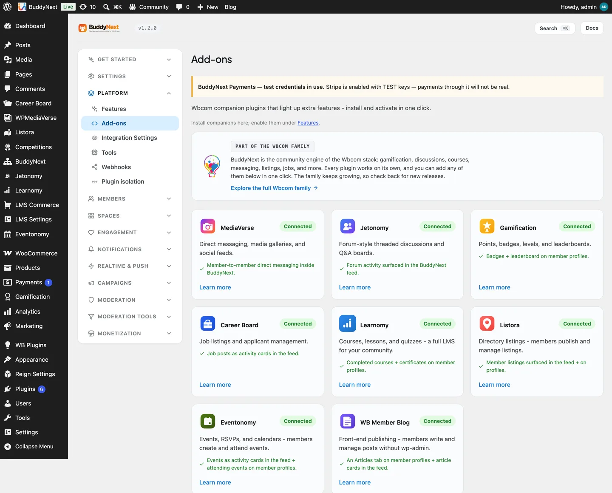

# Listora

Listora is the companion plugin that adds directory listings to your community - businesses, services, places, profiles, anything worth cataloguing. Run it alongside BuddyNext Pro and those listings come to life inside the community: a new listing appears in the feed and in community search the moment a member publishes it, so a directory is not a separate silo but a living part of what members already browse.

Bringing Listora into your community needs BuddyNext Pro. The Listora plugin works on its own without Pro - you simply will not get the community surfacing described below until Pro is active.

## Why use it

A directory turns a community into a resource. Members do not just talk to each other - they list the things they offer and find the things they need, all in a place they already trust.

You add Listora when you want to:

- Let members publish business, service, or place listings other members can discover.
- Give your community a built-in directory instead of pointing people to an outside site.
- Surface new listings where members already are - the feed and community search - rather than behind a separate menu.
- Add a revenue or membership-perk angle, since featured or premium listings are something members will pay for.

The listings live in Listora, which owns the directory, its categories, and its forms. BuddyNext adds a community layer on top so a new listing is seen as it happens.

## How it works (for members)

The directory itself - submitting a listing, browsing the directory, editing or removing a listing - is handled by Listora. Members use Listora's own screens for those actions. BuddyNext surfaces the activity in the community:

- **A new listing appears in the feed.** When a member publishes a directory listing, BuddyNext posts a feed activity announcing it and linking out to the listing's Listora page. Members can see new listings as they scroll the feed.
- **Listings are searchable in the community.** Each published listing is added to community search, so a member searching for a business, service, or place finds it alongside people and spaces.
- **A member's listings show on their profile.** BuddyNext adds a Listings panel to the member's profile Portfolio, so anyone viewing the profile sees what that member has listed, linking out to each listing's Listora page.
- **Listings come down automatically.** When a listing leaves public view - it is unpublished, set to draft or pending, or deleted - its community surfacing is removed too, so the feed and search only show listings that are actually live.

> **Note:** Submitting, editing, and managing listings happen on Listora's screens. BuddyNext does not replace those - it surfaces the results in the community.

## Setting it up (for owners)

1. Make sure BuddyNext Pro is active. The community surfacing is a Pro integration.
2. Install and activate Listora alongside BuddyNext.
3. Set up your directory in Listora as usual - the listing form, categories, and submission rules live there.

As soon as both plugins are active, the integration is on and published listings start appearing in the feed and community search. There is nothing you have to fill in.

### Display settings

Listora gets a card on the **Platform > Integration Settings** tab, with the same switches every integration has:

| Setting | What it does | Default |
|---|---|---|
| Show in navigation | Whether Listora's tab appears in member navigation. | On |
| Post to the activity feed | Whether a published listing posts a feed activity. | On |
| Include in search | Whether published listings are found in community search. Switching it off also removes the listings already in the search index. | On |

The directory's own behavior - who can list, the categories, the listing fields - is configured in Listora, not here. These switches only decide where the results show up inside your community.

## Businesses in a space

Beyond surfacing new listings in the feed and search, Listora can run a curated business directory inside a space. A space owner turns it on for their space, members submit a listing they own, and the space team approves it before it appears. It is the same idea as the Media, Files and Events tabs: an optional, per-space surface the owner opts into.

**Turning it on (space owner).** In a space's Settings > Integrations, switch on the Businesses tab (off by default). A Businesses tab then appears in that space. Nothing else is required; there is no separate provisioning step.

**Submitting (member).** On the Businesses tab, a member picks one of their own published listings and submits it to the space. It waits for the team's approval and the member is told it is pending. To keep the review queue usable, a member can have only a limited number of submissions awaiting review in one space at a time (five by default), so no one can flood it.

**Approving (space team).** The space owner, a space moderator, or a site admin sees a review queue on the tab and approves or rejects each submission. Nothing appears in the showcase until the team approves it.

**The showcase.** Approved businesses appear as compact cards - name, one category and location line, a verified badge, rating, owner and image - each linking out to the full listing on Listora for the complete detail. The showcase never reproduces the whole listing in the space; it is a directory that sends people to the source. The space team can remove a card at any time.

**Visibility follows the space.** The Businesses tab respects the space's own privacy. An open space's directory is visible to anyone who can see the space; a private or secret space's directory is visible only to its members. The site-wide Listora **Show in navigation** switch (Platform > Integration Settings) is the master control: with it off, no space shows a Businesses tab.

**Requirements.** Needs BuddyNext Pro and WB Listora 1.8.0 or newer (the release that added the space-listings storage and its REST endpoints). Without them the Businesses tab simply does not appear, and the rest of the Listora integration - feed, search, the profile Listings panel - is unaffected. Listora still owns the listings themselves; this feature only decides which of them a space showcases.

## Good to know

- **Listings appear and disappear with their public status.** BuddyNext keys off the listing's WordPress publish status: a listing becomes a feed and search entry when it goes public, and that entry is removed when the listing leaves public view or is deleted. There is no separate approval step to wire - public status is the signal.
- **Turning search off clears the index.** Switching **Include in search** off does not only stop new listings being indexed - it also removes the ones already there. Nothing is deleted from Listora itself; only the community search index is cleared. Switch it back on and listings are indexed again as they are published or updated.
- **The published link is reconstructed so removal matches.** When a listing comes down, BuddyNext rebuilds the same published URL it surfaced, so the right feed and search entry is removed cleanly with nothing left behind.
- **Listora keeps its own notifications for now.** This integration surfaces listings in the feed and search; Listora's own notifications continue to work as they do on their own.
- **Inert when Listora is not installed.** Without the Listora plugin, the integration does nothing - no feed activity and no search entries. BuddyNext checks for Listora before wiring anything in, so a site without it sees no errors and no empty surfaces.
- **Listora owns the data.** All listings, categories, and forms live in Listora. BuddyNext reacts to status changes and links out to its pages; it does not store or edit the listings.

## Free vs Pro

The Listora community integration is part of BuddyNext Pro. The Listora plugin itself is separate and runs on its own, but surfacing its listings inside the BuddyNext community - the feed activity, community search, and the in-space Businesses directory described above - requires BuddyNext Pro. The in-space directory additionally needs WB Listora 1.8.0 or newer.

## Related

- [Integrations Overview](01-overview.md) - how every companion plugin connects.
- [Activity Feed](../community/01-activity-feed.md) - where new listings appear.
- [Search](../community/12-search.md) - where published listings become findable.
- [Member Profiles](../members/01-member-profiles.md) - the profile the Listings panel joins.
- [Spaces overview](../spaces/01-spaces-overview.md) - where the Businesses tab lives, alongside Media, Files and Events.
