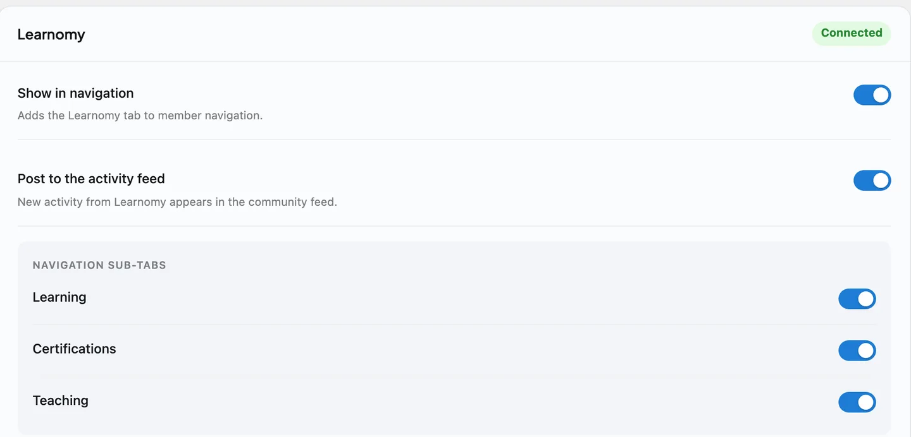

# Learnomy

Learnomy is the companion plugin that adds courses and certificates to your community. Run it alongside BuddyNext Pro and learning becomes social: when a member finishes a course or earns a certificate, the community sees the milestone in the feed, and every course notification gathers into the BuddyNext bell so a learner has one place to follow everything.

Bringing Learnomy into your community needs BuddyNext Pro. The Learnomy plugin works on its own without Pro - you simply will not get the community surfacing described below until Pro is active.

## Why use it

Learning is more motivating when it is shared. A member who completes a course or earns a credential has done something worth recognizing, and a community is exactly where that recognition belongs.

You add Learnomy when you want to:

- Let members take courses and earn certificates inside the same community they already belong to.
- Celebrate real progress - course completions and credentials - in the feed, so achievements are seen.
- Give members a verifiable certificate they can share, backed by a public verify page.
- Keep learners on top of their course activity through the single BuddyNext notification bell.

The courses, lessons, and certificates live in Learnomy, which owns the learning experience. BuddyNext adds a community layer on top so milestones are visible and notifications are unified.

## How it works (for members)

The learning itself - enrolling, taking lessons, completing a course, earning a certificate - is handled by Learnomy. Members use Learnomy's own screens for those actions. BuddyNext surfaces the meaningful moments in the community:

- **Completing a course posts to the feed.** When a member finishes a course, BuddyNext posts a "completed a course" activity so the community sees the achievement.
- **Earning a certificate posts to the feed.** When a member earns a certificate, BuddyNext posts an activity that links to the public certificate-verify page, so the credential can be checked and shared.
- **Only credentials and milestones post - never enrollment noise.** Starting or simply progressing through a course does not post to the feed. Only the achievements that are worth showing - completions and certificates - become feed activity, so the feed stays meaningful.
- **A Continue Learning panel lives on the profile.** A member's Portfolio tab shows a panel listing the courses they currently have in progress, each with its completion percentage and a link back into the lesson. A "Go to my courses" link jumps to the full Learnomy learning dashboard. This panel is private - it shows only when a member is viewing their own profile, never on someone else's.
- **Course notifications land in one place.** Learnomy's own notifications gather into the BuddyNext notification center as a Courses source, so a member has a single bell for everything across the community.

> **Note:** Enrolling, taking lessons, and managing courses happen on Learnomy's screens. BuddyNext does not replace those - it surfaces the milestones in the community.

## Setting it up (for owners)

1. Make sure BuddyNext Pro is active. The community surfacing is a Pro integration.
2. Install and activate Learnomy alongside BuddyNext.
3. Set up your courses and certificates in Learnomy as usual - the lessons, completion rules, and certificate options live there.

There is nothing to configure on the BuddyNext side. As soon as both plugins are active, the integration is on and course completions, certificates, and notifications start surfacing in the community.

This integration has no settings of its own in BuddyNext. The learning experience - the courses, lessons, and certificate templates - is configured in Learnomy.

## Linking a course or Learnomy Space to a community

Beyond course completions and certificates, a course, a Learnomy Space, or a cohort can be linked directly to a BuddyNext Space, so learners get a community built around what they are studying.

**Setting up the link.** The link is created from Learnomy's own admin screens, not from BuddyNext. Open a course's detail page, or a Learnomy Space's detail page, and use the **Community** card or tab that BuddyNext adds there. Pick an existing BuddyNext Space to link, or let BuddyNext create one for you.

**Membership follows access.** When a member enrolls in a linked course, joins a linked Learnomy Space, or is added to a linked cohort, they are added to the mapped BuddyNext Space automatically - its feed and discussions included. When that access ends - they unenroll, their enrollment expires, or they leave the Learnomy Space or cohort - they are removed from the community the same way. If access is restored later, they are added back.

> **Note:** A cohort simply reaching its scheduled end date is not a departure and never removes anyone - only an explicit removal from the cohort does.

**A community BuddyNext creates for you enforces the roster; one you pick does not.** Let BuddyNext create the linked Space for you, and it becomes that course's (or Learnomy Space's) exclusive roster - membership is fully driven by Learnomy enrollment, removal included. Link an existing Space you already run instead, and BuddyNext only ever adds members to it; it never removes someone from a Space you are managing yourself.

**Re-linking re-syncs it.** Running the link again for the same course or Learnomy Space adds anyone who enrolled since the last run - it does not create a second, duplicate community.

> **Note:** There is currently no BuddyNext-side screen to see or manage this link from the Space itself - it is set up and changed from Learnomy's course or Space admin screen only.

## Membership plans that grant Learnomy access

The reverse direction also exists: a BuddyNext membership plan can grant access to specific Learnomy courses, or to a Learnomy Space, the moment a member buys or upgrades to that plan. When the plan lapses or is cancelled, that Learnomy access is withdrawn the same way.

This is set up on the plan itself - open the plan in BuddyNext Pro's Membership Plans screen and map the courses and/or the Learnomy Space it should unlock. See Membership Plans for the full plan-editing walkthrough.

> **Note:** Access granted this way is tracked separately from a member's own direct Learnomy purchases or enrollments, so a plan lapsing never touches a course the member paid for on their own.

## Good to know

- **Only achievements post to the feed.** Course completions and earned certificates each post a feed activity; routine enrollment and progress do not. This keeps the feed focused on real milestones.
- **Certificates link to a public verify page.** A certificate's feed activity points to the public certificate-verify page, so anyone can confirm the credential is genuine.
- **The Continue Learning panel is owner-only.** It is a personal resume shortcut, not a public credential like certifications or teaching - only the profile owner ever sees it, on their own profile.
- **Sub-groups and learning paths cannot be linked yet.** A course, a whole Learnomy Space, or a cohort can be linked to a community Space; a Learnomy Space's individual sub-groups and standalone learning paths cannot be linked on their own yet.
- **Learnomy-Space roles are not carried over.** A member added to the community through the link joins as a plain member, regardless of the role (instructor, moderator, and so on) they hold in the linked Learnomy Space.
- **Notifications are gathered as a Courses source.** Learnomy's notifications collect into the BuddyNext bell under a Courses source, so learners follow course activity alongside everything else in the community.
- **Inert when Learnomy is not installed.** Without the Learnomy plugin, the integration does nothing - no feed activity and no Courses notifications. BuddyNext checks for Learnomy before wiring anything in, so a site without it sees no errors and no empty surfaces.
- **Learnomy owns the data.** All courses, lessons, and certificates live in Learnomy. BuddyNext reacts to its events and links out to its pages; it does not store or edit the learning content.

## Free vs Pro

The Learnomy community integration is part of BuddyNext Pro. The Learnomy plugin itself is separate and runs on its own, but surfacing its course completions and certificates inside the BuddyNext community - the feed activity, the profile's Continue Learning panel, notification gathering, linking a course or Learnomy Space to a community, and granting Learnomy access from a membership plan - requires BuddyNext Pro. Linking a Learnomy Space (rather than a course) additionally needs the Learnomy Pro Spaces extension active.

## Related

- [Integrations Overview](01-overview.md) - how every companion plugin connects.
- [Activity Feed](../community/01-activity-feed.md) - where course completions and certificates appear.
- [Notifications](../messaging-notifications/02-notifications.md) - the bell that gathers course notifications.
- [Member Profiles](../members/01-member-profiles.md) - the profile the Continue Learning panel joins.
- [Spaces overview](../spaces/01-spaces-overview.md) - what a course or Learnomy Space can be linked to.
- [Membership Plans](../pro/01-membership-plans.md) - where a plan is mapped to the Learnomy courses or Space it grants.
