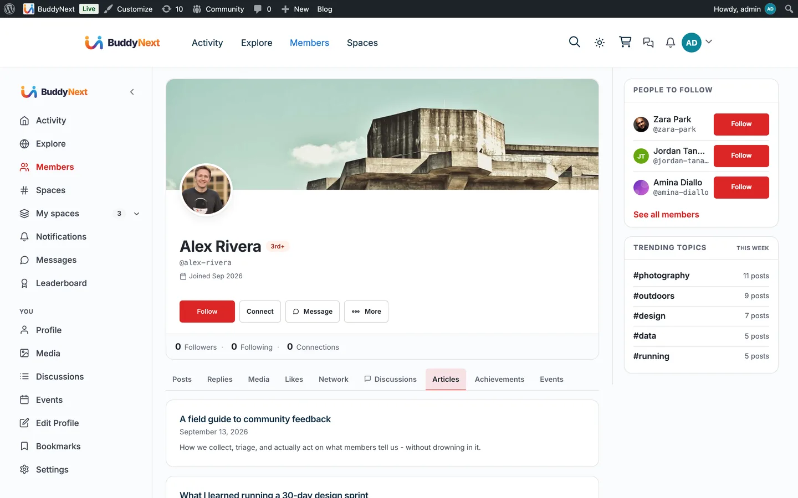

# WB Member Blog

[WB Member Blog](https://wbcomdesigns.com/downloads/buddypress-member-blog/) lets your members write and manage WordPress posts from the front end, without ever seeing wp-admin. When it is active, BuddyNext adds an **Articles** tab to every member profile listing what that member has published, and gives the member a route back to the dashboard where they write.

## Why use it

A community where members only comment is a community with one publisher. Letting members write long-form gives them somewhere to put the thing that does not fit in a post - a tutorial, a trip report, a case study - and gives everyone else a reason to look at their profile.

BuddyNext already carries a published post into the community feed as an article card. What it could not do before was show a member's body of work in one place. The Articles tab is that place: a member's writing, on their profile, next to their discussions and their media.

## What BuddyNext adds

BuddyNext's side of this integration is deliberately small, and deliberately generic.

- **An Articles tab** on each member profile, listing that member's published posts - title, date, excerpt and featured image - each linking out to the post itself. The list is paged, ten posts to a page, and the tab shows a count.
- **An owner route back to writing.** When you are looking at your own Articles tab, you also get **Write a new article** and **Manage articles**, plus an Edit link on each row. All of them go to Member Blog's dashboard.
- **Drafts and pending posts, for you only.** Your own tab shows work in progress with a status badge so an unfinished draft never reads as published. Nobody else sees them, apart from people who can edit other members' posts (such as editors and administrators).

Everything else stays where it belongs. BuddyNext does not render an editor, does not own a posting form, and does not duplicate Member Blog's dashboard. All writing, editing and submission happens in Member Blog.

### What BuddyNext already did without this

The feed side needs no integration at all. BuddyNext's site tracking publishes an article card whenever a member publishes a post, so member writing has always reached the community feed. That is generic too - it does not know or care whether the post was written through Member Blog, through wp-admin, or through anything else.

The card follows the post. If the post is unpublished, trashed, made private or given a password, its card leaves the feed; publishing it again brings back the same card, with its reactions and comments. Deleting the post permanently removes the card.

## Setting it up

1. Install and activate **WB Member Blog**.
2. In Member Blog's settings (the Pages tab), map its **Dashboard Page** - the front-end page where members write and manage their posts. BuddyNext reads this to build the "Write a new article" link.
3. That is all. The Articles tab appears on member profiles automatically.

The **Blog posts** card on **BuddyNext > Integration Settings** has two switches:

| Setting | What it does | Default |
|---|---|---|
| Show in navigation | Shows the Articles tab on member profiles. Turning it off also decides whether author links open the member's profile (they only do while the profile can list the author's posts); see [Member Profiles](../members/01-member-profiles.md). | On |
| Post to the activity feed | Whether a published post posts an article card in the feed. This works with or without Member Blog. | On |

There is no search switch for this integration.

> **Note:** The tab appears only when Member Blog is active. Without it, members have no front-end way to write, so the tab would be empty for everyone except administrators - and the "Write a new article" link would have nowhere to point.

## What appears on the tab

The tab lists the member's posts in the standard WordPress `post` type, newest first, paginated. If your site teaches BuddyNext about additional post types through the `buddynext_site_tracking_post_types` filter, those appear on the tab and in the feed together - one change, both surfaces.

Visitors and other members see published posts only. You see your own drafts, pending review and scheduled posts as well, each labelled. With no posts yet, your own tab says "You have not published an article yet." with a **Write your first article** button.

## Pro

Neither BuddyNext Pro nor WB Member Blog Pro is required. The Articles tab works with BuddyNext free and Member Blog free. Both Pro plugins add their own features on their own surfaces; none of them are involved in this tab.

## Related

- [Integrations Overview](01-overview.md)
- [Activity Feed](../community/01-activity-feed.md) - where article cards appear
- [Member Profiles](../members/01-member-profiles.md) - the profile tabs this joins
