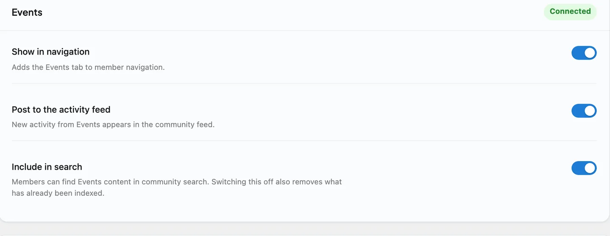

# Eventonomy

Eventonomy is the companion plugin that adds events, RSVPs, and calendars to your community. Run it alongside BuddyNext Pro and events become social: when a member publishes an event or RSVPs to one, the community sees it in the feed, members find events in community search, and every event notification gathers into the BuddyNext bell.

Bringing Eventonomy into your community needs BuddyNext Pro. The Eventonomy plugin works on its own without Pro - you simply will not get the community surfacing described below until Pro is active.

## Why use it

A community is a reason for people to gather, and events are how gathering actually happens - a webinar, a meetup, an AMA, a launch. When events live inside the community rather than on a separate calendar page, members see what is coming up while they are already reading the feed, and RSVPs become a visible, social signal rather than a private form submission.

You add Eventonomy when you want to:

- Let members create events and others RSVP, inside the community they already belong to.
- Surface what is coming up in the feed, so events are seen instead of buried on a calendar nobody checks.
- Turn attendance into a social signal - members see who else is going.
- Keep members on top of their events through the single BuddyNext notification bell.

The events, calendars, and RSVPs live in Eventonomy, which owns the event experience. BuddyNext adds a community layer on top so events are visible and notifications are unified.

## How it works (for members)

Creating and managing events - the event form, dates, the calendar, and the RSVP itself - is handled by Eventonomy. Members use Eventonomy's own screens for those actions. BuddyNext surfaces the activity in the community:

- **A new event appears in the feed.** When a member publishes an event, BuddyNext posts a premium event card to the feed - with the event's cover image, a date chip, and an RSVP - linking out to the event's Eventonomy page. It is a real event card, not a plain link box.
- **RSVPs show in the feed.** When a member RSVPs "going", BuddyNext posts an "is attending" activity, so others can see who is going. Only a "going" RSVP posts; the card is retracted automatically if the member later cancels.
- **Events are searchable in the community.** Each published event is added to community search, so a member searching for a topic finds upcoming events alongside people, spaces, and posts.
- **A member's events show on their profile.** BuddyNext adds an Events tab to the member's profile listing the events they are involved with, and an Events hub in the community navigation.
- **Event notifications land in one place.** Eventonomy's notifications (an RSVP confirmation, a reminder, an event change) gather into the BuddyNext notification center as an Events source, so a member has a single bell for everything across the community.
- **Cancelled events come down automatically.** When an event is cancelled or deleted, its feed card and search entry are removed too, so the community only shows events that are still happening.

> **Note:** Creating events, managing the calendar, and RSVPing happen on Eventonomy's screens. BuddyNext does not replace those - it surfaces the results in the community.

## Setting it up (for owners)

1. Make sure BuddyNext Pro is active. The community surfacing is a Pro integration.
2. Install and activate Eventonomy alongside BuddyNext.
3. Set up your events and calendar in Eventonomy as usual - the event form, RSVP rules, and calendar options live there.

As soon as both plugins are active, the integration is on and published events, RSVPs, and notifications start surfacing in the community. There is nothing you have to fill in.

### Display settings

Eventonomy gets a card on the **Platform > Integration Settings** tab, with the same switches every integration has:

| Setting | What it does | Default |
|---|---|---|
| Show in navigation | Whether the Events tab appears in member navigation. | On |
| Post to the activity feed | Whether a published event and a "going" RSVP post a feed activity. | On |
| Include in search | Whether published events are found in community search. Switching it off also removes the events already in the search index. | On |

The event experience itself - who can create events, RSVP rules, calendar display - is configured in Eventonomy, not here. These switches only decide where the results show up inside your community.

## Good to know

- **Notifications are collect-only.** BuddyNext gathers Eventonomy's notifications into its center for convenience but does not re-send them by email. Eventonomy owns its own emails, so members are not notified twice.
- **Inert when Eventonomy is not installed.** Without the Eventonomy plugin, the integration does nothing - no feed cards, no search entries, no profile tab. BuddyNext checks for Eventonomy before wiring anything in, so a site without it sees no errors and no empty surfaces.
- **Eventonomy owns the data.** All events, calendars, and RSVPs live in Eventonomy. BuddyNext reacts to its events and links out to its pages; it does not store or edit them.

## Free vs Pro

The Eventonomy community integration is part of BuddyNext Pro. The Eventonomy plugin itself is separate and runs on its own, but surfacing its events and RSVPs inside the BuddyNext community - the feed cards, community search, profile Events tab, and notification gathering described above - requires BuddyNext Pro.

## Related

- [Integrations Overview](01-overview.md) - how every companion plugin connects.
- [Activity Feed](../community/01-activity-feed.md) - where new events and RSVPs appear.
- [Search](../community/12-search.md) - where published events become findable.
- [Notifications](../messaging-notifications/02-notifications.md) - the bell that gathers event notifications.
