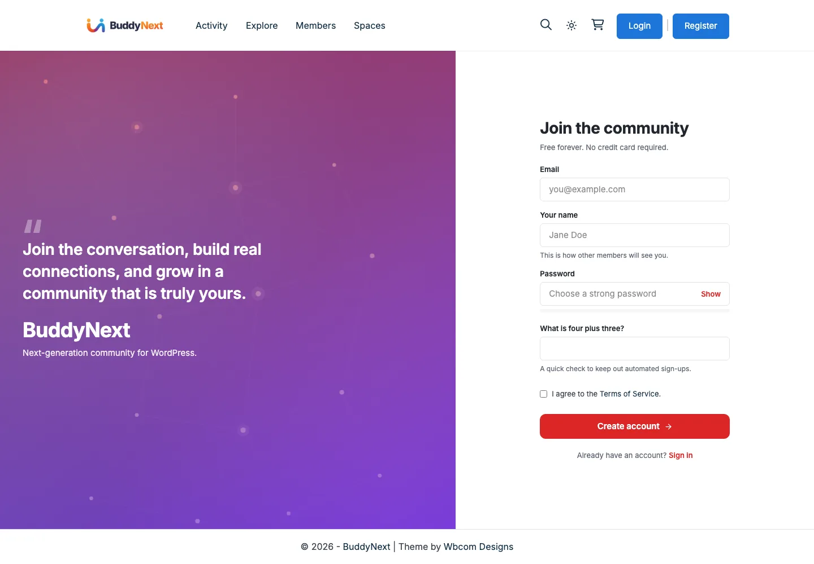
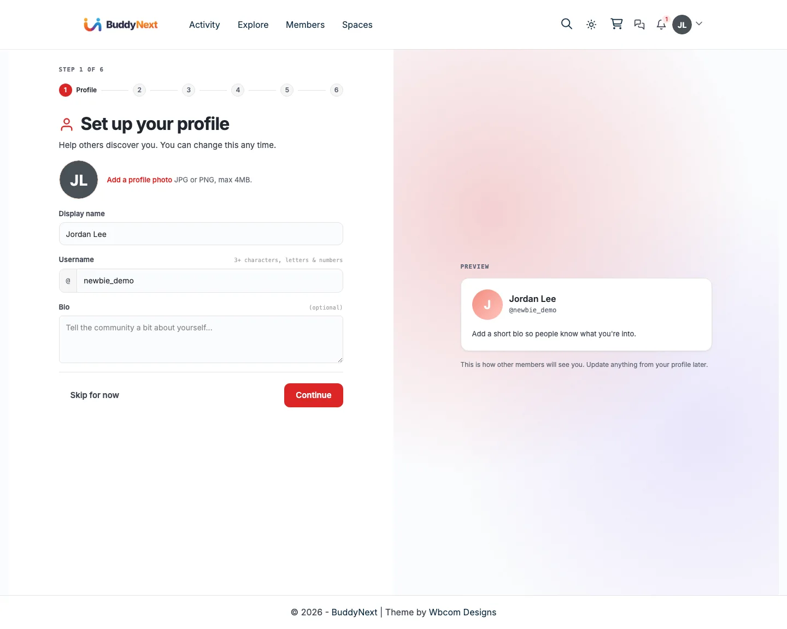
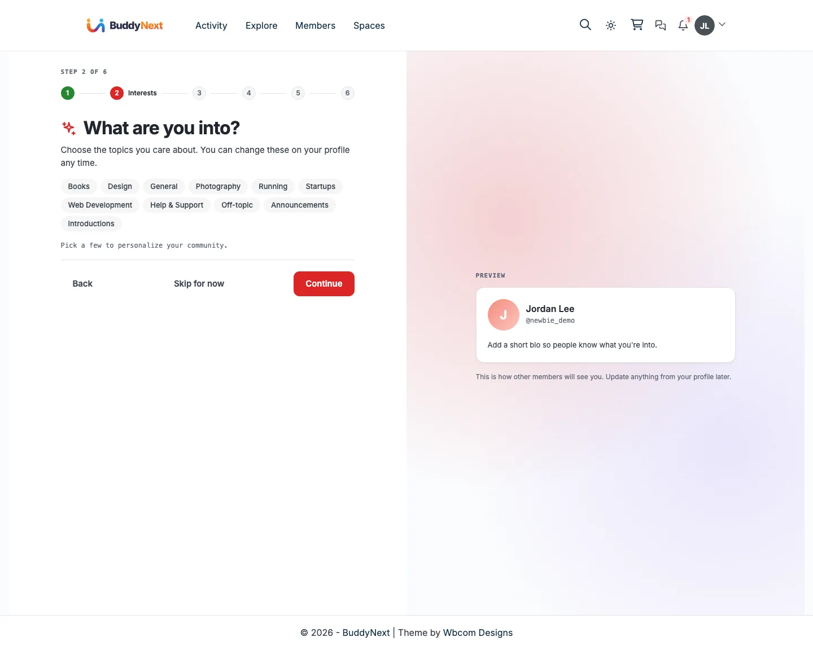
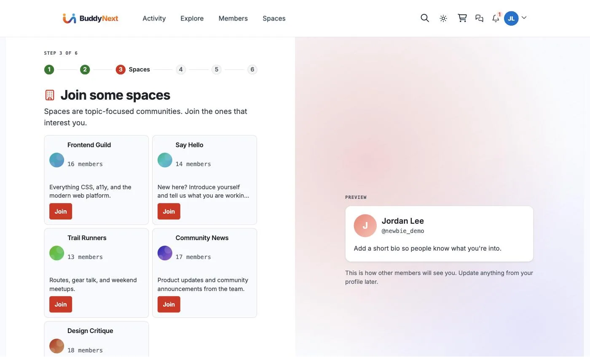
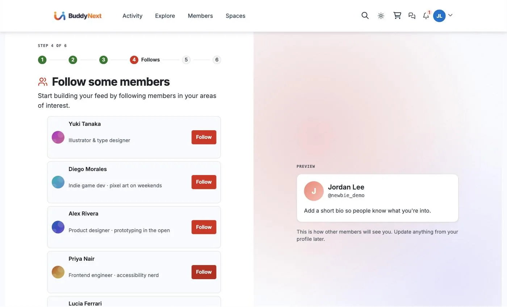
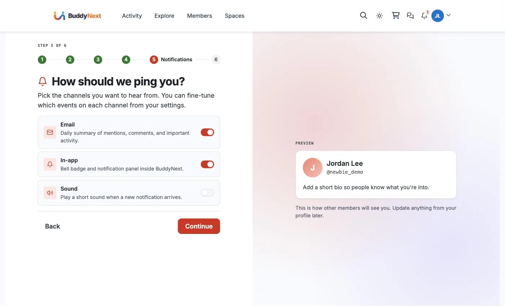
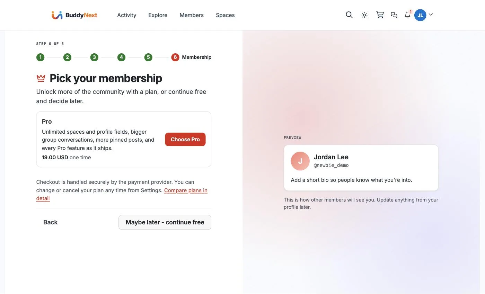
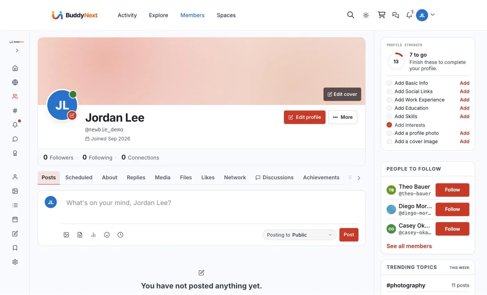

# The Member Journey, Screen by Screen

This is the path a brand-new person walks from the moment they land on your community to their first post - every screen, in order, with what they see and do. Use it to understand the out-of-the-box experience, to decide what to change, and to explain the flow to your own members.

The whole journey is three stages: **sign up**, a **six-step welcome wizard**, and the **member home** they land on. Nothing here needs configuration - it is what every BuddyNext community does on a fresh install.

---

## Stage 1 - Sign up

A visitor who clicks **Register** (or opens `/login/signup/`) gets a single, focused screen: a welcoming panel on the left and a short form on the right.

The form asks for only what it needs:

- **Email** and a **Your name** field ("This is how other members will see you.")
- **Password**, with a **Show** toggle
- A one-line **math check** ("What is four plus three?") - an in-house spam guard, so there is no third-party CAPTCHA to configure or slow the page down
- An **I agree to the Terms of Service** checkbox

"Free forever. No credit card required." sits right under the heading, and a **Sign in** link is there for people who already have an account. One click on **Create account** and the new member moves straight into the welcome wizard.

---

## Stage 2 - The welcome wizard (six steps)

The moment sign-up completes, BuddyNext opens a guided wizard. Every step shows a **live profile preview** on the right and a **numbered progress bar** at the top, and almost every step can be **skipped** - so the flow guides without ever trapping. By the time the member reaches the end they already have a filled-in profile, spaces to read, and people to talk to.

### Step 1 - Set up your profile

Add a profile photo (JPG or PNG, max 4 MB), a **display name**, a **username** (the `@handle` other members see), and an optional **bio**. The preview card on the right updates as they type, showing exactly how their profile will read to everyone else. **Skip for now** or **Continue**.

### Step 2 - What are you into?

The member picks the topics they care about from a row of chips (Design, Photography, Running, and so on - these come from your space categories). Selected chips fill with your brand colour. These interests personalise their feed and appear on their profile. This step only shows when your community has space categories set up.

### Step 3 - Join some spaces

Spaces are topic-focused mini-communities. The member sees a grid of open spaces with names, descriptions, and member counts, and can **Join** any of them right here - so they land with somewhere to read on day one.

### Step 4 - Follow some members

A short list of members with their headlines ("Product designer", "UX writer", "Frontend engineer") and a **Follow** button each. Following even a couple of people means the feed is not empty the first time they open it.

### Step 5 - How should we ping you?

Three channel toggles with sensible defaults: **Email** (daily summary) and **In-app** (bell badge) are on, **Sound** is off. The member can fine-tune exactly which events reach each channel later, from Settings - this step just sets the broad strokes.

### Step 6 - Pick your membership

The final step is an optional upgrade offer - the Pro plan, its benefits, and its price - with a clear **Maybe later - continue free** button next to it. Checkout is handled by the payment provider, and a member can change or cancel any time from Settings. Nobody is forced to pay to finish onboarding.

---

## Stage 3 - The member home

Finishing the wizard drops the new member on **their own profile**, set up to nudge the next action rather than a blank page.

The right rail shows a **Profile Strength** ring with a checklist - Add Basic Info, Social Links, Work Experience, Skills, a profile photo, a cover image - with **Interests already ticked off** from the wizard. Alongside it sit **People to follow** and **Trending topics**, and the composer ("What's on your mind?") is right there. The member has a clear, low-pressure list of what to do next and everything they need to make their first post.

---

## Related

- [New-Member Onboarding Wizard](../accounts-access/06-member-onboarding.md) - the admin side: turning the wizard on or off and configuring it
- [Profile completion](03-profile-completion.md) - how the Profile Strength score is calculated
- [Interests](11-interests.md) - how interest topics personalise the feed
- [Following](06-following.md) and [Connections](07-connections.md) - the two ways members link up
