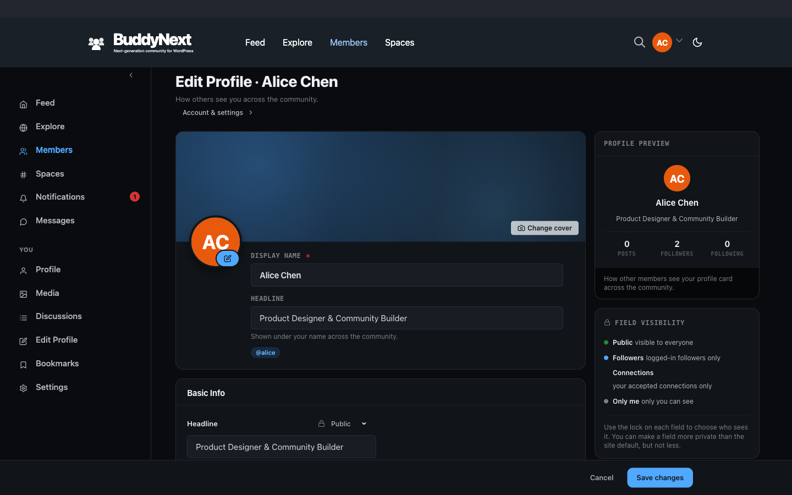
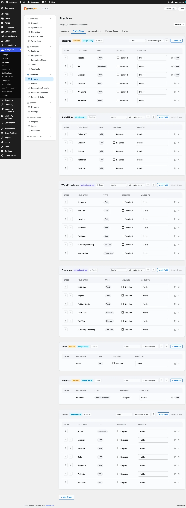

# Custom Profile Fields

Profile fields let you decide what members can tell each other about themselves. You build the fields (name, bio, role, location, links, and more), and members fill them in on their profile. BuddyNext ships with a starter set of groups and fields, and you can add your own.

## Why use it

A profile is the first thing one member sees about another. Out of the box you get a name and an avatar, which is rarely enough for a real community. Custom fields turn a thin profile into a useful one: a member can show their role, their skills, where they work, the links they want to share, and anything else your community cares about.

Two things make this worth setting up early:

- **Richer profiles.** Members who can describe themselves are more likely to be recognised, followed, and trusted. A profile that answers "who is this and why should I connect" does more for engagement than any feature you can bolt on later.
- **Better directory filtering.** Fields you mark as searchable feed the member directory and search. If you collect "Skills" or "Department" as a field, members can find each other by it. Empty profiles cannot be filtered, so the fields you ask for today are the filters you get tomorrow.

You group fields so they render as tidy sections (Basic Info, Work Experience, and so on), control who can see each one, and choose which fields appear on the sign-up form so you collect the essentials before a member ever reaches their profile.

## How it works (for members)

A member manages their own fields from Edit Profile.

- **Fill in fields.** Every field you have created shows on the member's Edit Profile form, grouped by section. The member types or selects a value and saves. Empty fields are simply left blank.
- **Repeating sections.** Some groups (for example Work Experience or Education) allow more than one entry, so a member can add several jobs or schools, each with its own set of values.
- **Per-field visibility.** Next to each field the member can set who is allowed to see that value. The visibility you set is only a starting point, not a floor: each member can change their own field's audience anywhere up to the group's ceiling - opening it up to Public, or narrowing it to Only me. A member can never make a field more open than the group allows, but within that ceiling the choice is theirs.

When another member views the profile, they see only the fields their relationship allows. A logged-out visitor, a follower, a connection, and the profile owner can each see a different set of values from the same profile.

## Setting it up (for owners)

You manage groups and fields from the BuddyNext profile fields admin area. A group is a section; a field lives inside a group.

### Create a group, then add fields

1. Create a field group and give it a label (for example "Professional Info"). Choose whether the group is a flat section or a repeating section.
2. Add one or more fields to the group. For each field you set its label, its type, and the controls below.
3. Reorder groups and fields so they render in the order you want.

### Per-field controls

Every field carries the following controls.

| Control | What it controls | Default |
|---|---|---|
| Label | The field name members see on the form and the profile. | (required, no default) |
| Field type | How the field is captured and displayed - see the type table below. | Text |
| Visibility | Who can see the value: Public, Members only, Followers only, Connections only, or Only me. This is the starting value each member gets; a member can then set their own field's audience anywhere up to the group's ceiling. | Members only |
| Required | Marks the field as expected. The member is nudged to complete it (it counts against their profile completion score). | Off |
| Searchable | Mirrors the value into search so members can find each other by this field in the directory and search. Available on text-style fields only. How far it reaches depends on the field's visibility - see below. | Off |
| Show on registration | Adds the field to the sign-up form so you collect it before the member reaches their profile. Fields in a repeating group cannot be added to sign-up. | Off |
| Sort order | The position of the field within its group. Lower numbers appear first. | Appended last |

### Group controls

| Control | What it controls | Default |
|---|---|---|
| Label | The section heading shown on the profile and edit form. | (required, no default) |
| Type | Flat (single set of fields) or Repeater (members can add multiple entries). | Flat |
| Visibility | Section-level visibility that sets the ceiling for every field inside it (same five levels). Group visibility is the ceiling; each field starts at its default and a member may set their own field anywhere up to that ceiling. | Members only |
| Sort order | The position of the group on the profile. Lower numbers appear first. | Appended last |

### Field types (free plan)

The free plan covers the everyday field types most communities need.

| Type | Use it for |
|---|---|
| Text | Short single-line answers (job title, city). |
| Paragraph | Longer free text (bio, about me). |
| Number | Numeric values (years of experience). |
| URL | A single web address. |
| Email | An email address. |
| Phone | A phone number. |
| Date | A single date. |
| Yes / No | A simple boolean toggle. |
| Dropdown | One choice from a list you define. |
| Radio | One choice shown as radio buttons. |
| Multi-select | Several choices from a list. |
| Colour | A colour value. |

> **Tip:** Mark the one or two fields your directory should filter on (such as Skills or Department) as searchable, and the rest as not searchable. Only searchable fields can be used to find members.

### How far a searchable field reaches (1.0.8)

Ticking **Searchable** does not override the field's visibility - it works inside it. What "searchable" gets you therefore depends on which visibility the field carries:

| Field visibility | Ticking Searchable means... |
|---|---|
| Public | Anyone can find the member by this value, including a logged-out visitor. |
| Members only | Only a signed-in member can find them by it. A logged-out visitor never matches it. |
| Followers only, Connections only, Only me | The value is not put into the search index at all, so it never matches for anyone. Searchable has no effect on these. |

Before 1.0.8, ticking Searchable on anything other than a Public field silently did nothing: no index entry, no warning. If you ticked it on a Members-only field and wondered why nobody could be found by it, that is why - and it now works as you would expect.

> **Tip:** If a field exists to help members find each other, set it to Public or Members only. Setting it to Followers only and ticking Searchable is a contradiction: you cannot be found by something only your existing followers can see.

### Displaying a date without exposing it (Date fields)

A Date field carries a **Display as** control with four choices:

| Display as | What other members see |
|---|---|
| Full date | Jan 15, 1990 |
| Month + Year | Jan 1990 |
| Year only | 1990 |
| Calculated age | 34 years old |

This matters most on a **birthday** field. Choosing Year only or Calculated age means the member's full date of birth is never published - the profile, the member card, and the app all receive only the reduced form. The exact date stays in the member's own record.

> **Warning:** In releases before 1.0.8 this control was saved but never applied - every date rendered as the full stored date regardless of what you picked. If you set a birthday field to Year only or Calculated age on an earlier version, check it now: it is finally doing what it said.

### Showing a group on a page with the block

You can render a single profile group anywhere on the site with the Profile Fields block. The block has two settings: which member's profile to read from, and which group to display (for example Basic Info or Work Experience). Leave the member setting at its default to show the profile being viewed.

## Shaping the form (1.0.4)

Since 1.0.4 the profile form is fully yours to shape:

- **Help text and placeholders.** Every field can carry an owner-written hint that renders under its name, and an example placeholder inside the input. Both appear on the profile editor and the signup form - write them once, guide members everywhere.
- **Sections per member type.** A group can be limited to one member type. A "Coach details" section then appears only on coaches' profiles, never on students' - and a restricted section never appears on the signup form, because the member has no type yet at that point.
- **Remove preset sections.** The seeded Social Links, Work Experience, Education, and (since 1.0.7) Skills groups can all be deleted when they do not fit your community. Profiles simply hide a section that is gone.
- **Core fields are protected.** Bio, headline, and location cannot be deleted, because member cards, search, and the directory depend on them. Everything else is fair game.
- **Deletes show their impact.** Removing a field or group that holds member data tells you exactly how many members are affected and asks you to type its name to confirm. The value cleanup then runs in small background batches, so deleting a field on a 100,000-member site does not slow anything down.

## Clearer field setup (1.0.7)

- **Show on registration, set once.** The add-field form now includes the "Show on the registration form" checkbox directly, so you decide whether a new field collects a value at signup while you are creating it, instead of adding the field first and coming back to turn it on.
- **Field types explain themselves.** The add-field form describes what each type does as you pick it - for example, that Dropdown, Radio, and Multi-select let members choose from the options you define below, while Yes / No is a single checkbox and the rest are free text. You no longer have to guess which type fits before trying it.

## Good to know

- **Visibility is enforced by relationship, not by hiding in the page.** When a profile is read, BuddyNext checks the viewer's relationship to the owner (logged-out, follower, connection, or the owner themselves) and drops any field the viewer is not allowed to see before the value ever leaves the server. A Private field never appears for anyone but the owner.
- **The member's own choice decides, capped by the group ceiling.** A field's effective visibility is the member's own per-field choice, capped by the group ceiling. New fields start at Members only; each member can then open their own field up to the ceiling (including Public) or narrow it to Only me.
- **Required is enforced.** Since 1.0.4, saving a profile with a required field left empty is rejected with a clear message next to that field. Required fields also count against the member's profile completion score.
- **Required only applies where the field is actually shown.** If you limit a group to one member type and mark a field in it required, members of every other type are not asked for it and are not blocked by it. (Before 1.0.8 they were told a field was missing that they could not see and could never fill in, which left them unable to save their profile at all.)
- **A field's type survives an edit made while Pro is inactive.** Editing a field whose type is provided by an add-on (a Pro type such as Location or Conditional) no longer silently resets it to Text when that add-on happens to be switched off. Deactivate Pro, edit a field's label, reactivate Pro, and the field is still the type you built.
- **Bad values are skipped, not rejected.** If a member enters a value that does not fit the field type (for example letters in a Number field), that one value is not stored and the rest of the profile still saves. The member is not shown an inline error for the skipped field today.
- **Empty profiles hide the feature.** A field with no value does not render on the profile view. A brand-new community with empty profiles will look sparse until members fill fields in, which is why setting a few fields to show on registration is worth doing.
- **The starter set is yours to keep or change.** BuddyNext seeds a few groups (Basic Info, Social Links, Work Experience, Education, Skills, and Interests) so you are not starting from a blank slate. You can edit, reorder, or extend them - see [Member Interests](11-interests.md) for the one field with a system role.

## Free vs Pro

The free plan covers the basics: the everyday field types listed above (text, paragraph, number, URL, email, phone, date, yes/no, dropdown, radio, multi-select, and colour), grouped into sections with visibility, required, searchable, and show-on-registration controls. For a typical community a handful of well-chosen fields is enough to get started.

Pro adds six advanced field types for communities that need richer data capture:

- Extended date (date ranges and finer date handling)
- Location (structured place data)
- File (advanced file handling)
- Multi-select (advanced multi-choice)
- Advanced number (numeric fields with extra rules)
- Conditional (fields that show or hide based on another field's answer)

These advanced types are registered by the Pro add-on and become available in the same field type picker once Pro is active. For the full list and setup, see Advanced Profile Fields.
