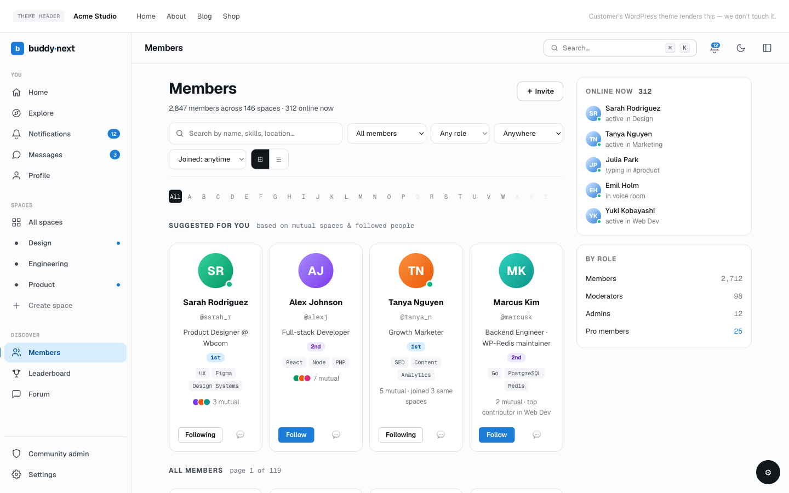
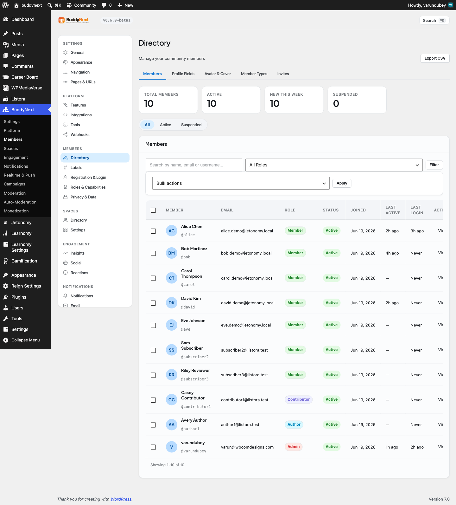

# Member Directory

The member directory is the page where everyone in your community can be browsed, searched, and filtered in one place. It is the "find people" surface of your site, and lives at your members URL (for example, `/members`).

## Why use it

A community is only as useful as the connections people make in it. Without a directory, members have no way to discover each other - they can only meet people who happen to post in the same place at the same time. The directory turns your whole membership into something people can actually browse: a new member can look up the colleague who invited them, a mentor can find mentees, and anyone can scan the room to see who else is here.

For the owner, the directory is the front door to your people. It gives the community a sense of scale and life ("there are real members here"), and it is where member types, follow, and connect all come together in one place. Turn it on and members find each other without you having to introduce anyone.

## How it works (for members)

The directory renders as a grid of member cards. Each card shows the member's avatar, name, member type badge (if they have one), an online indicator, and follower and mutual-connection counts, plus the actions a viewer can take on that person.

Members can:

- **Browse** the grid and page through it. The directory loads more members as needed, so a community of thousands stays fast.
- **Search by name** using the search box. Results update as you type (after a short pause), with no page reload. Search matches display names and usernames, and also matches against searchable profile fields.
- **Filter by member type** using the type tabs or the type selector - for example, show only Students or only Mentors. See Member Types for how those are set up.
- **Sort** the list (for example, by recently active or newest members).
- **Show online members only** with the online toggle.
- **Act on a member directly from their card** - Follow, send a Connect request, or accept/decline a pending request, all inline without leaving the page. See Following and Connections for how those relationships work.
- **Open the card menu** (the kebab) to Mute, Block, or Report a member. See Blocking and Muting and Reporting and Moderation.

## Setting it up (for owners)

The directory works out of the box once BuddyNext is active - your members URL renders the grid with no configuration. You place it where you want it using one of the two blocks below, and you shape who appears in it through member privacy and member types rather than a long settings panel.

### The Member Directory block

Add the Member Directory block to any page or post to render the full filterable grid with search and filters. This is the block the members page uses, and you can drop it onto any other page (a custom landing page, for example).

The block has these display options in the editor:

| Setting | What it controls | Default |
|---|---|---|
| Items per page | How many member cards load per page before the next set is fetched | 24 |
| Layout | Grid or list presentation of the cards | Grid |

The block also supports the standard WordPress block controls for background and text color, font size, and padding and margin spacing.

### The Member Card block

Add the Member Card block to show a single member - avatar, name, and a follow button - which is useful in a sidebar, a widget area, or anywhere you want to feature one person.

| Setting | What it controls | Default |
|---|---|---|
| User | The member shown on the card | None (pick a user) |

### Shaping who appears

You do not manage the directory roster from a settings screen. Who shows up is driven by:

- **Member privacy** - a member who opts out of the directory is excluded from it. See Privacy and Visibility.
- **Member types** - define types like Student or Mentor to give the directory its filter tabs. See Member Types.

## Good to know

- **The directory is viewer-aware.** What each person sees is filtered to them. Members who are suspended, shadow-banned, or who have opted out of the directory are excluded for everyone. People you have blocked (or who have blocked you) do not appear in your view of the directory, and you do not appear in theirs. This keeps the directory clean and safe without the owner curating it by hand.
- **Badges and counts only appear once there is data to show.** A brand-new member with no member type assigned shows no type badge; mutual-connection counts appear once connections exist. On a fresh site the directory can look sparse until members join, set up profiles, and connect.
- **Search is privacy-safe.** It matches names, usernames, and the profile fields a member has made searchable - it never surfaces fields a member has kept private.
- **First paint is server-rendered.** The grid is drawn on the server on the first load, so it is visible immediately and to search engines, and the live search/filter/sort behavior layers on top once the page is interactive.

## Free vs Pro

The core directory - browse, search by name, filter by member type, sort, online-only, and the directory and member-card blocks - is included in BuddyNext free.

Advanced directory filters are a Pro addition. Pro adds the ability to filter the directory by finer criteria such as membership tier, editorial label, join date, and recently-active status, so owners of larger communities can slice their membership more precisely. Editorial badges shown on cards (Verified, Expert, Staff) come from Member Labels, which is also Pro - see Member Labels.
