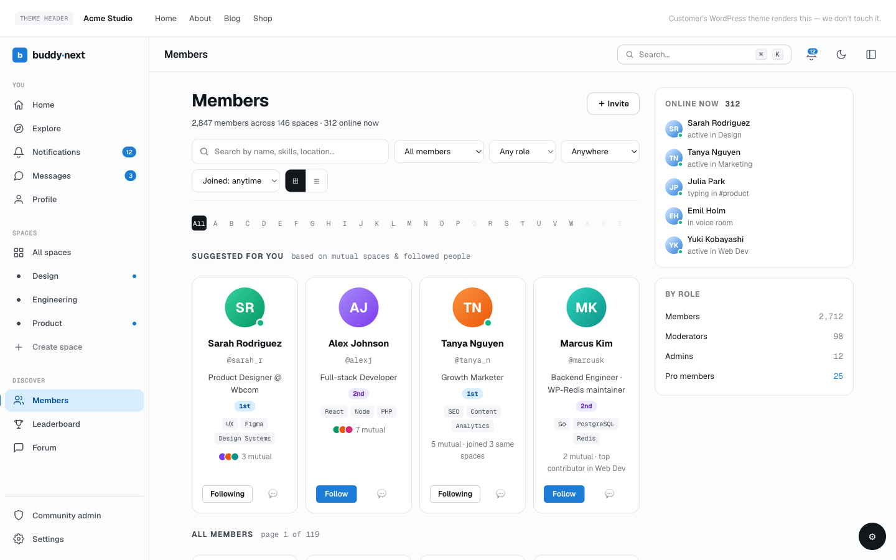

# Online Presence

BuddyNext shows who is around right now. When a member is active, an online indicator appears next to them across the community - in the member directory, on member cards, in profiles, and in the messaging rail. Members who were here a little earlier show as recently active. Presence updates on its own as people browse, so the community always looks current.

## Why it matters

An empty-looking community feels dead even when people are there. Online presence is what makes a space feel alive: a new member who lands on the directory and sees several people online right now knows this is a place where conversations happen, not an abandoned forum. For members, presence answers a simple, useful question before they reach out - is this person around to reply, or should I expect a slower response? An owner who wants their community to feel active and responsive gets that signal for free, with no configuration and no extra load on the site.

## How it works (for members)

You do not do anything to appear online. As you browse the community while logged in, BuddyNext quietly records that you are active. That activity is what powers your online indicator for everyone else, and the same thing happens for the people you see.

Where presence shows up:

- **Member directory.** Each member card shows an online indicator when that person is currently active. The directory also offers an "Online now" view that lists only members active in the last few minutes, and a most-active sort so the people around right now rise to the top.
- **Member profiles.** A member's profile reflects whether they are currently active.
- **Member cards anywhere they appear**, including sidebar widgets such as an online-members list.
- **The messaging rail**, so you can see at a glance whether the person you are chatting with is around.

A member counts as online when they have been active within the last five minutes. Past that window they are no longer shown as online; they simply drop back to a regular listing rather than being flagged as active right now.

### How presence stays current (the heartbeat)

Presence is kept fresh by a lightweight heartbeat. Every time you load a page in the community while logged in, BuddyNext refreshes your "last active" time. To avoid doing unnecessary work, it only records that update at most once a minute per member, which is well inside the five-minute online window - so an active member never flickers offline, and a busy browsing session does not slow the site down. The community app receives the same heartbeat, so presence stays accurate whether someone is on the website or in an app.

This runs without JavaScript. Even on a plain page view, your presence is refreshed, so the online indicators are reliable for everyone.

## Setting it up (for owners)

Online presence works automatically. There is no admin setting to switch it on, no provider to connect, and no keys to enter - the moment members are browsing, presence is recorded and shown. The directory's "Online now" filter and most-active sort are part of the member directory and need no separate configuration.

There is currently no per-member privacy control to hide your online status. Presence is shown for active members as described above. If you need presence gated behind a different rule for your community, that is a developer-level customization rather than a built-in setting.

## Good to know

- **Active means the last five minutes.** Anyone active inside that window shows as online; after it, they quietly stop showing as online.
- **Presence is passive.** Members do not toggle themselves online or off - it follows real activity.
- **No flicker for active members.** The once-a-minute refresh sits comfortably inside the five-minute window, so someone who is genuinely around stays shown as online.
- **Empty "Online now" is normal.** On a quiet site at a quiet hour, the "Online now" view can legitimately be empty - that means no one has been active in the last few minutes, not that something is broken.
- **No admin toggle and no member opt-out.** Presence is on by default and does not have a built-in privacy switch.

## Free vs Pro

Everything described here - the online indicators, the "active recently" window, the automatic heartbeat, and the "Online now" directory view - works in free BuddyNext over standard polling. Pro can upgrade the transport underneath to push real-time updates over a live connection, but it uses the same presence signal, so the indicators and behavior members see are the same. Presence never breaks or disappears without Pro; Pro only makes the updates feel more instant.
