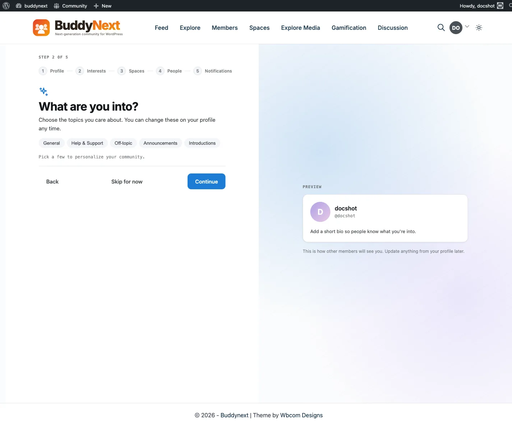

# Member Interests

Interests let each member say what they care about, and BuddyNext uses those picks to personalize what that member sees - the people suggested to them, the spaces recommended to them, and the order of their For You feed. Interests come from your own space categories, so the list always matches what your community is actually about.

## Why use it

The hardest moment in any community is a member's first session: an empty feed, strangers in the sidebar, and no reason to come back. Interests fix the cold start. A member who ticks "Photography" and "Trail Running" during signup immediately sees photographers to follow, running spaces to join, and posts from both ranked higher in their feed - before they have followed a single person.

There is nothing to configure. If you have space categories, you have interests.

## How it works (for members)

- **Pick at signup.** The onboarding wizard shows your community's topics as tappable chips. Picking is optional - a member can skip and choose later.
- **Edit any time.** Interests live on the profile editor like any other profile field. Adding or removing one updates suggestions from the next visit.
- **Chips that go somewhere.** On a profile, each interest renders as a chip. Tapping one opens the spaces directory filtered to that category, so an interest is always one tap from the matching spaces.

## What it personalizes

| Surface | Effect |
|---|---|
| People suggestions | Members who share interests rank first |
| Space suggestions | Spaces in those categories rank first |
| For You feed | Posts from spaces in picked interests rank higher |
| Explore | Suggests popular spaces from those interests, not only the newest |

Interests influence **ranking, not inclusion** - a member still sees the whole community; their picks decide what leads.

## Setting it up (for owners)

1. Create meaningful **space categories** under **BuddyNext > Spaces**, on the **Categories** tab - these are the interest choices members see.
2. That's it. The onboarding step, the profile field, and the personalization engines all follow your categories automatically.

You can view (but not edit) each member's picks from the admin member profile - interests belong to the member.

## Good to know

- The Interests profile field is a protected system field: it cannot be deleted from the profile-fields editor, because suggestions and feed ranking depend on it.
- A member with no picks simply gets the default (non-personalized) suggestions - nothing breaks.
- Categories you rename update everywhere; categories you delete disappear from members' picks gracefully.
