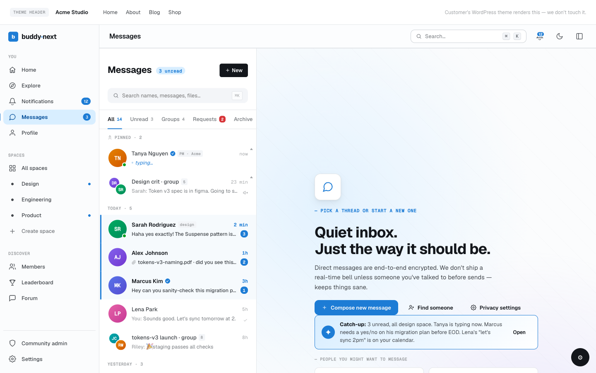
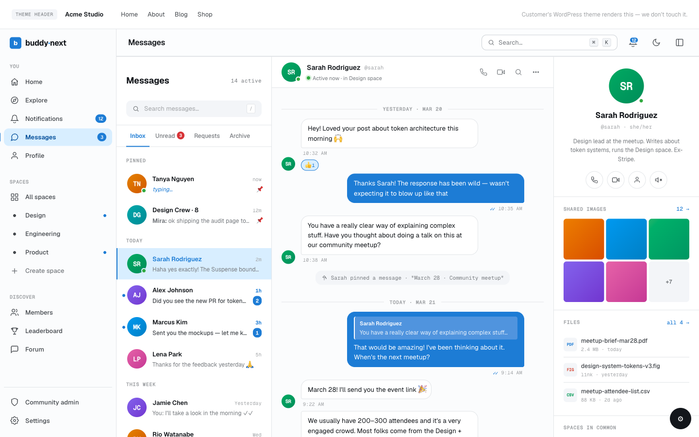

# Direct Messaging

Direct messaging lets two members hold a private 1:1 conversation away from the public feed. BuddyNext provides the inbox, the conversation view, and the privacy controls; the messages themselves run on the WPMediaVerse companion plugin, which is the messaging engine.

## Why use it

Public feeds and comments are for the whole community. Some conversations are not. A member who wants to ask a private question, follow up on a shared interest, or talk to someone one-on-one needs a private channel, and a community without one pushes that traffic off to email or another app.

Direct messaging keeps those conversations inside your community. For members it is the difference between "I had to track down their email" and "I just messaged them." For owners it raises the value of belonging: people stay because the relationships they build are usable, not just visible. It also stays under your community's rules, because the same blocking and privacy controls that govern the rest of the site govern who can reach whom in a private message.

> **Note:** Direct messaging needs the WPMediaVerse companion plugin to work. BuddyNext renders the inbox and the privacy controls, but WPMediaVerse stores and delivers the messages. See the How it works and Good to know sections below.

## How it works (for members)

### Start a conversation

A member can open a new conversation from several places:

- The Messages inbox, using the "new message" control to pick a recipient.
- A member's profile, using the "Message" button.
- A member card in the Members directory, using the "Message" action.

Selecting a member opens (or creates) the private conversation with that person, ready to type.

### Send a message

Inside a conversation, the member types in the composer and sends. The message appears in the thread and is delivered to the recipient. The recipient's notification bell increments so they know a new message arrived, and they can reply in the same thread.

### Mark a conversation as read

Opening a conversation marks its messages as read for that member, which clears the unread state on that thread. The inbox reflects which conversations still have unread messages so a member can see at a glance what they have not yet looked at.

### Share media in a message

The composer accepts more than text. A member can attach media to a message so the conversation can carry a photo or file alongside the written reply, not just plain text.

## Setting it up (for owners)

Direct messaging is controlled from Settings > General, in the Direct Messaging section. Both settings live there.

| Setting | What it does | Default |
|---|---|---|
| Enable direct messaging | Turns private 1:1 messaging on or off for the whole community. When off, every messaging entry point (the inbox, the profile and directory "Message" buttons, the header icon, and the Messages nav item) is hidden. This setting requires the WPMediaVerse plugin to be active; while WPMediaVerse is not active the toggle is disabled and cannot be turned on. | On |
| Who can DM me (default) | The default privacy applied to new accounts: who is allowed to start a message with a member. Options are Everyone, Members only, Connections only, and No one. Members can override this in their own privacy settings. | Everyone |

> **Tip:** "Who can DM me (default)" only sets the starting value for new members. Each member can change their own preference afterward, so this controls the community default, not a hard rule.

## Good to know

- Messaging needs the WPMediaVerse companion plugin. BuddyNext is the interface and the privacy layer; WPMediaVerse is the engine that stores and delivers the messages. If WPMediaVerse is not active, the messaging settings are unavailable and members will not see messaging entry points. For how to install and connect it, see the WPMediaVerse integration page.
- Blocking prevents messaging. If a member has blocked someone, that person cannot send them a message - the block is checked on every send. The sender is told why the send was refused, so a block, a "No one" preference, and a "Connections only" preference each produce an accurate notice rather than a generic error.
- Privacy preferences are enforced on send. A member set to "Connections only" can be reached only by people they are connected with; a member set to "No one" cannot be reached by direct message at all. Site administrators can always reach members regardless of these preferences.
- The empty state is normal. A brand-new account with no conversations sees an empty inbox until someone messages them or they start a conversation.

## Free vs Pro

1:1 direct messaging is free, as long as the WPMediaVerse companion plugin is installed and active. That covers starting a conversation, sending messages, marking conversations read, and sharing media in a message.

Read receipts, group messages (more than two people in one conversation), and instant live delivery are not part of the free tier. They come with WPMediaVerse Pro. On the free engine, new messages surface through the notification bell, which refreshes on a short interval, rather than arriving the very instant they are sent.
