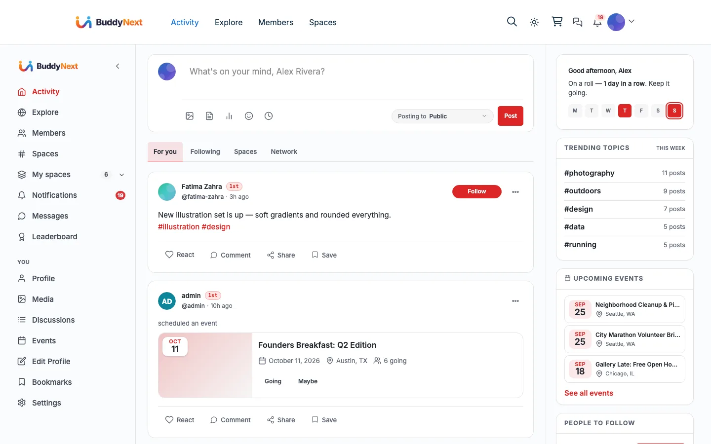
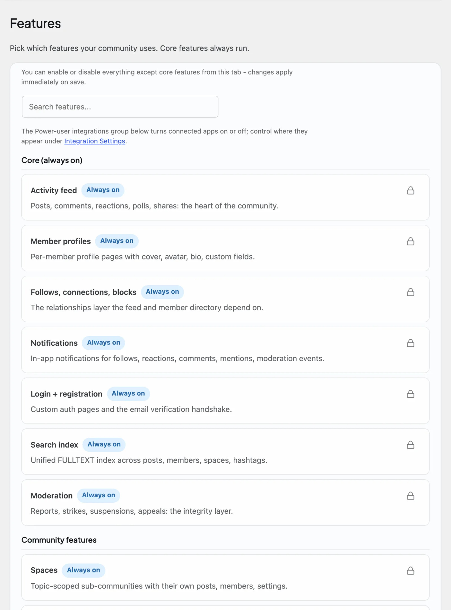

# Direct Messaging

Direct messaging lets two members hold a private 1:1 conversation away from the public feed. BuddyNext provides the inbox, the conversation view, and the privacy controls; the messages themselves run on the WPMediaVerse companion plugin, which is the messaging engine.

## Why use it

Public feeds and comments are for the whole community. Some conversations are not. A member who wants to ask a private question, follow up on a shared interest, or talk to someone one-on-one needs a private channel, and a community without one pushes that traffic off to email or another app.

Direct messaging keeps those conversations inside your community. For members it is the difference between "I had to track down their email" and "I just messaged them." For owners it raises the value of belonging: people stay because the relationships they build are usable, not just visible. It also stays under your community's rules, because the same blocking and privacy controls that govern the rest of the site govern who can reach whom in a private message.

> **Note:** Direct messaging needs the WPMediaVerse companion plugin to work. BuddyNext renders the inbox and the privacy controls, but WPMediaVerse stores and delivers the messages. See the How it works and Good to know sections below.

## How it works (for members)

### Start a conversation

A member can open a new conversation from several places:

- The Messages inbox, using the "new message" control to pick a recipient.
- A member's profile, using the "Message" button.
- A member card in the Members directory, using the "Message" action.

Selecting a member opens (or creates) the private conversation with that person, ready to type.

### Send a message

Inside a conversation, the member types in the composer and sends. The message appears in the thread and is delivered to the recipient. The recipient's notification bell increments so they know a new message arrived, and they can reply in the same thread.

### Mark a conversation as read

Opening a conversation marks its messages as read for that member, which clears the unread state on that thread. The inbox reflects which conversations still have unread messages so a member can see at a glance what they have not yet looked at.

### Share media in a message

The composer accepts more than text. A member can attach media to a message so the conversation can carry a photo or file alongside the written reply, not just plain text.

## Setting it up (for owners)

The messaging controls live in **MediaVerse > Settings > Messages** (the Social tab), because WPMediaVerse runs messaging. BuddyNext shows them and links there: **BuddyNext > Platform > Features** shows whether Messages is on, and **BuddyNext > Settings > General > Direct Messaging** ("Who can message members") shows the site's level with a **Change in WPMediaVerse** button.

| Setting | What it does | Default |
|---|---|---|
| Messages ("Turn on private messages", in WPMediaVerse) | Turns private messaging on or off for the whole community, on the web, in the app and over the API. When off, every messaging entry point (the inbox, the profile, directory and space "Message" buttons, the header icon, the Messages nav item and the Messages notification filter) is hidden, and "sent you a message" notifications are left out of the bell until it is on again. Conversations are kept. Visiting the Messages page shows members "Messages are turned off on this community", and shows administrators a link to the switch. | On |
| Who can send messages (in WPMediaVerse) | The most open level any member can have: Everyone, Followers only (others go to Requests), People the member follows back, or Nobody. Members see these as Everyone, People who follow you, People you follow back and No one. Each member picks this level or a stricter one under **Settings > Privacy > Who can message me**, which saves straight to WPMediaVerse. | Everyone |
| Minimum Account Age in days (in WPMediaVerse) | Accounts younger than this cannot send messages. 0 turns it off. | 0 |

> **Tip:** the site level is a ceiling. If you set it to "People you follow back", members can choose that or "No one", and nobody can open their inbox wider than you allow.

## Good to know

- **Live typing indicator.** Since 1.0.4 a conversation shows "typing..." while the other person writes, and it clears the moment they stop or send.

- **Load older history and in-thread search.** Since 1.0.5 a conversation can pull in older messages on demand as you scroll back, and search within the thread to find a past message.

- **Per-conversation mute.** Since 1.0.5 a member can mute a single conversation from its info panel, silencing its unread pings without leaving the thread; unmuting restores them.

- **Unread message badge.** Since 1.0.7 the header Messages icon carries its own unread count, right beside the notification bell, so a member sees at a glance whether they have new direct messages without opening the inbox.

- Messaging needs the WPMediaVerse companion plugin. BuddyNext is the interface and the privacy layer; WPMediaVerse is the engine that stores and delivers the messages. If WPMediaVerse is not active, the messaging settings are unavailable and members will not see messaging entry points. For how to install and connect it, see the WPMediaVerse integration page.
- **Messages go through the same content safeguards as posts.** A message containing a site-wide banned word or a blocked link domain is rejected outright, the same as a post - the sender sees why. (Because a message is not posted into a space, a space's own banned-word list is not checked.) See Content Safeguards.
- Blocking prevents messaging in both directions. If either member has blocked the other, neither can send a message - the block is checked on every send. The sender is told why the send was refused, so a block, a "No one" choice and a "People you follow back" choice each produce an accurate notice rather than a generic error.
- "Who can message me" is enforced on send by WPMediaVerse, using the same follows members see in BuddyNext. A member set to "No one" cannot be reached by direct message at all.
- The empty state is normal. A brand-new account with no conversations sees an empty inbox until someone messages them or they start a conversation.

## Free vs Pro

1:1 direct messaging is free, as long as the WPMediaVerse companion plugin is installed and active. That covers starting a conversation, sending messages, marking conversations read, and sharing media in a message.

Read receipts, group messages (more than two people in one conversation), and instant live delivery are not part of the free plan. They come with WPMediaVerse Pro. On the free engine, new messages surface through the notification bell, which refreshes on a short interval, rather than arriving the very instant they are sent.

## Related

- [WPMediaVerse](../integrations/02-wpmediaverse.md) - the companion plugin that stores and delivers messages
- [Blocking and Muting](../members/08-blocking-and-muting.md) - how a block prevents messaging
- [Notifications](02-notifications.md) - the bell alert a new message triggers
- [Content Safeguards](../moderation/05-content-safeguards.md) - the banned-word and blocked-link checks messages also run through
