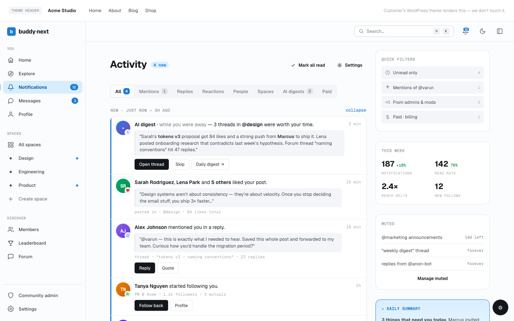

# Notifications

Notifications are the in-app activity feed that tells a member when someone interacts with them or with content they care about: new followers, connection requests, reactions, comments, mentions, space activity, and more. They appear behind the bell icon in the header and on the full Notifications page, with a live unread count.

## Why use it

A community only grows when people come back, and people come back when something is waiting for them. A follow, a comment, a mention, an approved space request - each of these is a reason to return, but only if the member finds out about it. Notifications close that loop. The moment someone acts, the recipient sees a count on the bell and can jump straight to what happened.

For the member, notifications are the pulse of their presence in the community: who noticed their post, who wants to connect, what is happening in their spaces. For the owner, timely notifications are the single biggest driver of re-engagement - they turn a one-time visitor into a returning member without any extra effort on the owner's part. The system is on by default for every sensible event, so a member is kept in the loop from day one, and they stay in control of what reaches them (see Notification Preferences).

## How it works (for members)

### What gets a member notified

BuddyNext creates a notification when another member does something that involves you. The current events are:

| Event | When it fires |
|---|---|
| New follower | Someone starts following you |
| Follow request | Someone requests to follow your private account |
| Connection request | Someone sends you a connection request |
| Connection accepted | Someone accepts your connection request |
| Connection declined | Someone declines your connection request |
| Reaction on your post | Someone reacts to a post you authored |
| Comment on your post | Someone comments on a post you authored |
| Reply to your comment | Someone replies to one of your comments |
| Share of your post | Someone shares a post you authored |
| Mention | Someone mentions you in a post or comment |
| New member in your space | Someone joins a space you own |
| Space join request | Someone asks to join a space you moderate |
| Space request approved | Your request to join a space is approved |
| Space request declined | Your request to join a space is declined |
| Space invite | You are invited to join a space |
| New post in your space | Someone posts in a space you belong to |
| Space role change | Your role in a space changes |
| Direct message | Someone sends you a direct message |
| Moderation events | Warnings, strikes, suspension or reinstatement, post approved or not approved, and updates on appeals or reports you submitted |
| Growth events | Badges earned, level-ups, onboarding reminders, and daily or weekly digests |

A member never gets notified about their own actions, and notifications are suppressed between members who have blocked each other. Muting or restricting a member silences the notifications you would have received from them, one direction only.

> **Note:** Some events depend on the feature being active. Direct-message notifications only appear when messaging is enabled on the site, and discussion-reply, media, badge, and level-up notifications require the matching companion plugin.

### Viewing notifications

The bell icon sits in the site header. When you have unread notifications, a small badge shows the count (it caps at "99+"). Click the bell to open the full Notifications page, which lists everything addressed to you, newest first, grouped into Today, Yesterday, and Older. Each row shows who acted, what they did, and a relative time, and links to the post, profile, or space it refers to.

> _Screenshot: the Notifications page showing grouped Today / Yesterday / Older rows with the unread bell badge - captured in the image pass._

### Marking as read and mark-all-read

- Clicking a notification row marks that single notification as read and takes you to the related content.
- The page has a mark-all-read action that clears every unread notification at once.

The unread count and the bell badge update immediately, without a page reload.

### Deleting a notification

Each row has a dismiss action that removes that notification permanently. Dismissing is different from marking read: a read notification stays in your list, a dismissed one is gone.

### Filtering

The Notifications page has filter tabs so you can narrow the list (for example, unread only). Switching tabs updates the list in place, without reloading the page.

### Grouped notifications

When the same kind of event happens repeatedly on the same object, BuddyNext merges them into one row instead of flooding your list. If ten people react to the same post, you see a single "reactions on your post" notification with a count, not ten separate entries. Merging applies to unread notifications within a 24-hour window; after that, or once you have read the row, a new event starts a fresh entry. This keeps a busy post from burying everything else.

### Near-real-time updates

You do not need to refresh the page to see new activity. The bell badge checks for new notifications in the background and keeps itself current - roughly every 30 seconds while you are idle, and every 5 seconds for the first minute after you take an action, so a reply or new arrival shows up almost at once. An optional sound can play when a new notification arrives (off by default; see Notification Preferences).

## Setting it up (for owners)

Notifications are on out of the box - there is nothing a member must enable to start receiving them. As the owner, what you control is the default state for the most common notification types, so new members start with sensible settings they can later adjust. Those defaults live under Settings > Notifications and are covered in Notification Preferences.

You can also add the bell to your header in the block editor by inserting the Notification Bell block. It shows the bell icon with the live unread badge for the logged-in member and links to the full Notifications page. Logged-out visitors see nothing.

> **Tip:** BuddyNext-aware themes already place the bell in the header for logged-in members, so you only need the block if you are building a custom header layout.

## Good to know

- An empty Notifications page is normal for a brand-new member. The list fills as other members interact with them.
- Marking read and dismissing are independent: read keeps the row, dismiss removes it.
- The bell badge counts unread notifications only; reading or dismissing them brings the count down.
- Grouped rows count as one notification toward the unread badge, no matter how many events they represent.
- Notifications between blocked members are never created, so neither side can use them to reach the other.

## Free vs Pro

In-app notifications, the bell, the full Notifications page, grouping, filtering, and automatic background refresh are all part of the free plugin. The free build keeps the bell current by checking for new activity on a short interval, which is enough to feel live for most communities. Pro adds instant web push so a member is alerted even when the tab is not open - see Push Notifications.
