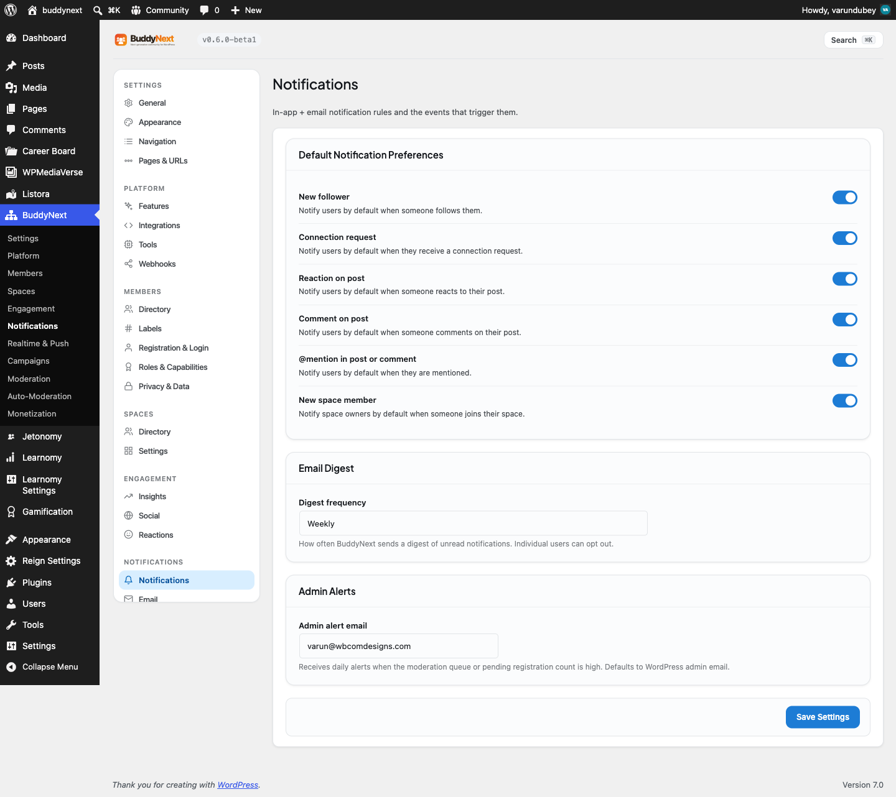

# Notification Preferences

Notification Preferences let each member decide which events notify them and how those notifications are delivered: on-site, by email, and (with Pro) by web push. The site owner sets the starting defaults for the most common types; the member fine-tunes the rest.

## Why use it

The fastest way to lose a member is to send them notifications they did not want. Too many emails, too many pings, and they either tune everything out or turn it all off - and a member who has globally muted you is hard to win back. Giving people granular control is what prevents that. A member who can keep the one notification they care about and silence the five they do not is a member who stays opted in.

For the owner, this is the difference between healthy engagement and a stream of unsubscribe complaints. You set sensible defaults so members start in a good place, and you trust them to adjust from there. For the member, it is simple respect: they choose what reaches them and through which channel, so notifications stay useful instead of becoming noise.

## How it works (for members)

A member manages their preferences from their notification settings, where every notification type BuddyNext supports is listed and grouped into sections: Social graph, Feed activity, Spaces, Messages, Moderation, and Growth and digests.

### Per-type on or off

Each notification type has its own on-site toggle. Turning it off stops that type from showing up on the Notifications page and in the bell count, while leaving every other type untouched. For example, a member can keep mentions and direct messages but turn off "new posts in your spaces" if a busy space is too noisy.

### Delivery channels

Notifications can reach a member through more than one channel, and each is controlled independently:

| Channel | What it delivers | Default |
|---|---|---|
| On-site | The in-app notification on the bell and Notifications page | On |
| Email | A transactional email for the event, at the member's chosen frequency | On |
| Push (Pro) | A web push alert to the browser, even when the tab is closed | On when Pro push is active |
| Sound | A short sound when a new notification arrives while the member is on the site | Off |

The Push channel only appears when the Pro push module is installed and active. See Push Notifications.

### Email frequency

For each type that can send email, the member picks how often email arrives:

| Frequency | What it does |
|---|---|
| Immediate | Send an email as soon as the event happens |
| Daily | Roll the event into one daily digest email |
| Weekly | Roll the event into one weekly digest email |
| Off | Never email for this type (on-site still works if it is on) |

Choosing Daily or Weekly batches that type into a single digest instead of one email per event, which is the usual choice for high-volume types like reactions. Email delivery is handled by the email system - see Email System for how digests are built and sent, and for the unsubscribe links that set a type to Off without the member having to log in.

### Per-space preferences

For spaces a member belongs to, the level of new-post notifications can be set per space, so one active space can be quieted without affecting the others.

## Setting it up (for owners)

The owner controls the starting on-site default for the most common notification types under Settings > Notifications. These defaults apply to members who have not changed the setting themselves; once a member adjusts their own preference, their choice wins.

| Setting | What it controls | Default |
|---|---|---|
| New follower | Whether members are notified by default when someone follows them | On |
| Connection request | Whether members are notified by default when they receive a connection request | On |
| Reaction on post | Whether members are notified by default when someone reacts to their post | On |
| Comment on post | Whether members are notified by default when someone comments on their post | On |
| @mention in post or comment | Whether members are notified by default when they are mentioned | On |
| New space member | Whether space owners are notified by default when someone joins their space | On |

Every type that is not in the table above ships with its own sensible default built in. As a guide, social, feed, space, message, and moderation notifications default to on-site on, while the email frequency varies by type - immediate for high-signal events like mentions, comments, connection requests, and direct messages; daily or weekly for higher-volume events like reactions, shares, and new space members; and off for low-value confirmations. Members can override any of these.

> **Note:** These owner settings govern the on-site default only. Whether the matching email goes out, and how often, is the member's choice through the email-frequency selector described above.

## Good to know

- Owner defaults are a starting point, not a lock. A member who changes a preference keeps their own choice from then on.
- Turning a type's on-site channel off removes it from the bell count as well as the list.
- A type set to email Off still shows on-site if the on-site channel is on; the two channels are independent.
- The Sound channel is off by default and only plays while the member is actively on the site.
- A notification type whose underlying feature is not active (for example, direct messages when messaging is disabled) does not appear in the preferences list, so there are no dead toggles.

## Free vs Pro

Per-type control, the on-site and email channels, email frequency, the optional sound, per-space new-post preferences, and the owner defaults are all part of the free plugin. Pro adds the Push channel - instant browser web push - which then appears as its own toggle in this same preferences screen. See Push Notifications for setup, and Email System for how email and digest delivery work.
