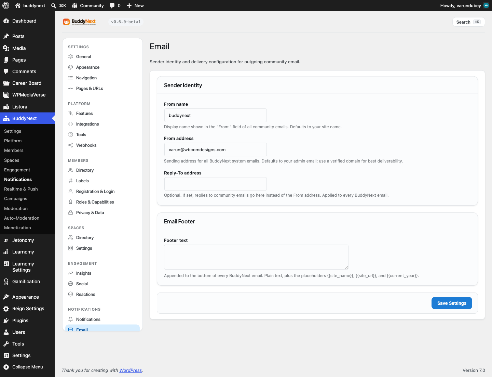
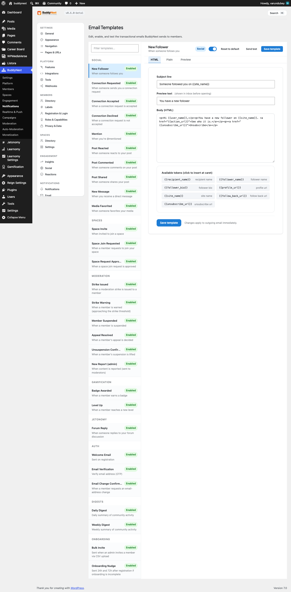

# Transactional Email System

BuddyNext sends the emails your community depends on - new follower, connection request, mention, comment, space invite, moderation notices, and more - and lets you edit every one of them. All of these emails share one branded wrapper and one sender identity, so whatever leaves your site looks like it came from your community, not from a generic WordPress install.

## Why use it

Email is how members hear about activity when they are not on the site. If those emails look unbranded or arrive from a mismatched address, members ignore them or mark them as spam, and your community loses the re-engagement loop that brings people back.

The email system solves three problems for an owner:

- **On-brand by default.** Every email is wrapped in a shell that carries your logo (or your site name as a wordmark), your brand color, and your footer text. You do not have to design an email; you author the words and BuddyNext supplies the chrome.
- **One consistent sender.** A single From name, From address, and optional Reply-To apply to every BuddyNext email, so members always recognize the sender. This identity is applied only to BuddyNext's own emails - password resets and other WordPress mail are never affected.
- **Editable copy.** The subject, preview text, and body of each built-in email are yours to rewrite, enable, or disable, without touching code.

For members, the result is email that is easy to recognize, easy to act on (every email has a clear call-to-action link back to the right place), and easy to opt out of (every notification email carries a one-click unsubscribe link).

## How it works (for members)

Members do not configure the email system. They receive the transactional emails they are subscribed to, and each email includes:

- A branded header with your logo or site name, linking back to the community.
- The message body, personalized with their name and the relevant actor and content.
- A call-to-action link that takes them straight to the follower, request, post, or space the email is about.
- An unsubscribe link that turns off that one type of email for them, with no login required (the link is signed, so only the intended recipient can use it).

Members control which emails they get, and how often, from their notification preferences. See Notification Preferences and Email Digests.

## Editing the emails (for owners)

The built-in emails live under Settings > Email Templates. BuddyNext ships a catalogue of transactional templates grouped by area:

- **Social** - new follower, connection requested, connection accepted, connection declined, mention, post reacted, post commented, post shared, new message, media favorited.
- **Spaces** - space invite, join requested, join request approved.
- **Moderation** - strike issued, warning, member suspended, appeal resolved, unsuspension confirmation, new report (to the team).
- **Gamification** - badge awarded, level up.
- **Jetonomy** - discussion reply.
- **Auth** - account and sign-in lifecycle emails.
- **Digests** - daily digest, weekly digest (see Email Digests).
- **Onboarding** - bulk invite, onboarding nudge.

For each template you can edit three fields and one switch:

- **Subject** - the email subject line.
- **Preview text** - the inbox preheader snippet shown before the email is opened.
- **Body** - the HTML body.
- **Enabled** - turn this email on or off. A disabled template stops sending that event email.

Templates use merge tokens like `{{site_name}}`, `{{user_name}}`, `{{first_name}}`, `{{action_url}}`, and `{{unsubscribe_url}}`, which resolve to real values when the email is sent. Each template lists the tokens it supports. You can restore any template to its shipped default at any time.

### Sending a test

From the template editor you can send a test email. The test sends the current subject and body (with sample values filled in for the tokens) to your admin address, or to any address you enter. The test goes out through the same sender identity and the same branded wrapper a real send uses, so what you receive is exactly what a member would receive.

## Setting it up (for owners)

The sender identity and footer live under Settings > Email. The admin alert recipient lives under Settings > Notifications.

| Setting | What it does | Default |
|---|---|---|
| From name | Display name in the "From:" field of every BuddyNext email. Accepts the `{{site_name}}` token. | Your site name |
| From address | Sending address for every BuddyNext email. Use a verified domain for best deliverability. | Your WordPress admin email |
| Reply-To address | Optional. When set, replies go here instead of the From address. Applied to every BuddyNext email. | Empty (replies go to the From address) |
| Footer text | Plain text appended to the bottom of every email. Supports `{{site_name}}`, `{{site_url}}`, and `{{current_year}}`. | Empty (a default copyright line is used) |
| Admin alert email | Address that receives daily alerts when the moderation queue or pending-registration count is high. | Your WordPress admin email |

> **Note:** The From name and From address fields show the effective value, never a blank box. If you leave them empty, BuddyNext falls back to your site name and admin email, so no email ever sends as the bare WordPress default.

> **Tip:** For the best chance of landing in the inbox, set the From address to an address on a domain you own. Pairing BuddyNext with an email-delivery (SMTP) plugin, so a real email provider handles sending rather than your web server, also helps emails arrive reliably.

### The branded wrapper

Every BuddyNext email - notifications, digests, account emails, invites, and the admin test - passes through one branded shell. You author only the content; the wrapper supplies:

- A header with your logo (set under Appearance) when one exists, or your site name as a wordmark.
- A thin strip in your brand color across the top of the email card.
- A padded, readable body.
- A footer using your footer text, or a default copyright line, plus a link home.

Because every email uses the same shell, your whole outbound mail looks consistent without any per-email design work.

## Good to know

- **Emails are sent in the background.** When a member action triggers an email, BuddyNext sends it just after, in the background, rather than making the member wait. The action that triggered it (following, commenting, and so on) stays fast, and the email goes out a moment later. If the background path is ever unavailable, BuddyNext sends the email right away instead, so it is never lost.
- **The email log.** Every successful send is recorded in an email log with the recipient, the email type, and the time sent. This is the reliable way to confirm an email actually went out - useful when a member says they did not receive something, or when you are verifying delivery on a new install.
- **Disabling a template is per-email.** Turning off a template stops that one event email; it does not affect any other email or any member's in-app notifications.
- **Identity applies only to BuddyNext mail.** The From name, From address, and Reply-To are attached per message and detached immediately after, so WordPress password resets and other plugins' email are never changed.

## Free vs Pro

The full transactional email system - editable templates, sender identity, footer, branded wrapper, test send, background delivery, and the email log - is included free.

Pro adds outbound email that goes beyond per-event transactional mail:

- **Broadcast campaigns** - compose and send a one-off email to a segment of members.
- **Drip sequences** - automated multi-step email sequences (for example, an onboarding series) that enroll members and send over time.

Broadcast and drip emails use the same branded wrapper and sender identity as the free transactional emails, so everything you send stays visually consistent. See Email Digests for how batched activity emails work in both Free and Pro.
