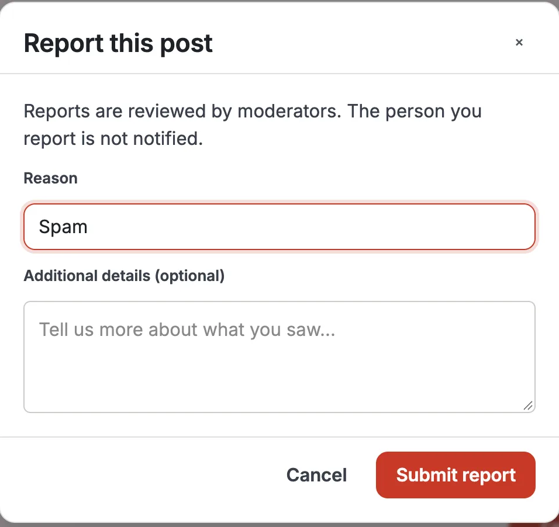
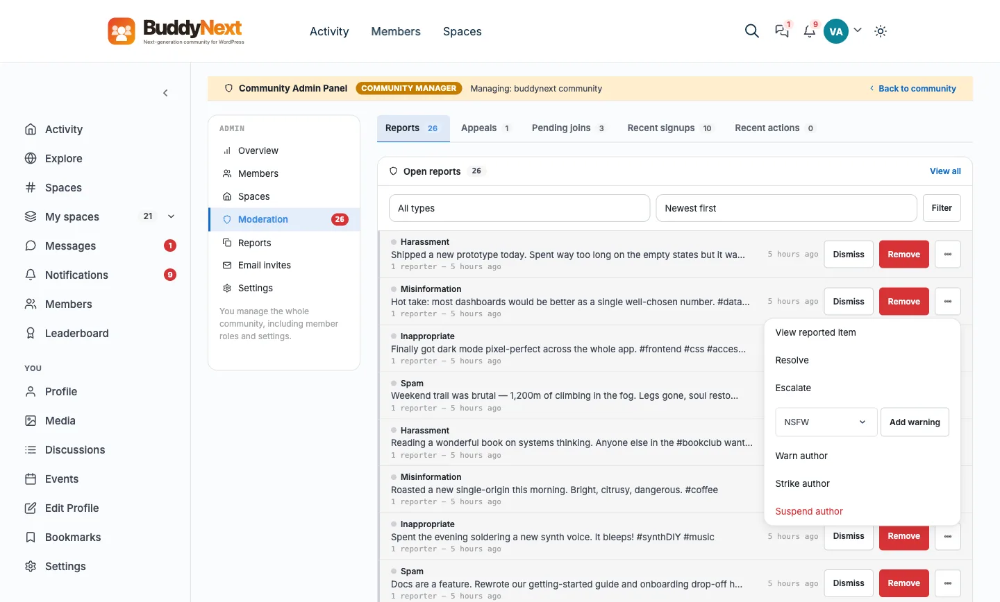
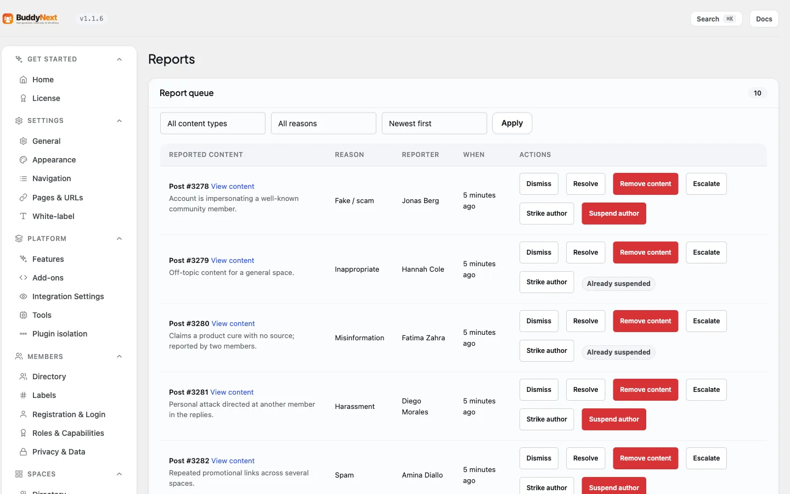

# Reporting Content

Reporting lets any member flag a post, comment, direct message, media item, or member profile for a moderator to review. A report records what was flagged, the reason, and any optional details, then sends it to the moderation queue without notifying the person who was reported.

## Why use it

Your moderators cannot watch every post in real time, and as a community grows that becomes impossible. Member reporting is the first line of defense: the people actually reading a thread are the first to notice spam, harassment, or a fake account, and a report turns that attention into a queued task a moderator can act on.

For the member, reporting is a quiet, safe action. The person being reported is never told who reported them, so members can flag a problem without fear of retaliation. For the owner, reports surface the content that needs a human decision instead of forcing moderators to read everything. A handful of reports on the same post is also a strong signal of how urgent a problem is, which is exactly what the moderation queue uses to sort work.

Reporting does not remove anything on its own. It opens a case. A moderator still reviews each report and decides what happens, so honest mistakes and disagreements do not silently delete content.

## How it works (for members)

A member can report a post, a comment, a direct message, a media item, or another member's profile.

1. Open the actions menu on the item you want to report. On a post or comment this is the menu on the post card; on a member, it is the menu on their profile card in the member directory; on a photo or video, it is in the media lightbox (the full-screen viewer you get when you click the media).
2. Choose Report. A report dialog opens.
3. Pick a reason from the list. The reason is required.
4. Optionally add details in the notes field to explain what you saw. Notes are limited to 500 characters and are optional.
5. Submit the report.

That is the whole flow. The dialog confirms the report was sent, and the person you reported is not notified.

### Reporting a photo or video

Media is reported from the lightbox, not from the post card. Click a photo or video to open it full-screen, and the viewer offers **Report** alongside Favorite, Share, and Download. Next to it is **Block**, which blocks the member who uploaded the media, not the file itself.

Two things behave differently here, and both are deliberate:

- Report and Block are hidden on your own media. Nobody needs to report themselves.
- Media reports go to the **Media Moderation** queue rather than the BuddyNext moderation queue. That queue is owned by WPMediaVerse, the plugin that stores your community's photos and videos. Moderators find them under **WPMediaVerse > Media Moderation** in the WordPress admin. See the note for owners below.

### Choosing a reason

Every report needs one reason. BuddyNext offers a fixed set so moderators see consistent, comparable labels in the queue. The exact list depends on what you are reporting, because a photo raises different questions than a profile does:

| Reason | Use it for | Offered on |
|---|---|---|
| Spam | Repetitive, promotional, or junk content. | Everything |
| Harassment or hate speech | Targeted abuse, threats, or hateful content. | Everything |
| Misinformation | False or misleading claims. | Everything |
| Something else | Anything not covered above. Use the notes field to explain. | Everything |
| Inappropriate content | Content that does not belong in the community. | Posts, comments, messages, profiles |
| Impersonation | An account pretending to be someone else. | Posts, comments, messages, profiles |
| Fake account | An account that looks automated or fraudulent. | Member profiles |
| Nudity or sexual content | Explicit imagery. | Media |
| Violence or graphic content | Graphic or violent imagery. | Media |
| Copyright infringement | Media published without the right to publish it. | Media |

> **Note:** Use the notes field whenever the reason alone does not tell the full story. A moderator reads it before deciding.

### What happens after a report

1. The report is saved and added to the moderation queue as a pending item.
2. The person you reported is not notified, and your identity is not shown to them.
3. A moderator reviews the report and decides the outcome: dismiss it, remove the content, warn or strike the member, or suspend the account. See the Moderation Queue page for how moderators work through reports.
4. The content stays visible unless and until a moderator removes it. Reporting does not hide or delete anything by itself.

## Good to know

- **Duplicate reports are prevented.** Each member can report a given item once. If you try to report the same post, comment, or profile a second time, BuddyNext blocks it and tells you that you have already reported this content (or this member). This stops one person from inflating the report count and keeps the queue honest. Where a post card knows you have already reported an item, it shows a Reported state instead of offering Report again.
- **Many members can report the same item.** The one-per-member limit applies per reporter, not per item. When several different members report the same post, those reports are grouped together for the moderator and the combined count raises the item's urgency in the queue.
- **Private messages.** A reported direct message is handled with privacy in mind: its content is not shown in the queue, so a moderator can act on the report without reading the private exchange.
- **Media reporting is on by default.** Installed on its own, WPMediaVerse ships with member reporting turned off, which suits a media library on a site with no moderators. A community is not that, so BuddyNext turns media reporting on for you. There is nothing to configure. If you deliberately want it off, a developer can switch it back off with a one-line filter, and the Report button then disappears from the lightbox rather than sitting there and failing. Block is unaffected either way, because blocking a member is BuddyNext's own feature.
- **Two queues, one job.** Reports on posts, comments, messages, and profiles land in **BuddyNext > Moderation > Reports**. Reports on photos and videos land in **WPMediaVerse > Media Moderation**. Both are report queues a moderator works through; they are separate because the media plugin owns the media. If you moderate media, check both.

## Free vs Pro

Member reporting, the reason set, duplicate prevention, and delivery to the moderation queue are all part of BuddyNext free. Pro adds tools for moderators who work through large volumes of reports, including acting on many items at once. See Bulk Moderation in the Pro documentation.
