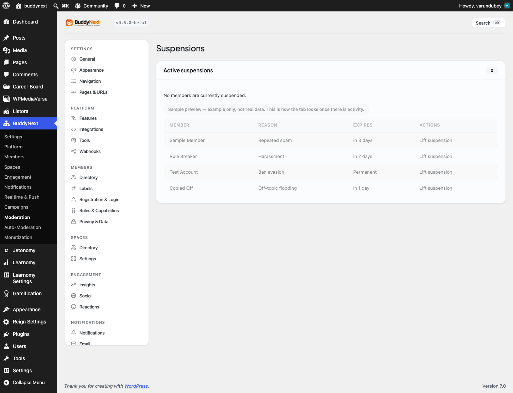

# Moderating a Member

User moderation is the set of actions a moderator or admin takes against a member who breaks the rules: a warning, a strike, a temporary suspension, a silent shadow-ban, or - through accumulated strikes - an automatic suspension or permanent ban. It is the human-judgment layer that sits on top of automatic Content Safeguards and the report queue.

Where reporting deals with a single piece of content, user moderation deals with the person behind it. The actions escalate in severity, so a first-time slip and a repeat offender are handled differently.

## Why use it

Instant bans feel decisive, but on a real community they cost you good members. People make mistakes - they paste a link they did not realize was against the rules, they post in anger, they misread the tone of a space. If the only tool you have is a ban, every mistake ends a membership, and the people you most want to keep are the ones most likely to leave over an overreaction.

Graduated enforcement is fairer and more durable. A warning tells a member they crossed a line and gives them the chance to correct course. A strike is a recorded, counted mark that says "this has happened before." A suspension is a cooling-off period, not a goodbye. Only when someone ignores every step does the system escalate to a suspension or a ban. That ladder - warn, then strike, then suspend - protects the community from genuine bad actors while giving honest members room to recover.

It also protects you, the owner. Every action is recorded, so when a member disputes a sanction you can show exactly what happened and when. Predictable, escalating consequences read as fair to the wider membership, which keeps trust in your moderation high.

## The moderation actions

Each action below is a deliberate step a moderator or admin takes against a member. They are listed from lightest to heaviest.

| Action | What it does |
|---|---|
| Warn | Sends the member a formal warning with a reason. Nothing is restricted - it is a recorded notice that they crossed a line and a chance to correct course. |
| Issue a strike | Records a counted strike against the member with a reason. Strikes accumulate, and reaching a threshold automatically escalates to a warning, a suspension, or a ban. |
| Reverse a strike | Cancels a previously issued strike. Use this when a strike was applied in error or after a successful appeal. A reversed strike no longer counts toward any threshold. |
| Suspend (temporary) | Blocks the member from posting for a set number of days, or indefinitely. Their existing content stays visible unless you choose to hide it. The suspension lifts automatically when the duration expires. |
| Shadow-ban | Silently hides the member's content from everyone else. The member still sees their own posts as normal and gets no error - they simply stop reaching anyone. Useful for persistent low-grade spammers who would just make a new account if openly banned. |

> **Note:** Warning, strike, suspension, and shadow-ban each take a reason. Write it for the record - it is what you will rely on if the member appeals, and it is the context the member sees in their notification.

## How strike thresholds escalate

Strikes are the engine that turns repeat offenses into automatic consequences. Each time you issue a strike, BuddyNext counts the member's active (non-reversed) strikes and applies the strongest threshold that has been reached:

1. **Warning threshold** (default: 2 strikes) - the member is sent a warning email noting how many strikes they now have.
2. **Suspension threshold** (default: 5 strikes) - the member is automatically suspended. The suspension is indefinite, and their content stays visible.
3. **Permanent-ban threshold** (default: off) - the member is permanently banned. This is a permanent suspension with the member's content hidden. It is opt-in: leave it at 0 and no strike count ever triggers an automatic permanent ban.

Escalation always applies the strongest tier reached, strongest first. The thresholds are yours to set in the admin settings (see "Setting it up" below), so you can make your community as forgiving or as strict as it needs to be.

> **Tip:** Reversing a strike lowers the member's active strike count, so a member who appeals successfully can drop back below a threshold.

## Setting it up (for owners)

Strike thresholds and the report auto-hide limit live in the Moderation settings. The defaults below are sensible for a general community - tighten them for a stricter space, loosen them for a more forgiving one.

| Setting | What it does | Default |
|---|---|---|
| Strikes before warning | A warning email is sent to the member once they reach this many active strikes. | 2 |
| Strikes before suspension | The member is automatically suspended once they reach this many active strikes. | 5 |
| Strikes before permanent ban | The member is permanently banned (a permanent, content-hidden suspension) at this many lifetime strikes. Set to 0 to disable automatic permanent bans. | 0 (off) |
| Auto-hide after N reports | Content is hidden automatically once it reaches this many reports, then waits in the moderation queue for review. | 5 |
| Queue alert threshold | Sends a daily email to admins when the moderation queue exceeds this many unreviewed items. Set to 0 to disable. | 20 |

## Good to know

- **A suspended member cannot post.** While a suspension is active, the member is blocked from creating posts and comments. Reading the community still works - the block is on contributing, not on access.
- **Shadow-banned content is hidden from others, not from the member.** The shadow-banned member sees their own posts exactly as before and receives no warning. To everyone else, their content does not appear in feeds or search. This is what makes it effective against spammers who would otherwise just register again.
- **Suspensions can be temporary or indefinite.** A suspension with a duration in days lifts itself automatically when it expires. A suspension with no duration stays in place until a moderator lifts it (or an appeal is approved).
- **Re-suspending is safe.** Suspending an already-suspended member does not stack a second suspension - the existing one is returned unchanged.
- **Reversing a non-existent or already-reversed strike fails clearly** rather than reporting a false success, so you always know whether the reversal actually changed anything.
- **Every action is logged.** Warnings, strikes, suspensions, shadow-bans, and reversals each write a permanent entry to the moderation log, so there is always a record of who did what and why.

## Free vs Pro

The full warn, strike, suspend, shadow-ban, and automatic-threshold system described here is included in BuddyNext free. Pro adds advanced moderation tooling on top - bulk moderation, a moderation rules engine, and member labels - but the per-member actions and the strike ladder are part of the free plugin.
