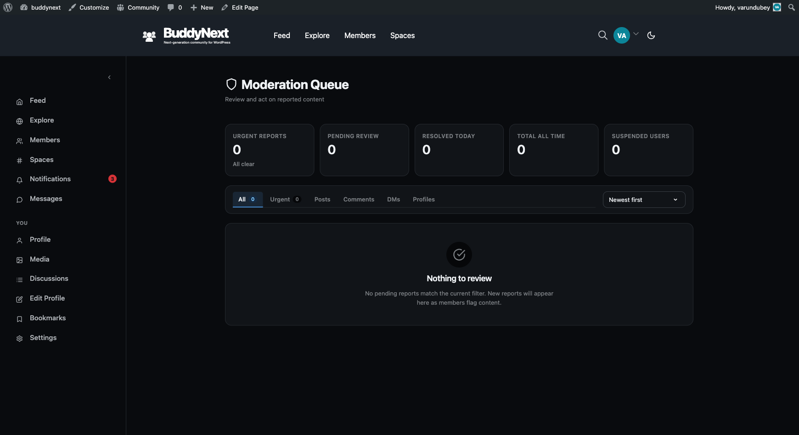

# Appeals

An appeal is the path a suspended member uses to dispute their suspension and ask a moderator to look again. The member submits a written explanation, and a moderator reviews it and either approves it - which lifts the suspension - or denies it.

Appeals close the loop on user moderation. Every sanction in BuddyNext is a human judgment call, and human judgment is sometimes wrong. The appeal gives the member a fair, structured way to say so, and gives you a clean way to reverse a mistake or confirm the original decision.

## Why use it

A community without an appeals path treats every moderation decision as final and unchallengeable. That is a problem for two reasons. First, moderators make mistakes - they act on incomplete information, misread context, or hit the wrong member. Without an appeal, those mistakes become permanent grievances. Second, even when a sanction is correct, a member who has no way to respond feels powerless, and powerless members vent in public, message you directly, or simply leave.

An appeals path defuses both. It tells members that decisions are reviewable, which signals that your moderation is confident rather than arbitrary. It moves the dispute off your public feed and your inbox and into a private, recorded channel built for it. And it gives moderators a structured second look - the member's own account of what happened, attached to the exact suspension being disputed - instead of a heated back-and-forth in comments.

The result is fewer public disputes, fewer angry direct messages, and a membership that trusts the process even when a particular decision goes against them.

## How it works (for members)

A member submits an appeal against a specific suspension and waits for a moderator's decision.

1. **Open the appeal.** A suspended member starts an appeal tied to the suspension they want to dispute.
2. **Explain the case.** The member writes a message making their case - why they believe the suspension was applied in error, or what has changed.
3. **Submit.** The appeal is recorded with a pending status, and moderators are notified that a new appeal is waiting.
4. **Wait for the decision.** The member cannot post while suspended, but the appeal itself is unaffected by the suspension. They are notified once a moderator approves or denies it.

> **Note:** An appeal must reference a real suspension that belongs to the member submitting it. A member cannot appeal someone else's suspension or a suspension that does not exist.

## How it works (for moderators)

Moderators see pending appeals in the Appeals admin area and resolve each one with a decision.

1. **Review the appeal.** Open the pending appeal to read the member's message and see which suspension it targets.
2. **Decide.** Approve the appeal or deny it. You can attach a note explaining your reasoning, which becomes part of the record.
3. **Approving lifts the suspension.** When you approve an appeal, BuddyNext lifts the exact suspension that was appealed - the member can post again immediately. Denying the appeal leaves the suspension in place.

> **Tip:** Approving an appeal is the clean way to undo a suspension, because it both records the decision and lifts the suspension in one step - you do not have to separately go and unsuspend the member.

## Good to know

- **Approving an appeal lifts the suspension.** Approval is not just a label change - it clears the appealed suspension so the member can post again. Denial leaves everything as it is.
- **The correct suspension is lifted.** Approval clears the specific suspension the appeal was filed against, even if the member has several historical suspensions on record.
- **Decisions are final and recorded.** Every appeal resolution writes the decision, the reviewer, the timestamp, and any note to the record, so there is always a clear history of how each appeal was handled.
- **A resolved appeal cannot be silently re-resolved.** Resolving an appeal that does not exist fails clearly rather than reporting a false success, so a moderator always knows whether their decision took effect.
- **Appeals are private.** The exchange happens between the member and the moderators - it is not posted to the feed or visible to other members.

## Free vs Pro

The appeals workflow described here - submit, review, approve or deny, and lift-on-approval - is part of BuddyNext free. Pro extends moderation with its own rules and tooling, but the member's right to appeal a suspension and a moderator's ability to resolve it are included in the free plugin.
