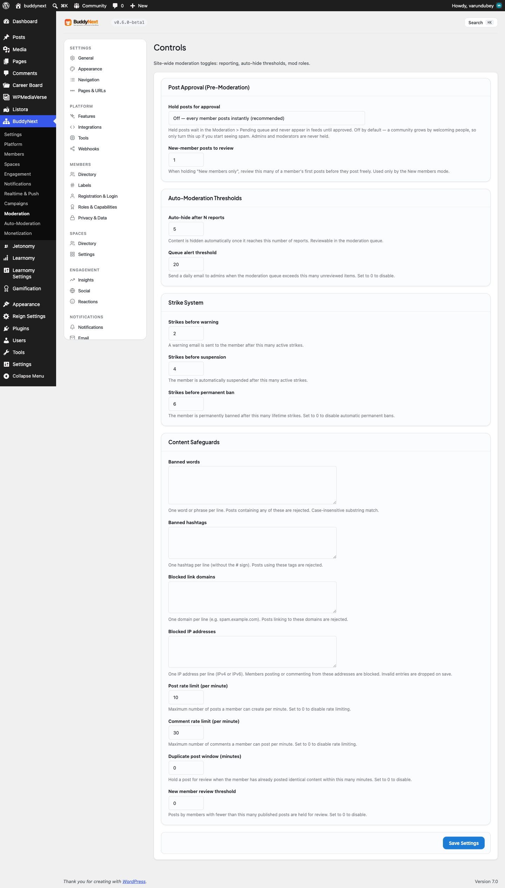
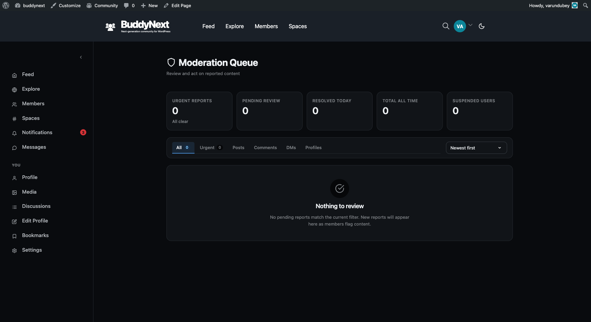

# Content Safeguards

Content safeguards are the automatic, always-on rules that check every post before it is saved. They run silently in the background: a banned word, a blocked link, a suspicious IP, or a burst of repeat posts is caught and stopped (or held for review) without a moderator lifting a finger.

Unlike the report queue, where a human reacts after something is posted, safeguards act at the moment of posting. You configure them once in the admin settings, and they apply to every member, every post, every day.

## Why use it

Reactive moderation alone does not scale. If the only line of defense is members reporting bad content and moderators clearing a queue, then spam, scam links, and abuse are already live and visible before anyone acts on them. On a busy community that means a moderator is always playing catch-up.

Proactive guards flip that. They stop the most common, most predictable problems at the door:

- Spam and scam links never reach the feed, because the domain is blocked.
- Slurs and banned phrases are rejected the instant a member tries to post them.
- A bot or troll hammering the post button is rate-limited after a few posts a minute.
- A brand-new account cannot flood the community on day one, because its first posts are held for a quick review.
- The same message pasted over and over is held instead of repeated.

The result is fewer items in the moderation queue, less moderator fatigue, and a cleaner feed for members who never see the junk in the first place. You set the thresholds to match the size and tone of your community, and the guards do the routine work so your moderators can focus on the genuine judgment calls.

## How it works (for members)

Members never configure safeguards - they experience them. When a member writes a post or comment, the checks run in order before the content is saved:

1. **Blocked IP** - the cheapest, hardest stop. If the member's IP address is on the blocklist, the post is refused.
2. **Banned words** - if the content contains a banned word or phrase (site-wide, or specific to the space they are posting in), the post is rejected with a clear message.
3. **Blocked link domains** - if the post attaches a link to a blocked domain, it is refused.
4. **Post rate limit** - if the member has already hit the per-minute post cap, they are asked to slow down.
5. **Duplicate content** - if the member just posted the exact same content inside the duplicate window, the repeat is held.
6. **New-member gate** - if the member has not yet reached the post threshold for established members, their post is held for review rather than published immediately.

The banned-word and blocked-link checks also run when a member **edits** existing content, so editing cannot be used to sneak a banned word past the first check. The rate-limit, duplicate, and new-member gates only apply at the moment of creation, not on edits.

A held post is not lost. It is saved with a pending status and routed into the moderation queue for a moderator to approve or remove. A rejected post (banned word, blocked link, blocked IP) is stopped outright, and the member sees why.

> **Note:** Banned hashtags work slightly differently. A hashtag on the banned list is never registered or attached to a post, so blocked tags simply do not become clickable, followable topics in your community.

## Setting it up (for owners)

All safeguards live under the Moderation settings tab. Each one is a single option you can change at any time without touching code. Leave a list empty, or set a numeric threshold to 0, to turn that individual guard off.

| Setting | What it does | Default |
|---|---|---|
| Banned words | Newline-separated list of words and phrases. Any post or comment containing one (case-insensitive, substring match) is rejected. Runs through the moderation rules pipeline, so Pro keyword and AI rules stack on top of this list. Spaces can also keep their own per-space banned-word list. | Empty (off) |
| Banned hashtags | Newline-separated list of hashtags that may never be created or attached to posts. Blocked tags never become followable topics. | Empty (off) |
| Blocked link domains | Newline-separated list of domains. Any post that attaches a link to a listed domain is rejected. Use this to stop known spam, scam, and phishing destinations. | Empty (off) |
| Blocked IPs | Newline-separated list of IP addresses. A member posting from a listed IP is blocked before any content check runs. | Empty (off) |
| Post rate limit | Maximum number of posts one member can publish per minute. Stops bots and burst-flooding. Set to 0 to remove the cap. | 10 |
| Duplicate post window | Number of minutes during which an identical repeat post by the same member is held instead of published. Set to 0 to allow duplicates. | 0 (off) |
| New-member post threshold | Number of approved posts a member must reach before their posts publish instantly. Until then, each post is held for review. Set to 0 to let new members post freely. | 0 (off) |
| Auto-hide threshold | Number of reports a single piece of content can receive before it is automatically hidden pending review. Set to 0 to never auto-hide. | 5 |
| Moderation-queue alert threshold | Number of pending items in the moderation queue that triggers an admin alert, so a growing backlog does not go unnoticed. Set to 0 to disable the alert. | 20 |
| Strike warn threshold | Number of strikes against a member that triggers an automatic warning. Set to 0 to disable. | 2 |
| Strike suspend threshold | Number of strikes that triggers an automatic suspension. Set to 0 to disable. | 5 |
| Strike permanent-ban threshold | Number of strikes that triggers an automatic permanent ban. Set to 0 to disable. | 0 (off) |

> **Tip:** Set the strike thresholds so they escalate in order: warn at the lowest count, suspend higher, permanent ban highest (or left at 0 if you never want an automatic permanent ban). A member who keeps accumulating strikes is warned first, suspended next, and only banned if the behavior continues.

## Good to know

- **A threshold of 0 means off.** Every numeric guard treats 0 as "disabled," not "block everything." A rate limit of 0 allows unlimited posting; a new-member threshold of 0 lets new members post freely; a permanent-ban threshold of 0 means strikes never auto-ban.
- **An empty list means off.** Leaving banned words, banned hashtags, blocked domains, or blocked IPs empty turns that filter off entirely - it does not block all content.
- **Banned words run through the moderation rules pipeline.** The site-wide banned-word list is the free, built-in keyword filter. It runs inside the same safeguard check that Pro keyword rules and AI moderation hook into, so your simple word list and any advanced rules are evaluated together on every post and every edit.
- **Spaces can extend the banned-word list.** A space can keep its own banned-word list on top of the site-wide one, so a space about, say, finance can ban terms that the rest of the community allows. The space list is checked alongside the global list for posts in that space.
- **Held vs rejected.** The new-member gate and the duplicate-content guard *hold* a post (saved as pending, sent to the queue). Banned words, blocked links, and blocked IPs *reject* the post outright. Auto-hide *hides* content that has already been posted once it crosses the report threshold.
- **Edits are re-checked.** Banned words and blocked link domains are re-scanned when a member edits content, closing the loophole where someone posts clean content and edits in something banned afterward.

## Free vs Pro

Everything on this page - banned words, banned hashtags, blocked domains, blocked IPs, rate limits, the duplicate window, the new-member gate, auto-hide, the queue alert, and all three strike thresholds - is included free.

Pro builds on the same safeguard pipeline with more capable, less manual tools:

- **Rule-based auto-moderation** - configurable keyword and condition rules that go beyond a flat word list, so you can match patterns, target specific content types, and choose the action per rule (see Auto-Moderation Rules).
- **AI moderation** - automated scoring of content for spam, toxicity, and abuse, so borderline content is caught without writing a rule for every variation (see AI Moderation).
- **Bulk moderation** - clear, approve, or remove many queued items at once instead of one at a time (see Bulk Moderation).

The free safeguards on this page run first and stack with these Pro tools through the same check, so adding Pro extends your guards rather than replacing them.
