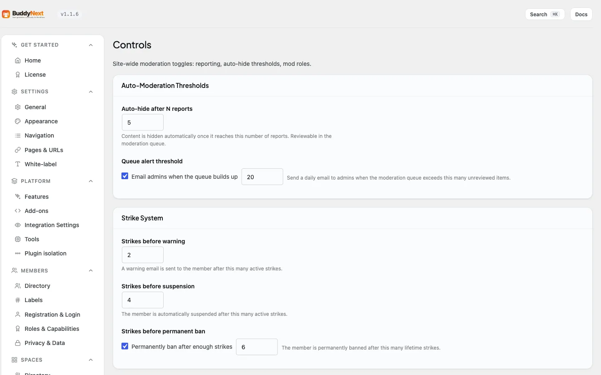

# Content Safeguards

Content safeguards are the automatic, always-on rules that check every post before it is saved. They run silently in the background: a banned word, a blocked link, a suspicious IP, or a burst of repeat posts is caught and stopped (or flagged for review) without a moderator lifting a finger.

Unlike the report queue, where a human reacts after something is posted, safeguards act at the moment of posting. You configure them once in the admin settings, and they apply to every member, every post, every day.

## Why use it

Reactive moderation alone does not scale. If the only line of defense is members reporting bad content and moderators clearing a queue, then spam, scam links, and abuse are already live and visible before anyone acts on them. On a busy community that means a moderator is always playing catch-up.

Proactive guards flip that. They stop the most common, most predictable problems at the door:

- Spam and scam links never reach the feed, because the domain is blocked.
- Slurs and banned phrases are rejected the instant a member tries to post them.
- A bot or troll hammering the post button is rate-limited after a few posts a minute.
- A brand-new account's first posts are flagged for a quick review, so a spam wave on day one gets caught.
- The same message pasted over and over is flagged for a moderator instead of quietly repeating.

The result is fewer items in the moderation queue, less moderator fatigue, and a cleaner feed for members who never see the junk in the first place. You set the thresholds to match the size and tone of your community, and the guards do the routine work so your moderators can focus on the genuine judgment calls.

## How it works (for members)

Members never configure safeguards - they experience them. When a member writes a post or comment, the checks run in order before the content is saved:

1. **Blocked IP** - the cheapest, hardest stop. If the member's IP address is on the blocklist, the post is refused.
2. **Banned words** - if the content contains a banned word or phrase (site-wide, or specific to the space they are posting in), the post is rejected with a clear message.
3. **Blocked link domains** - if the post attaches a link to a blocked domain, it is refused.
4. **Post rate limit** - if the member has already hit the per-minute post cap, they are asked to slow down.
5. **Duplicate content** - if the member just posted the exact same content inside the duplicate window, the repeat is flagged for review (it still posts, but a report is filed).
6. **New-member gate** - if the member has not yet reached the post threshold for established members, their post publishes but is flagged for a moderator to review.

The banned-word and blocked-link checks also run when a member **edits** existing content, so editing cannot be used to sneak a banned word past the first check. The rate-limit, duplicate, and new-member gates only apply at the moment of creation, not on edits - a member who has hit the cap can still go back and fix a typo in a post they already published. (If you run Pro, its rules follow the same line. See Auto-Moderation Rules.)

A flagged post is not blocked. It publishes normally, and a report is filed to the moderation queue so a moderator can review it - and remove it if needed. A rejected post (banned word, blocked link, blocked IP, or one over the rate limit) is stopped outright, and the member sees why. This keeps moderation reactive: members post freely and nothing waits invisibly in an approval queue.

> **Note:** Banned hashtags work slightly differently. A hashtag on the banned list is never registered or attached to a post, so blocked tags simply do not become clickable, followable topics in your community.

## Setting it up (for owners)

All safeguards live under **BuddyNext > Moderation > Controls**. Each one is a single option you can change at any time without touching code. Leave a list empty to turn a list-based guard off. Numeric guards that can be switched off carry a tick box for it - untick the box and the number field is ignored. A few guards have no off switch and take a minimum of 1; they are marked below.

| Setting | What it does | Default |
|---|---|---|
| Banned words | Newline-separated list of words and phrases. Matching is case-insensitive and by **whole word**, so `ass` blocks "ass" but not "class", "pass" or "passionate". Append `*` to catch variants deliberately - `spam*` blocks "spam", "spammer" and "spamming". Any post or comment matching an entry is rejected. Runs through the moderation rules pipeline, so Pro keyword and AI rules stack on top of this list. Spaces can also keep their own per-space banned-word list. | Empty (off) |
| Banned hashtags | Newline-separated list of hashtags that may never be created or attached to posts. Blocked tags never become followable topics. | Empty (off) |
| Blocked link domains | Newline-separated list of domains. Any post that attaches a link to a listed domain is rejected. Use this to stop known spam, scam, and phishing destinations. | Empty (off) |
| Blocked IPs | Newline-separated list of IP addresses (IPv4 or IPv6). An address on this list cannot sign in, register, post, or comment - including on accounts it already holds. This is the widest safeguard: it stops a blocked address before any content check runs, not just before posting. Your own address cannot be added. | Empty (off) |
| Post rate limit | Maximum number of posts one member can publish per minute. Stops bots and burst-flooding. Untick to remove the cap. | 10 |
| Comment rate limit | Maximum number of comments one member can post per minute. Separate from the post rate limit, so a fast-moving comment thread is not capped by the same number as new posts. Untick to remove the cap. | 30 |
| Duplicate post window | Number of minutes during which an identical repeat post by the same member is flagged for review. The repeat still publishes, but a report is filed. Untick to allow duplicates. | 0 (off) |
| New-member post threshold | Number of posts a member must reach before their posts stop being flagged. Until then, each post publishes but is also sent to the moderation queue for review. Untick to let new members post freely. | 0 (off) |
| Auto-hide threshold | Number of reports a single piece of content can receive before it is automatically hidden pending review. Minimum 1 - auto-hide cannot be switched off from this field. | 5 |
| Moderation-queue alert threshold | Number of pending items in the moderation queue that triggers an admin alert, so a growing backlog does not go unnoticed. Untick to disable the alert. | 20 |
| Strike warn threshold | Number of strikes against a member that triggers an automatic warning. Minimum 1; there is no off switch, and 0 is not accepted. | 2 |
| Strike suspend threshold | Number of strikes that triggers an automatic suspension. Minimum 1; there is no off switch, and 0 is not accepted. | 5 |
| Strike permanent-ban threshold | Number of strikes that triggers an automatic permanent ban. Untick to disable. | 0 (off) |

> **Tip:** Set the strike thresholds so they escalate in order: warn at the lowest count, suspend higher, permanent ban highest (or left at 0 if you never want an automatic permanent ban). A member who keeps accumulating strikes is warned first, suspended next, and only banned if the behavior continues.

## Good to know

- **A threshold of 0 means off.** Every numeric guard treats 0 as "disabled," not "block everything." A rate limit of 0 allows unlimited posting; a new-member threshold of 0 lets new members post freely; a permanent-ban threshold of 0 means strikes never auto-ban.
- **An empty list means off.** Leaving banned words, banned hashtags, blocked domains, or blocked IPs empty turns that filter off entirely - it does not block all content.
- **Banned words run through the moderation rules pipeline.** The site-wide banned-word list is the free, built-in keyword filter. It runs inside the same safeguard check that Pro keyword rules and AI moderation hook into, so your simple word list and any advanced rules are evaluated together on every post.
- **Content checks run on edits; counting checks do not.** Anything that inspects *what was written* is re-run when a member edits: banned words, blocked link domains, and (with Pro) keyword rules, blocked-link rules, and AI moderation. Anything that counts *how much someone posted* is not: the rate limit, the duplicate-content window, the new-member gate, and Pro's Anti-flood rule only apply at the moment of creation. This is the right line in both directions. If content checks skipped edits, a member could post something clean and edit a banned word in afterwards. If the rate limit applied to edits, a member who hit the cap could not fix a typo in a post they had already published.
- **Spaces can extend the banned-word list.** A space can keep its own banned-word list on top of the site-wide one, so a space about, say, finance can ban terms that the rest of the community allows. The space list is checked alongside the global list for posts in that space.
- **Flagged vs rejected.** The new-member gate and the duplicate-content guard *flag* a post - it still publishes, but a report is filed to the moderation queue for review. Banned words, blocked links, blocked IPs, and the rate limit *reject* the post outright, so it is never saved. Auto-hide *hides* content that has already been posted once it crosses the report threshold.
- **Moderators and admins are exempt from the rate limit.** Site admins and anyone who can review the moderation queue can post announcements and bulk content without tripping the per-minute cap.
- **Direct messages go through the same content checks.** Banned words, blocked link domains, and banned hashtags are checked on a direct message exactly as they are on a post - a message using one is rejected outright, and the sender is told why. Only the site-wide list applies (a message is not posted into a space, so no per-space banned-word list is consulted). The rate limit, duplicate window, and new-member gate are post/comment-only and do not apply to messages. See Direct Messaging.
- **Pre-moderation (hold-before-publish) exists but has no owner setting.** BuddyNext's default and only supported model is reactive: a post goes live immediately, and enforcement happens after the fact through this pipeline. A hold-every-post-for-approval engine still exists in the codebase for sites with a genuine compliance need (schools, healthcare, regulated brands), but as of 1.1.6 it can only be switched on by a developer filter (`buddynext_premod_mode`) - there is no toggle in the admin. When nothing is held, **BuddyNext > Moderation > Pending** simply does not appear; it renders only if a post is actually waiting. An approved or rejected held post is what triggers the "Post approved" / "Post not approved" notifications - see Notifications.

## Free vs Pro

Everything on this page - banned words, banned hashtags, blocked domains, blocked IPs, rate limits, the duplicate window, the new-member gate, auto-hide, the queue alert, and all three strike thresholds - is included free.

Pro builds on the same safeguard pipeline with more capable, less manual tools:

- **Rule-based auto-moderation** - configurable keyword and condition rules that go beyond a flat word list, so you can match patterns, target specific content types, and choose the action per rule (see Auto-Moderation Rules).
- **AI moderation** - automated scoring of content for spam, toxicity, and abuse, so borderline content is caught without writing a rule for every variation (see AI Moderation).
- **Bulk moderation** - clear, approve, or remove many queued items at once instead of one at a time (see Bulk Moderation).

The free safeguards on this page run first and stack with these Pro tools through the same check, so adding Pro extends your guards rather than replacing them.

## Related

- [Moderating a Member](03-user-moderation.md) - the strike thresholds these guards feed
- [Moderation Queue](02-moderation-queue.md) - where flagged content waits for review
- [Direct Messaging](../messaging-notifications/01-direct-messaging.md) - the same banned-word and blocked-link checks applied to messages
- [Notifications](../messaging-notifications/02-notifications.md) - the post-approved / post-not-approved events a held post triggers
- [Auto-Moderation Rules](../pro/14-auto-moderation.md) - the Pro rules that stack on this pipeline
- [AI Feed and Moderation](../pro/15-ai-feed-and-moderation.md) - Pro automated content scoring
