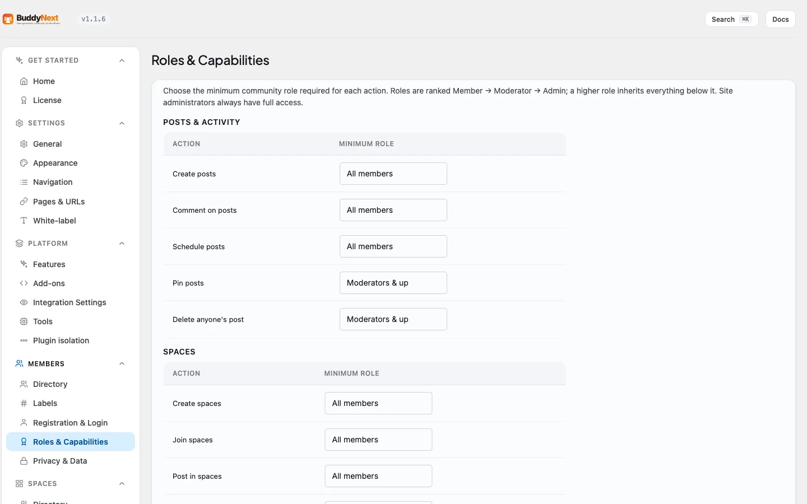

# Community Roles and Moderators

Your community has three roles that decide who can help run it - **member**, **moderator**, and **admin** - sitting below you, the **site administrator**. Members take part, moderators keep things tidy across the whole community, and admins help you run it. Appointing a couple of trusted people is how a growing community stays healthy without every report and every off-topic thread landing on one person.

## Why use it

A community with one owner and a few hundred members does not scale. You cannot read every post, clear every report, and answer every join request yourself. Promoting a trusted member to moderator hands them the day-to-day work - clearing the moderation queue, removing spam, pinning the posts that matter - while the decisions that should stay with you, like changing what each role is allowed to do or suspending an account, stay with you and your admins.

These roles are **community-wide**. A moderator here can moderate anywhere in the community, not just one space. (Spaces have their own separate owner / moderator / member roles for running a single space - see [Roles, Moderators, and Permissions](../spaces/05-roles-and-moderators.md).)

## The three roles

Each role can do everything the role below it can, plus more. The table lists the community-wide abilities each role adds.

| Ability | Member | Moderator | Admin |
|---|---|---|---|
| Post, comment, react, and join spaces | Yes | Yes | Yes |
| Report content and appeal decisions | Yes | Yes | Yes |
| Review the moderation queue | No | Yes | Yes |
| Remove any post and pin posts | No | Yes | Yes |
| Issue strikes | No | Yes | Yes |
| Moderate, manage, and delete any space | No | Yes | Yes |
| Suspend a member | No | No | Yes |
| Edit any member's profile | No | No | Yes |
| Promote members to moderator or admin | No | No | Yes |

Above all three sits the **site administrator** - the WordPress admin who installed BuddyNext. The site administrator can do everything an admin can, and two things no one else can: grant the top **admin** role to someone, and change what each role is allowed to do (see [Settings, below](#tune-what-each-role-can-do)).

> These are the defaults. If you have adjusted the **Roles & Capabilities** settings, your community's abilities may differ from the table above.

## How to promote someone

There are two places to change a member's community role. Both write the same role, so use whichever you have open.

**From the front end** - open the **Community Admin** panel (under **Settings** in the left menu, or your community admin link), go to **Members**, and pick a new role from the dropdown next to the person. The change saves immediately.

**From the WordPress admin** - go to **Users**, find the person, and set their role in the **Community role** column. Save the row.

A few rules keep this safe:

- Only an **admin** or the **site administrator** can change roles. Moderators see the roles but cannot change them.
- You cannot change your own role.
- Granting the top **admin** role is reserved for the site administrator.

## Tune what each role can do

The table above is the starting point, not a fixed rule. Open **Settings > Roles & Capabilities** to change the minimum role each ability needs - for example, letting members create spaces, or requiring admin to pin a post. Every ability in the community reads from this one place, so a change here applies everywhere at once.

For the full list of abilities and how to override them in code, see [Roles and Capabilities](../developer-guide/39-roles-and-capabilities.md) in the developer guide.
