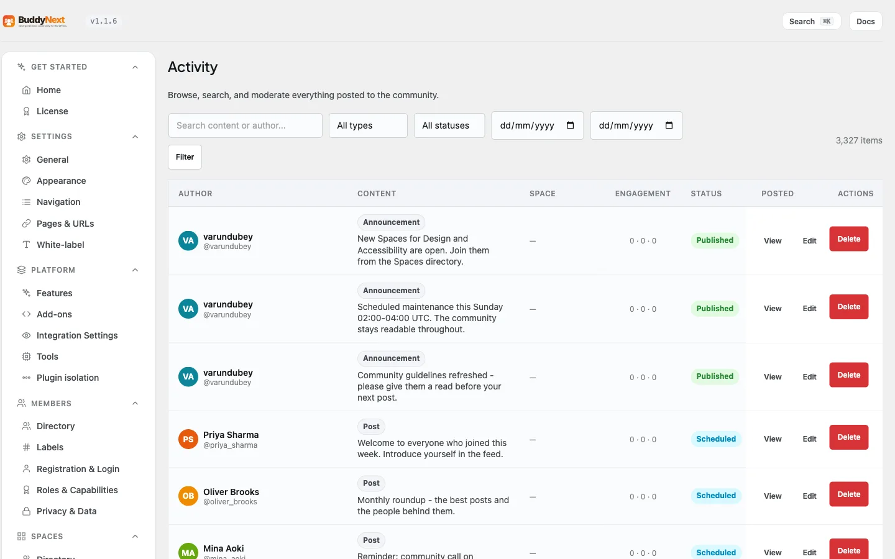

# Managing Activity from the Admin

The Activity screen is the admin-side list of everything posted to your community: every post, photo, poll, share and announcement, in one time-ordered table you can search, filter, open, edit or delete. It is where an owner goes when a specific piece of content needs attention and nobody has reported it.

## Why use it

Moderation usually starts with a report: a member flags something, it lands in the queue, a moderator acts. That covers content the community notices. It does not cover the rest.

Sometimes you need to find a post nobody reported. A broken embed that is mangling the feed layout. A test post left behind during setup. A member asking you to take down something they wrote months ago. An announcement with a typo in it. In each case you know roughly what you are looking for, but there is no report to work from, and hunting for it by scrolling the front-end feed is not a plan.

The Activity screen exists for exactly that. It lists all activity regardless of whether it has ever been reported, with search, type, status and date filters to narrow it down, and per-row actions to view, edit or remove what you find. For the owner, it is also the only place in wp-admin where a post that is breaking a page can be deleted - the front end only lets the author remove their own content.

## Where to find it

**BuddyNext > Engagement > Activity.** The screen is restricted to site administrators.

## How it works

### Finding the activity you want

The filter bar sits above the table:

| Control | What it does |
|---|---|
| Search | Matches the content of a post, or the author |
| Type | Text, photo, media, link, poll, share, announcement, or discussion |
| Status | Published, Scheduled, Pending, Under review, Draft, or Deleted |
| From / To | Limits the list to a date range |

Leave a filter unset to include everything. **Filter** applies your choices and **Clear** returns to the unfiltered list. A type that is not in the dropdown still appears in the list - the filter is a shortcut for the common ones, not a restriction on what is shown.

If nothing matches, the screen says so and suggests widening the search rather than showing an empty table with no explanation.

### Reading the table

| Column | What it shows |
|---|---|
| Author | Who posted it, with their avatar and handle |
| Content | An excerpt, with the activity type marked above it |
| Space | The space it was posted in, or a dash for the main feed |
| Engagement | Reactions, comments and shares for that item |
| Status | Published, Scheduled, Pending, and so on |
| Posted | When it was published |
| Actions | View, Edit, Delete |

The list is ordered newest first and paginated at 25 rows a page, with the total count shown above the table so you can see how much a filter actually matched.

### Acting on a row

- **View** opens the post on the front end in a new tab, so you can see it in context before deciding anything.
- **Edit** opens the content in a text area. Save changes rewrites the post body in place; Cancel leaves it untouched. This lets an administrator redact part of a member's post - a phone number, a name, a link - without removing the whole thing, which is often the fairer outcome.
- **Delete** removes the activity permanently.

## Good to know

- **Delete is permanent, and it cascades.** Removing an activity also removes its comments, reactions, shares, bookmarks, and any poll options and votes attached to it. There is no trash to restore from, so use Edit when redacting is enough.
- **Editing someone else's post is an administrator action.** Members can only edit their own content on the front end. The admin screen deliberately allows an administrator to edit any post, because the alternative when a post needs one line removed is deleting the whole thing.
- **The list includes content that is not publicly visible.** Scheduled, pending, draft and under-review activity all appear here, which is what makes the screen useful for finding something before it reaches the feed.
- **This is not the report queue.** Reported content is handled under Moderation, where you get the reason, the reporter, and the report-specific actions. Use Activity when there is no report to work from.
- **Built for large communities.** The list pages at the database level with an indexed query and batched author and space lookups, so it stays responsive on a community with a large back catalogue rather than loading everything to count it.

## Free vs Pro

The Activity admin screen, its filters, and the view, edit and delete actions are all part of BuddyNext free. Pro adds the wider moderation tooling around it - bulk moderation, the moderation rules engine, and AI-assisted review - but browsing and managing activity from the admin does not require Pro.
