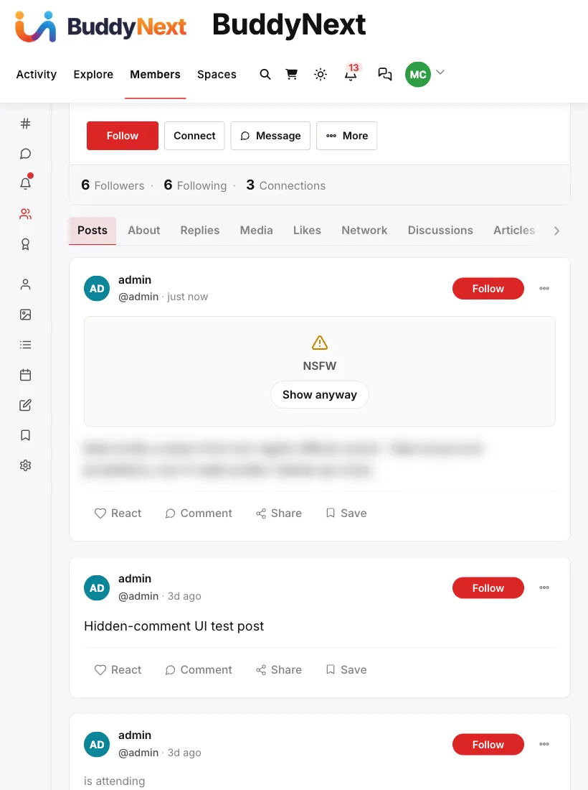

# Content Warnings

A content warning is a moderator-applied tag on a post that blurs it behind a label - NSFW, Spoilers, Violence, or Strong Language - until a viewer chooses to reveal it. It is a targeted cover for a specific post a moderator has already looked at, not a filter members set for themselves.



## Why use it

Some content is fine to keep on the platform but is not something every viewer wants to see appear in their feed without warning - a graphic image in a news discussion, a spoiler for a show that just aired, a post that quotes offensive language for context. Removing it is the wrong call when the post itself does not break any rule. Leaving it fully exposed is also the wrong call for anyone scrolling past who did not choose to see it.

A content warning splits the difference. The post stays up, in place, in the normal feed order. Anyone who wants to see it can click through in one action. Anyone who would rather not is protected by default. It gives a moderator a proportionate response between "leave it as-is" and "take it down."

## How it works (for members)

A post carrying a content warning shows a blurred overlay in place of its body, with the warning label (NSFW, Spoilers, Violence, or Strong Language) and a **Show anyway** button. Clicking it reveals the post's content for that viewing; the warning label stays visible so it is clear the content was flagged. The rest of the post - author, timestamp, reactions, comments - behaves normally once revealed.

A post's author does not set a content warning on their own post. It is applied by a moderator after the fact, the same way a strike or a removal is.

## How it works (for moderators)

Setting or clearing a content warning is a moderator action, gated the same way strikes and removals are - a site administrator, or a member with site-wide or space moderation authority.

Open the reported post's row in a moderation queue and use the content-warning control:

1. Open the queue: **Community Admin > Moderation**, a space's own **Moderation** tab, or **BuddyNext > Moderation > Reports** in wp-admin.
2. On a post report, pick a type from the dropdown: NSFW, Spoilers, Violence, or Strong language.
3. Select **Add warning**. If the post already carries a warning, the button reads **Update warning** and a **Clear warning** button appears.

In Community Admin and a space's Moderation tab the control sits inside the row's **More** menu. It is offered on reports of posts only.

Developers can also set it through the REST API:

```
PUT /wp-json/buddynext/v1/posts/{id}/content-warning
{ "content_warning": true, "content_warning_type": "nsfw" }
```

`content_warning_type` accepts `nsfw`, `spoilers`, `violence`, or `language`, and defaults to `nsfw` if omitted. Sending `content_warning: false` clears the warning and the post displays normally again. Checking whether a post carries a warning (`GET` the same URL) is public - anyone can query it, which is what lets the front end decide whether to render the blur before the full post loads.

## Good to know

- **This is a moderator judgment call, not a member preference.** A content warning is not something a member can turn on for their own posts, and it is not a personal content filter a viewer configures for themselves - it is a targeted action a moderator applies to one specific post.
- **The warning is visible to everyone, always.** There is no exemption for the post's own author or for staff - if a post carries a warning, the overlay shows for every viewer until someone clicks through.
- **You need a report to reach the control.** The control lives on report rows, so a post nobody reported has no button; the Activity admin screen does not offer content warnings.

## Free vs Pro

Content warnings - the REST endpoint, the four warning types, and the feed overlay - are part of BuddyNext free.

## Related

- [Moderation Queue](02-moderation-queue.md) - where a moderator reviews the post before deciding to warn or remove it
- [Content Safeguards](05-content-safeguards.md) - the automatic checks that run before a post is even saved
- [Managing Activity from the Admin](07-activity-management.md) - the admin screen that can edit or remove a post
