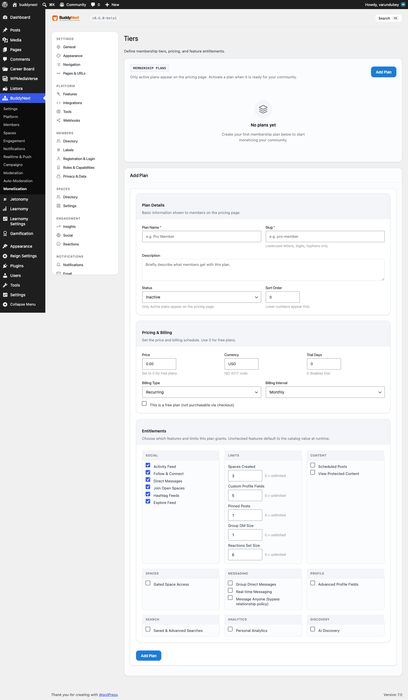
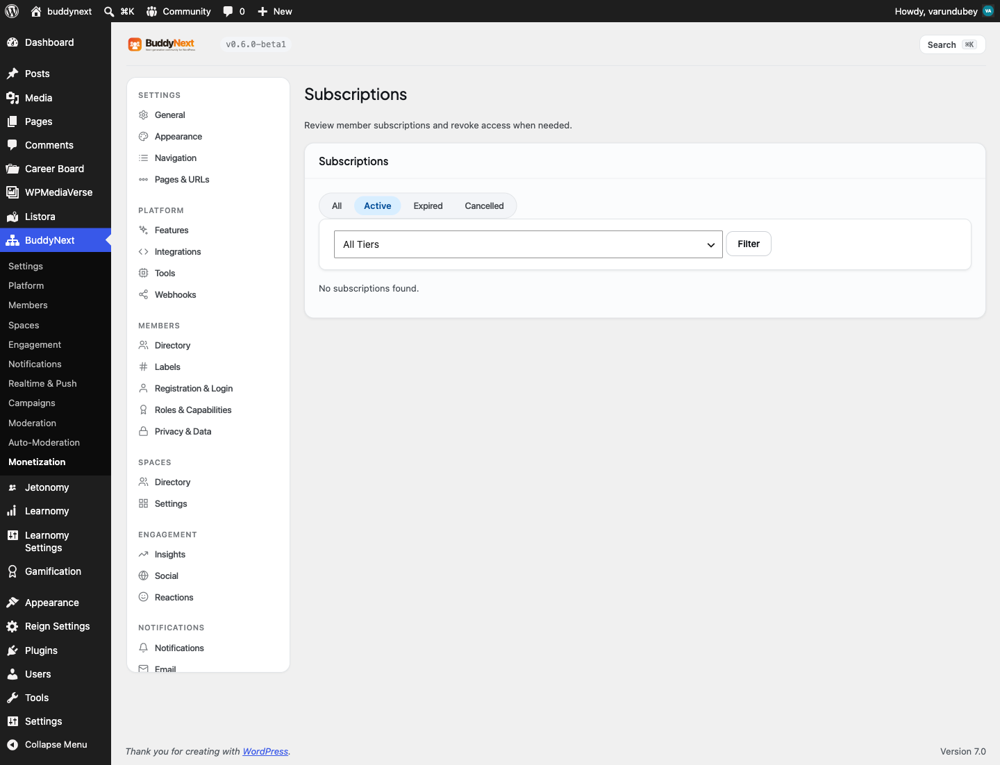

# Membership Tiers

Membership tiers are the plans, free or paid, that you offer your community. Each tier carries a price, a billing schedule, and a set of perks (the features and limits it unlocks), and members subscribe to a tier to get what it includes.






> **Before you start:** Membership tiers come with BuddyNext Pro. You need BuddyNext Pro active, and to take real payments you also need a payment gateway connected (see Requirements below). Even without a gateway you can still create tiers and grant access by hand, which is handy while you set things up.

## Why use it

Turning your community into a place people happily pay for is one of the most rewarding things you can do as an owner, and membership tiers are how you do it without leaving WordPress. You define the offer once, members choose the plan that fits them, and everyone gets a clear deal: pay this, get that.

Use tiers when you want to:

- Charge for access to premium areas of your community (see Gating Spaces).
- Offer a paid plan that lifts limits free members hit - more spaces they can create, more pinned posts, larger group messages.
- Run a free plan and one or more paid plans side by side, so members can self-upgrade when they need more.
- Sell a one-time pass or a recurring monthly or yearly subscription, with an optional free trial.

For the member, a tier is a clear promise. For you, it is a single place to define the offer, see who is subscribed, and step in when you need to extend or revoke access. The same tier definition drives the pricing page members see, the access checks across the community, and the reports you review.

## How it works (for members)

Members never touch the admin. They see two surfaces, both of which you place on ordinary WordPress pages using shortcodes.

### View the plans and subscribe

The pricing page lists every active plan with its name, description, price, and billing interval. Each paid plan has its own button that starts checkout; the free plan is marked as the member's current plan.

Add the pricing table to any page with this shortcode:

```text
[buddynext_membership_pricing]
```

The button submits a standard form, so the buy flow works even with JavaScript disabled. After a member completes checkout, they are returned to a thank-you page and their subscription becomes active.

### Check their own membership

Members can see their current plan, its price, status, and renewal date on a "my membership" page.

Add it with this shortcode:

```text
[buddynext_my_membership]
```

The page shows one of three states:

- Not logged in - a prompt to log in.
- No active membership - a note that they have no plan yet.
- Active membership - the plan name, price and interval, status (Active, Trialing, and so on), and the renewal date when the subscription has an expiry.


## Setting it up (for owners)

All tier and subscription management lives in wp-admin under BuddyNext, in the Monetization section. You manage tiers, review subscriptions, and configure the upgrade prompt across three tabs: Tiers, Subscriptions, and Paywall. (The Paywall tab is covered in Gating Spaces.)

### Create a tier

Open the Tiers tab and choose Add Plan. A tier is defined by three groups of settings: plan details, pricing and billing, and perks.

#### Plan details

| Setting | What it does | Default |
|---|---|---|
| Plan Name | The display name members see on the pricing page. Up to 120 characters. | (empty - required) |
| Slug | A short, unique identifier for the plan, using lowercase letters, digits, and hyphens. It is fixed once the tier is created, so choose it with care. | (empty - required) |
| Description | A short summary shown under the plan name on the pricing page. | (empty) |
| Status | Controls whether the plan is live. Only Active plans appear on the pricing page. Options: Active, Inactive, Archived. | Inactive |
| Sort Order | Orders plans on admin and pricing surfaces. Lower numbers appear first. | 0 |

#### Pricing and billing

| Setting | What it does | Default |
|---|---|---|
| Price | The plan price. Set to 0 for a free plan. | 0.00 |
| Currency | The three-letter ISO 4217 currency code (for example USD, EUR, GBP). | USD |
| Trial Days | Length of a free trial in days. Set to 0 to disable the trial. | 0 |
| Billing Type | Whether the plan bills repeatedly or once. Options: Recurring, One-time. | Recurring |
| Billing Interval | How often a recurring plan bills, or whether it is a single charge. Options: Monthly, Yearly, Once. | Monthly |
| This is a free plan | Marks the plan as free and not purchasable through checkout. Use this for the base plan members start on. | Off |

> **Tip:** Give your community one tier with the "free plan" box checked and name it "free". BuddyNext treats the free tier as the baseline for every member who has not bought anything, so its perks define what unpaid members can do. Set it up deliberately - it shapes the experience for most of your community.

#### Perks

Perks are the features and limits a plan grants. They are grouped in the form (Social, Limits, Content, Spaces, Messaging, Profile, Search, Analytics, Discovery), and each entry is either a toggle (on or off) or a numeric cap.

- A toggle perk turns a capability on or off for subscribers of that plan, for example View Protected Content or Gated Space Access.
- A numeric perk sets a cap, for example how many spaces a member can create or how many posts they can pin. A value of 0 means unlimited.

Anything you leave unchecked or unset falls back to the standard default, so you only need to change the perks that differ from the baseline.

The full list of perks:

| Group | Perk | Type | Default |
|---|---|---|---|
| Social | Activity Feed | Toggle | On |
| Social | Follow & Connect | Toggle | On |
| Social | Direct Messages | Toggle | On |
| Social | Join Open Spaces | Toggle | On |
| Social | Hashtag Feeds | Toggle | On |
| Social | Explore Feed | Toggle | On |
| Limits | Spaces Created | Number | 3 |
| Limits | Custom Profile Fields | Number | 5 |
| Limits | Pinned Posts | Number | 1 |
| Limits | Group DM Size | Number | 1 |
| Limits | Reactions Set Size | Number | 6 |
| Content | Scheduled Posts | Toggle | Off |
| Content | View Protected Content | Toggle | Off |
| Spaces | Gated Space Access | Toggle | Off |
| Messaging | Group Direct Messages | Toggle | Off |
| Messaging | Real-time Messaging | Toggle | Off |
| Messaging | Message Anyone | Toggle | Off |
| Profile | Advanced Profile Fields | Toggle | Off |
| Search | Saved & Advanced Searches | Toggle | Off |
| Analytics | Personal Analytics | Toggle | Off |
| Discovery | AI Discovery | Toggle | Off |

> **Note:** The Gated Space Access perk lets a subscriber into any gated space in one purchase, regardless of which specific tier each space requires. See Gating Spaces.

### Activate, edit, and remove a tier

Each plan card on the Tiers tab carries the controls you need:

- Activate / Deactivate - flips a plan between Active and Inactive without editing it. Only Active plans show on the pricing page. Archived plans cannot be toggled this way; edit them to change status.
- Edit - opens the full form to change name, description, pricing, status, sort order, and perks. The plan's identifier is fixed and shown read-only.
- Delete - removes the plan permanently. Any active subscriptions on that plan are cancelled at the same time, so members lose access cleanly; cancelled and expired records are kept for your billing history.


### Review and manage subscriptions

The Subscriptions tab is your record of who has access. It lists each subscription with the member, the tier, the status, the source (how it was created), the start date, and the expiry.

- Filter by status - switch between All, Active, Expired, and Cancelled.
- Filter by tier - narrow the list to one plan.
- Revoke - on an active subscription, immediately ends access. The record moves to Expired.

A subscription's source tells you how it was created: a gateway name (such as Stripe) for a paid purchase, or Manual for access you granted outside checkout.

> **Note:** Subscriptions expire automatically. A daily background job flips any subscription whose expiry date has passed to Expired and re-locks the content it unlocked. Subscriptions with no expiry date never time out.

#### Extending a subscription

There is no single "extend" button in the Subscriptions table. A subscription's expiry date is set by the source that created it:

- Gateway subscriptions (such as Stripe) extend themselves. When the next payment goes through, the expiry date moves to the new period end and the status stays Active.
- Manual access can be extended by granting it again the same way you first granted it, which issues a fresh subscription period.

So extending access is a matter of the next successful payment or a renewed grant, not a date you edit by hand in this table.

### Settings reference

The tier and subscription screens above have no separate options - everything is stored on the tier itself. The one shared settings group is the paywall prompt, documented in Gating Spaces.

## Good to know

- The plan's identifier is permanent. Pick it carefully when you create a tier; you can rename the plan freely afterwards, but its underlying identifier stays fixed.
- Only Active plans are public. Inactive and Archived plans are hidden from the pricing page but kept in your admin, so you can prepare a plan before launch or retire one without deleting its history.
- The free plan is the baseline. For anyone without an active paid subscription, what they can do falls back to the free tier's perks, then to the standard default. Set the free tier up deliberately.
- Deleting a tier cancels its active subscriptions. This is on purpose, so no member is left holding access to a plan that no longer exists. Cancelled and expired records are kept for your reporting.
- One active plan per member. BuddyNext treats a member as being on their most recent active subscription when deciding what they can do.

## Free vs Pro

Membership tiers, subscriptions, the pricing and my-membership pages, content protection, and gated spaces are all BuddyNext Pro. BuddyNext Free has no paid-plan or subscription layer.

Within Pro, taking real payments needs a payment gateway. Pro is built to work with whichever gateway you connect, and a built-in Stripe integration is included. If a tier has no gateway price linked yet, the upgrade prompt falls back to a plain call-to-action link you set, so the offer still points members somewhere even before billing is fully connected.

## Requirements

- BuddyNext Pro active alongside BuddyNext.
- A connected payment gateway (the included Stripe integration, or another connected gateway) to charge members through checkout. Without one, you can still define tiers and grant access by hand while you finish setting up.
