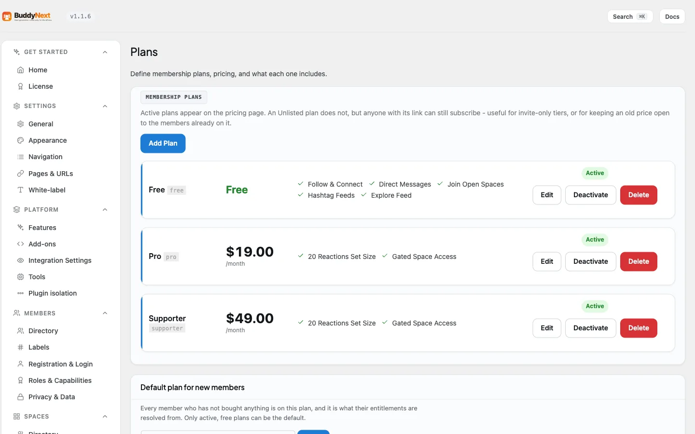
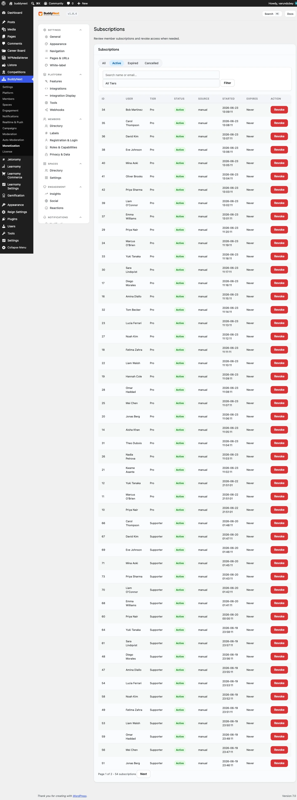

# Membership Tiers

Membership tiers are the plans, free or paid, that you offer your community. Each tier carries a price, a billing schedule, and a set of perks (the features and limits it unlocks), and members subscribe to a tier to get what it includes.







> **Before you start:** Membership tiers come with BuddyNext Pro. You need BuddyNext Pro active, and to take real payments you also need a payment gateway connected (see Requirements below). Even without a gateway you can still create tiers and grant access by hand, which is handy while you set things up.

## Why use it

Turning your community into a place people happily pay for is one of the most rewarding things you can do as an owner, and membership tiers are how you do it without leaving WordPress. You define the offer once, members choose the plan that fits them, and everyone gets a clear deal: pay this, get that.

Use tiers when you want to:

- Charge for access to premium areas of your community (see Gating Spaces).
- Offer a paid plan that lifts limits free members hit - more spaces they can create, more pinned posts, larger group messages.
- Run a free plan and one or more paid plans side by side, so members can self-upgrade when they need more.
- Sell a one-time pass or a recurring monthly or yearly subscription, with an optional free trial.

For the member, a tier is a clear promise. For you, it is a single place to define the offer, see who is subscribed, and step in when you need to extend or revoke access. The same tier definition drives the pricing page members see, the access checks across the community, and the reports you review.

## How it works (for members)

Members never touch the admin. They see two surfaces, and BuddyNext creates both for you automatically - you do not have to build them by hand. (Both were reworked in 1.0.4.)

- **The pricing page** - a normal, editable WordPress page at `/membership-plans/` by default. It carries the pricing shortcode, and because it is a real page you can restyle the plan showcase with the editor you already use: add a hero, testimonials, an FAQ, anything.
- **Settings > Membership** - the member's own billing area, at `/settings/membership/`, sitting alongside their notification settings.

You can rename the pricing slug, or point it at a different page, from Settings → Pages & URLs. The default slug avoids the bare `/membership/` path, which other plugins sometimes claim. If the page is ever deleted, BuddyNext recreates it on the next admin screen load while Monetization is on. The billing area is a settings tab rather than a page, so it needs no Pages & URLs row.

### View the plans and subscribe

The pricing page lists every active plan with its name, description, price, and billing interval. Each paid plan has its own button that starts checkout; the free plan is marked as the member's current plan. The button submits a standard form, so the buy flow works even with JavaScript disabled. After a member completes checkout, they are returned to their Settings > Membership tab with a confirmation, and their subscription becomes active.

To show the pricing table somewhere else as well - a marketing landing page, for example - drop this shortcode on any page:

```text
[buddynext_membership_pricing]
```

### Manage their own plan (Settings > Membership)

The member's billing area shows their current plan, price and interval, status, and renewal date - plus, since 1.0.4:

- **Payment history** with a **downloadable invoice** for every charge, showing the 24 most recent.
- **Cancel** - protected by a proper confirmation dialog. Cancelling keeps access until the paid period ends; the plan shows as cancelling until then, and afterwards the member lands in a lapsed state (free plan) rather than being cut off mid-period.

To surface a compact version of this plan summary on another page, the shortcode remains available:

```text
[buddynext_my_membership]
```


## Setting it up (for owners)

Monetization is an optional layer and is off by default with Pro. You turn the whole layer on or off under Platform → Features ("Memberships & monetization"): while it is off, the pricing and My Membership pages, checkout, and gated content are all disabled; when you turn it on, the pages are created automatically.

All tier and subscription management lives in wp-admin under BuddyNext, in the Monetization section. You manage plans, review subscriptions, issue coupons, configure the upgrade prompt and connect gateways across five tabs: Plans, Subscriptions, Coupons, Paywall and Payment Gateways. (Paywall is covered in Gating Spaces, coupons and tax in Coupons and Tax, and gateways in Payment Gateways.)

### Create a tier

Open the Plans tab and choose Add Plan. A tier is defined by three groups of settings: plan details, pricing and billing, and perks.

#### Plan details

| Setting | What it does | Default |
|---|---|---|
| Plan Name | The display name members see on the pricing page. Up to 120 characters. | (empty - required) |
| Slug | A short, unique identifier for the plan, using lowercase letters, digits, and hyphens. It is fixed once the tier is created, so choose it with care. | (empty - required) |
| Description | A short summary shown under the plan name on the pricing page. | (empty) |
| Status | Controls whether the plan is live. Only Active plans appear on the pricing page. Options: Active, Inactive, Archived. | Inactive |
| Sort Order | Orders plans on admin and pricing surfaces. Lower numbers appear first. | 0 |

#### Pricing and billing

| Setting | What it does | Default |
|---|---|---|
| Price | The plan price. Set to 0 for a free plan. | 0.00 |
| Currency | The three-letter ISO 4217 currency code (for example USD, EUR, GBP). | USD |
| Trial Days | Length of a free trial in days. Set to 0 to disable the trial. | 0 |
| Billing Type | Whether the plan bills repeatedly or once. Options: Recurring, One-time. | Recurring |
| Billing Interval | How often a recurring plan bills, or whether it is a single charge. Options: Monthly, Yearly, Once. | Monthly |
| This is a free plan | Marks the plan as free and not purchasable through checkout. Use this for the base plan members start on. | Off |

> **Tip:** Give your community one tier with the "free plan" box checked and name it "free". BuddyNext treats the free tier as the baseline for every member who has not bought anything, so its perks define what unpaid members can do. Set it up deliberately - it shapes the experience for most of your community.

#### Perks

Perks are the features and limits a plan grants. They are grouped in the form (Social, Limits, Content, Spaces, Messaging, Profile, Search, Analytics, Discovery), and each entry is either a toggle (on or off) or a numeric cap.

- A toggle perk turns a capability on or off for subscribers of that plan, for example View Protected Content or Gated Space Access.
- A numeric perk sets a cap, for example how many spaces a member can create or how many posts they can pin. A value of 0 means unlimited.

Anything you leave unchecked or unset falls back to the standard default, so you only need to change the perks that differ from the baseline.

The full list of perks:

| Group | Perk | Type | Default |
|---|---|---|---|
| Social | Follow & Connect | Toggle | On |
| Social | Direct Messages | Toggle | On |
| Social | Join Open Spaces | Toggle | On |
| Social | Hashtag Feeds | Toggle | On |
| Social | Explore Feed | Toggle | On |
| Limits | Spaces Created | Number | 3 |
| Limits | Custom Profile Fields | Number | 5 |
| Limits | Pinned Posts | Number | 1 |
| Limits | Group DM Size | Number | 1 |
| Limits | Reactions Set Size | Number | 6 |
| Content | Scheduled Posts | Toggle | Off |
| Content | View Protected Content | Toggle | Off |
| Spaces | Gated Space Access | Toggle | Off |
| Messaging | Group Direct Messages | Toggle | Off |
| Messaging | Real-time Messaging | Toggle | Off |
| Messaging | Message Anyone (bypass relationship policy) | Toggle | Off |
| Profile | Advanced Profile Fields | Toggle | Off |
| Search | Saved & Advanced Searches | Toggle | Off |
| Analytics | Personal Analytics | Toggle | Off |
| Discovery | AI Discovery | Toggle | Off |

> **Note:** The Gated Space Access perk lets a subscriber into any gated space in one purchase, regardless of which specific tier each space requires. See Gating Spaces.

> **Note:** There is no perk for the activity feed itself, and there will not be one. The feed is the community: a member on a plan with the feed switched off would land on the home page of your site with nothing to read and no way to fix it. That is a dead end, not a paywall. Every perk above leaves the member with the community still in front of them and a clear upgrade path. If an old plan of yours still has a saved Activity Feed value from an earlier release, it is simply ignored - nobody's feed is broken by it and there is nothing for you to clean up.

### Activate, edit, and remove a tier

Each plan card on the Plans tab carries the controls you need:

- Activate / Deactivate - flips a plan between Active and Inactive without editing it. Only Active plans show on the pricing page. Archived plans cannot be toggled this way; edit them to change status.
- Edit - opens the full form to change name, description, pricing, status, sort order, and perks. The plan's identifier is fixed and shown read-only.
- Delete - removes the plan permanently. Any active subscriptions on that plan are cancelled at the same time, so members lose access cleanly; cancelled and expired records are kept for your billing history.

#### The four statuses

| Status | On the pricing page? | Can someone subscribe? |
|---|---|---|
| **Active** | Yes | Yes |
| **Unlisted** | No | **Yes**, with the link |
| Inactive | No | No |
| Archived | No | No |

**Unlisted (1.1.5) is a live plan that is simply not advertised.** It does not appear on the pricing page, but anyone who has its link can still subscribe and be charged - so treat the link as the offer. Use it for a negotiated rate, a legacy price you are honouring, a partner tier, or a plan you are testing before announcing.

The plan's own edit screen shows the link to share. Members already on the plan keep it whether it is Active or Unlisted, so moving a plan to Unlisted quietly closes it to new sign-ups without disturbing anyone who already pays for it.

The pricing page will render an unlisted plan when the link names it explicitly (`?plan=<id>`), and only that one - every other unlisted plan stays hidden, and a visitor without the link sees nothing extra.

> **It is not a way to hide a plan.** An unlisted plan is live and taking money. If you want a plan to stop selling, set it Inactive.


### Review and manage subscriptions

The Subscriptions tab is your record of who has access. It lists each subscription with the member, the tier, the status, the source (how it was created), the start date, and the expiry.

- Filter by status - switch between All, Active, Expired, and Cancelled.
- Filter by tier - narrow the list to one plan.
- Revoke - on an active subscription, immediately ends access. The record moves to Expired.
- **Export to CSV (1.1.5)** - downloads the list carrying whichever filters are on screen, so you export what you are looking at rather than everything. The Orders view has the same button.

A subscription's source tells you how it was created: a gateway name (such as Stripe) for a paid purchase, or Manual for access you granted outside checkout. A membership granted by another system - WooCommerce, Paid Memberships Pro, or any integration that uses the source contract - is named as that source and is deliberately **not** counted as revenue this site collected.

#### Money received, not just projected (1.1.5)

The Subscriptions tab shows a **Received, 30 days** figure alongside MRR and ARR, one per currency. The distinction matters: MRR and ARR are projections of what recurring plans should bring in, while Received is money that actually arrived. A month with failed payments, refunds or a batch of externally-granted memberships will show the two diverging, and that gap is the number worth looking at.

#### One member's payment history (1.1.5)

The edit-member screen carries that member's recent payments and links through to their full order history, so a support question about a charge does not mean searching the Orders table by hand.

> **Note:** Subscriptions expire automatically. A daily background job flips any subscription whose expiry date has passed to Expired and re-locks the content it unlocked. Subscriptions with no expiry date never time out.

#### Extending a subscription

There is no single "extend" button in the Subscriptions table. A subscription's expiry date is set by the source that created it:

- Gateway subscriptions (such as Stripe) extend themselves. When the next payment goes through, the expiry date moves to the new period end and the status stays Active.
- Manual access can be extended by granting it again the same way you first granted it, which issues a fresh subscription period.

So extending access is a matter of the next successful payment or a renewed grant, not a date you edit by hand in this table.

### The printable invoice

Every charge in a member's payment history has a printable invoice behind it. The member opens it from Settings > Membership and prints it or saves it as a PDF.

The invoice brands itself from settings you have probably already filled in:

- **Your logo.** It uses the logo from **Settings > Appearance** - the same one your community's HTML emails use. Set it once and it appears on both. If you have not set a logo, the invoice prints your site name as a wordmark instead, so it never looks unfinished.
- **Your brand colour.** The accent on the invoice is your site's brand colour, also from Settings > Appearance.

Two things about the invoice are worth knowing up front:

- **It does not follow dark mode, on purpose.** An invoice is a document headed for a printer or a PDF, not a screen you scroll. A dark invoice prints as a black page and wastes a cartridge. It is a deliberately light document on every theme, which is also why it looks identical no matter which theme your site runs.
- **Company details are added by a developer, not in a settings field.** Businesses need very different things on an invoice - a registered company address, a VAT or GST number, payment terms, a legal footer - and no two countries agree on the set. Rather than grow a settings screen full of fields most owners would leave blank, BuddyNext exposes the invoice's logo, seller details, footer, colours, and title as filters your developer can set in a few lines. Copy-and-paste snippets for all five are in the developer guide, under [Pro and Integration Hooks](../developer-guide/33-hooks-pro-and-integration.md). Hand that page to whoever maintains your site and the job takes a couple of minutes.

### How plans decide who gets which Pro features

This is the part owners most often get surprised by, so it is worth reading once carefully.

Perks are not only about *paid* plans. Once you pick a **default plan** - the plan a member is on when they have not bought anything - that plan decides what a non-paying member gets. Any Pro perk the default plan does not grant becomes a paid perk.

That is the whole point of a membership system, but it has a consequence worth stating plainly: **turning memberships on can take Pro features away from members who had them.** Scheduled posts, advanced profile fields, saved searches, personal analytics, extra profile pins, and custom reactions are all perks. If your default plan does not include them, your free members no longer have them.

The three states, in plain terms:

| Your setup | What members get |
|---|---|
| Memberships off (the default) | Every Pro feature works for every member. No plan, no perks, no gates. |
| Memberships on, but you have not chosen a default plan | Still nothing is enforced. Plans exist but do not gate anything yet, and an admin notice tells you so. Nothing is taken away from anyone. |
| Memberships on, and you have chosen a default plan | The default plan is now the floor. Members with no subscription get exactly what it grants, and nothing else. |

The shipped **Free** plan is a starting point, not a neutral one. It grants the social basics and modest limits (3 spaces, 5 custom profile fields, 1 pinned post, 6 reactions), and it deliberately does *not* grant the premium perks. That is a sensible free tier if you are selling upgrades. It is the wrong choice if you only turned memberships on to gate one space and did not intend to take anything else away.

> **Tip:** Before you choose a default plan, open its perk list and read it as your free members will experience it. If you want memberships purely to sell access to one thing, edit your default plan to grant everything *except* that thing, rather than accepting a free tier that quietly withdraws five features nobody asked you to withdraw. Site administrators are exempt from all of this, which is exactly why it is easy to miss - it will look perfect while you test it and be wrong for everyone else.

### Settings reference

The tier and subscription screens above have no separate options - everything is stored on the tier itself. The one shared settings group is the paywall prompt, documented in Gating Spaces.

### Entitlements that explain themselves (1.0.4)

Every entitlement row in the plan editor carries a one-line explanation of what granting it does - "Members can enter spaces gated to paying plans", "How many spaces a member on this plan can create" - directly under its toggle or limit. You configure plans without a reference manual open in the next tab.

## Good to know

- The plan's identifier is permanent. Pick it carefully when you create a tier; you can rename the plan freely afterwards, but its underlying identifier stays fixed.
- Only Active plans are public. Inactive and Archived plans are hidden from the pricing page but kept in your admin, so you can prepare a plan before launch or retire one without deleting its history.
- The free plan is the baseline. For anyone without an active paid subscription, what they can do falls back to the free tier's perks, then to the standard default. Set the free tier up deliberately.
- Deleting a tier cancels its active subscriptions. This is on purpose, so no member is left holding access to a plan that no longer exists. Cancelled and expired records are kept for your reporting.
- One active plan per member. BuddyNext treats a member as being on their most recent active subscription when deciding what they can do.

## Free vs Pro

Membership tiers, subscriptions, the pricing and my-membership pages, content protection, and gated spaces are all BuddyNext Pro. BuddyNext Free has no paid-plan or subscription layer.

Within Pro, taking real payments needs a payment gateway. Pro is built to work with whichever gateway you connect, and a built-in Stripe integration is included. If a tier has no gateway price linked yet, the upgrade prompt falls back to a plain call-to-action link you set, so the offer still points members somewhere even before billing is fully connected.

## Requirements

- BuddyNext Pro active alongside BuddyNext.
- A connected payment gateway (the included Stripe integration, or another connected gateway) to charge members through checkout. Without one, you can still define tiers and grant access by hand while you finish setting up.
