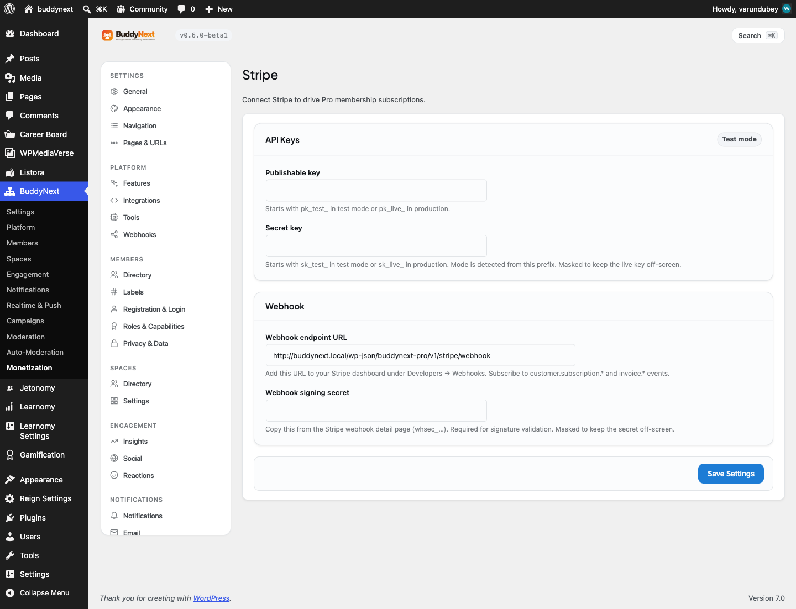

# Stripe Payments

Stripe is the payment gateway BuddyNext Pro uses to take real payments for memberships. You connect your Stripe account once, and from then on members can buy a tier with a card, manage their own billing, and have their access kept in sync automatically as payments succeed or fail.

> **Before you start:** BuddyNext is built to work with whichever gateway you connect. Stripe is the live gateway available today, and a built-in Test gateway ships so you can try the checkout flow without real money. More gateways are planned. This page covers Stripe; it does not enable WooCommerce or PayPal.

## Why use it

Membership tiers and gated spaces define *who* gets access. Stripe is what turns that into income, and it takes most of the hard work off your plate. With Stripe connected, a member who hits a paywall can pay on the spot and get in immediately, with no admin in the loop.

For the owner, Stripe handles the tricky parts of taking money: card entry, fraud checks, receipts, renewals, retries on failed cards, and refunds. BuddyNext keeps each member's subscription and access current alongside Stripe, so a lapsed card automatically marks the member past due and a cancellation re-locks the content. You set a price once on the plan, and BuddyNext sets up the matching product and price in Stripe for you.

For the member, it is the familiar Stripe checkout plus a self-service billing page where they can update their card, switch plans, cancel, and download invoices without ever sending you a support ticket.

## How it works (for members)

A member never sees keys or settings. Their flow is:

1. They reach a paywall - on a gated space or a locked post - and choose to upgrade.
2. They are taken to Stripe Checkout, the hosted payment page, where they enter card details.
3. On success, Stripe sends BuddyNext a confirmation and access opens right away. The member lands back on your site.
4. Later, a returning subscriber can open the billing portal to update their card, change plan, cancel, or view past invoices.

Renewals happen on their own. Each time Stripe charges the card successfully, the member's access is extended to the new period end. If a charge fails, the member is marked past due until the card is fixed; if they cancel, access is removed at the gate.

## Setting it up (for owners)

### Requirements

- A Stripe account.
- Your Stripe publishable key and secret key (both found in your Stripe dashboard).
- A webhook added in your Stripe dashboard that points back to BuddyNext (covered below). This step is required - without it, Stripe payments will not sync access back to your members.
- At least one membership tier with a price set on it (see Membership Tiers and Gated Spaces).

### Step 1: Enter your keys

Open BuddyNext settings and go to the Monetization section, Stripe tab. Paste your publishable key and secret key, then save.

| Setting | What it does | Default |
|---|---|---|
| Publishable key | Your Stripe publishable key. Stripe gives you a test version while you are setting up and a live version once you are ready. This one is safe to be public; it is used to load the card form. | Empty |
| Secret key | Your Stripe secret key. Like the publishable key, it comes in a test and a live version. BuddyNext keeps it masked on screen. Whether you are in test or live mode is detected automatically from this key. | Empty |
| Webhook signing secret | A short secret Stripe gives you when you create the webhook in Step 2. It lets BuddyNext confirm that incoming updates genuinely came from Stripe. Kept masked on screen. | Empty |

> **Note:** Test versus live mode is detected automatically from your secret key, so there is no separate switch to flip. Paste your live key and you are in live mode; anything else is treated as test mode. The Stripe tab shows a badge telling you which mode is active, so you always know whether you are taking real payments.

### Step 2: Add the webhook in Stripe

A webhook is how Stripe tells your site when a payment succeeds, renews, or fails, so access stays in sync. The Stripe tab shows a webhook address for you to copy. In your Stripe dashboard, under Developers then Webhooks, add a new endpoint and paste in that address.

When Stripe asks which events to send, choose the subscription and invoice events. After Stripe creates the endpoint, it shows you a signing secret - copy that back into the Webhook signing secret field on the Stripe tab and save.

> **Warning:** Until the webhook is set up and its signing secret is saved, payments will go through in Stripe but access will not reach your members. Always finish the webhook step before going live.

### Step 3: Price your tiers

You set the price on the membership plan itself - there is no Stripe price to copy across. When a tier is ready to sell, BuddyNext sets up the matching product and price in your Stripe account from the plan's price, currency, and billing interval, and remembers it so it is only created once. If that price is later removed in Stripe, BuddyNext recreates it on the next checkout.

This keeps test and live separate: your test price and your live price are tracked on their own, so switching from test keys to live keys creates a fresh live price without disturbing your test setup.

## How a member's access stays in sync

Once the webhook is connected, BuddyNext keeps each member's access current automatically as their Stripe subscription changes. You do not manage any of this by hand:

- When a member subscribes (or their subscription is updated), BuddyNext records it and grants the tier's access while the subscription is active or in its trial.
- When a subscription is cancelled, BuddyNext removes the tier's access and re-locks gated spaces and protected content.
- When a renewal payment succeeds, BuddyNext extends access to the new billing period - this is how renewals keep access alive.
- When a payment fails, BuddyNext marks the member past due so you can see who needs to fix their card.

BuddyNext links each Stripe customer to the matching member on your site. The first time it sees a new customer, it matches them by email, so every update after that resolves to the right member instantly.

### Hosted checkout

When a member buys a tier, BuddyNext creates a Stripe Checkout session and sends them to Stripe's hosted payment page. The session carries the tier and member identity so the webhook can grant the right access on completion. Promotion codes are allowed at checkout, so any coupons you set up in Stripe work out of the box. After paying, the member is returned to your site.

### Customer billing portal

Returning subscribers can open the Stripe billing portal from your site. The portal is Stripe's own self-service page where members update their card, switch plan, cancel, and view invoices. BuddyNext generates a fresh, single-use portal link each time it is requested.

## Good to know

- **A few things need to be in place before the live path works.** Stripe keys, the webhook plus its signing secret, and a priced tier all have to be set up. If any is missing, the paywall falls back to a plain call-to-action or a friendly "not configured" notice rather than a broken checkout. This is expected, not a fault.
- **An expired Pro license never blocks Stripe.** A Pro license controls update downloads only; your payment features keep working regardless.
- **The card form loads from Stripe.** As Stripe's terms require, the card form comes straight from Stripe's own servers. Nothing card-related is ever stored on your site.
- **Test or live is driven entirely by your keys.** There is no separate "live mode" switch to forget. Swap in live keys and you are live; the mode badge on the Stripe tab confirms it.
- **Stripe never flags your site as failing.** Stripe sends many kinds of updates; BuddyNext quietly accepts the ones it does not need, so your webhook always reports healthy.

## Free vs Pro

Membership gating exists at the model level in the platform: a space can require an ability, and the paywall can point members to an external page to upgrade. Stripe payments - taking the card, hosted checkout, the billing portal, automatic price provisioning from the plan, and the subscription lifecycle synced from Stripe webhooks - are part of BuddyNext Pro. See Membership Tiers and Gated Spaces for how access is defined, and Content Protection for locking individual posts and pages behind the same memberships.
