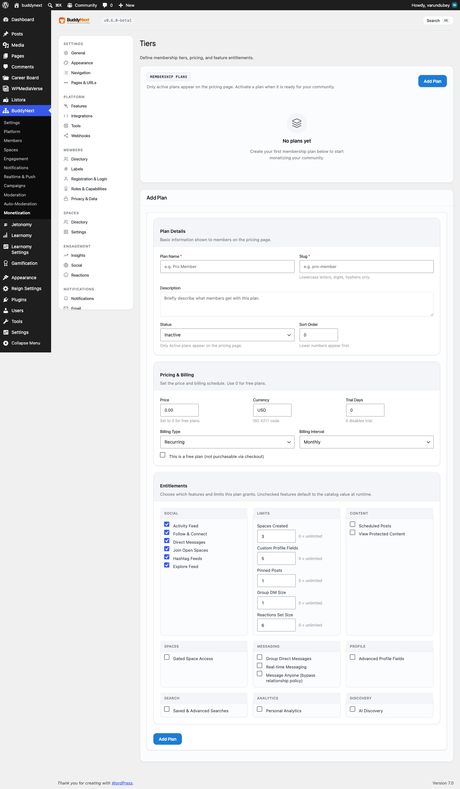

# Content Protection

Content Protection locks individual posts, pages, and even sections inside a page behind membership. Non-members see a short teaser and a friendly locked card inviting them to join; members with the right plan see the full content.




> **Before you start:** Content Protection comes with BuddyNext Pro and uses the same memberships as your spaces, so set up at least one membership tier first (see Membership Tiers).

## Why use it

Gated spaces let you sell access to a whole community area. Content Protection lets you earn from a single piece of content - one premium article, one resource page, one paragraph of a tutorial - without moving it into a space. That is often a more natural thing to sell: members pay for the specific thing they want to read.

For the owner, this turns ordinary WordPress posts and pages into paid content with almost no effort. You write as usual, flip one toggle (or wrap a section in a shortcode), and the same memberships that power your spaces now also unlock that content. There is nothing new for members to learn - the access they already pay for opens the protected post.

For a member, the value is clear right at the lock: a readable teaser plus a single button to become a member. They are never shown a blank page or a dead end.

## How it works (for members)

When a member or visitor opens protected content without the required plan:

1. They see a teaser - the first part of the content, roughly the first forty words, as plain text.
2. Below the teaser, a locked card explains the content is for members and shows a call-to-action button to upgrade.
3. After they join the right plan, the same page shows the full content with no teaser and no card.

Logged-out visitors are treated as non-members and see the teaser plus the locked card. Members who hold the required plan, and site administrators, always see the full content.

For inline protection (a locked section inside an otherwise public page), only the wrapped section is replaced with the locked card. The rest of the page reads normally.

## Setting it up (for owners)

There are three ways to protect content, from whole-post to inline to a global default for the call-to-action.

### Lock a whole post or page

Mark the post or page as members-only. Once flagged, anyone without the required plan sees the teaser and locked card in place of the full content; members see it in full. The teaser is built automatically from the start of your content, so you do not write a separate excerpt.

### Lock a section inside content

To gate only part of a post, page, widget, or page-builder block, wrap that part in the members-only shortcode:

```text
[buddynext_members_only]
Premium content goes here.
[/buddynext_members_only]
```

Members see the wrapped content; everyone else sees the locked card in its place. To require a specific plan, name it with the `plan` attribute:

```text
[buddynext_members_only plan="premium"]
Premium content goes here.
[/buddynext_members_only]
```

When `plan` is set, the section unlocks for members who hold the general members-only access or who are subscribed to that named plan. Use the plan's slug as it appears in your membership tiers.

### The locked card and global call-to-action

The locked card non-members see has a heading, a short note, and a call-to-action button. The button's link and label are shared with the space paywall, so you set them once and they apply everywhere content is locked.

| Setting | What it controls | Default |
|---|---|---|
| Call-to-action URL | Where the locked card's button sends non-members to upgrade. Shared with the space paywall. | Your site's `/membership/` page |
| Call-to-action label | The text on the locked card's button. Shared with the space paywall. | "Become a Member" |

> **Tip:** Point the call-to-action URL at the page where members choose and buy a plan, so a non-member who hits a locked post can subscribe in one click. With Stripe connected, that page is where they pay. See Stripe Payments.

## Good to know

- **The teaser is plain text.** Shortcodes and HTML are stripped from the teaser, and it ends with an ellipsis when the content runs longer than the teaser length. If the post has no readable text, no teaser is shown - just the locked card.
- **Admins and entitled members are never blocked.** Protection only ever changes what non-members see, so you can always preview the full content while logged in as an administrator.
- **Editing is unaffected.** Protection applies on the public side only; it does not alter the post editor or admin screens.
- **One membership, many surfaces.** The same plan that opens a gated space also unlocks protected posts and inline sections, so members do not buy access twice.
- **The card matches your paywall.** The locked card reuses the same styling as the space paywall, so locked posts and gated spaces look consistent.


## Free vs Pro

Content Protection - the members-only post toggle, the `[buddynext_members_only]` shortcode, the locked card, and the shared call-to-action - is part of BuddyNext Pro. It builds on the same memberships as gated spaces, so see Membership Tiers and Gated Spaces for how access is defined and Stripe Payments for how members pay to unlock it.
