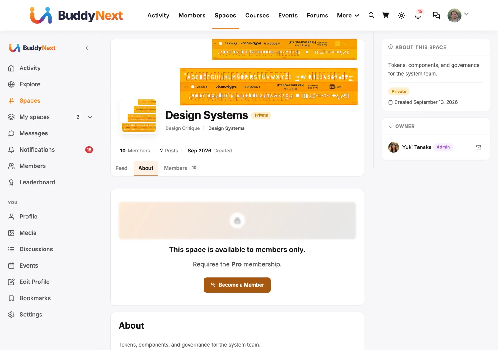
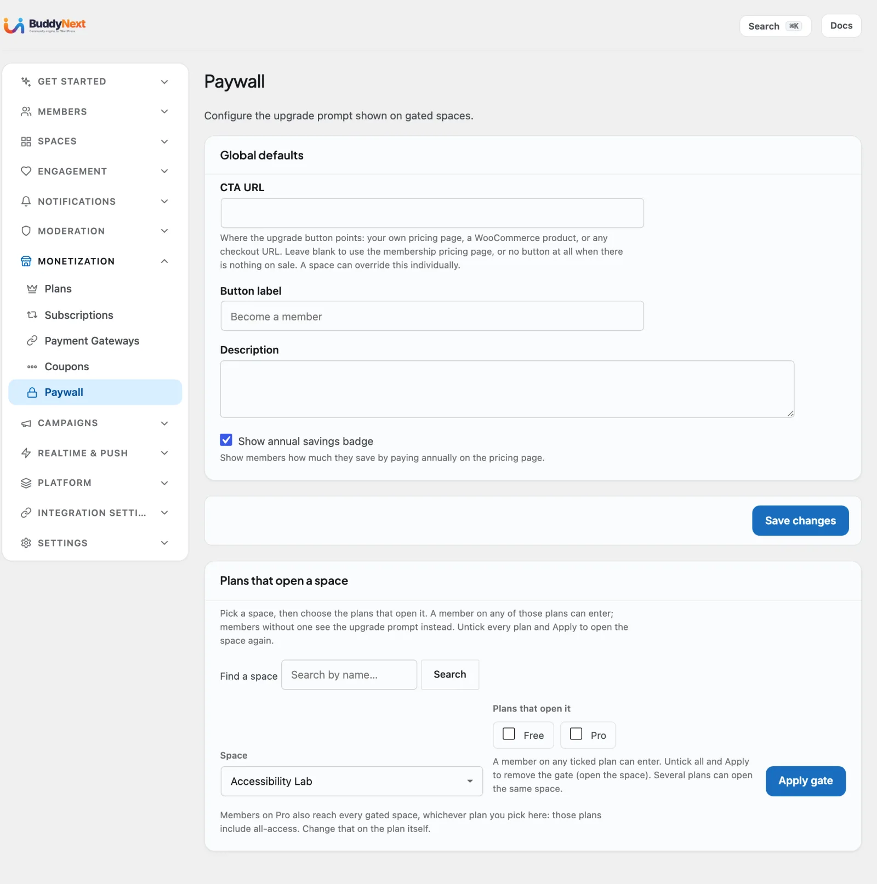

# Content Protection

Content Protection locks individual community posts, and sections inside any page, behind membership. Non-members see a short teaser and a friendly locked card inviting them to join; members with the right plan see the full content.





> **Before you start:** Content Protection comes with BuddyNext Pro and uses the same memberships as your spaces, so set up at least one membership plan first (see Membership Plans).

## Why use it

Gated spaces let you sell access to a whole community area. Content Protection lets you earn from a single piece of content - one premium article, one resource page, one paragraph of a tutorial - without moving it into a space. That is often a more natural thing to sell: members pay for the specific thing they want to read.

For the owner, this turns a community post or a section of a page into paid content with almost no effort. You post as usual, choose **Members only** (or wrap a section in a shortcode), and the same memberships that power your spaces now also unlock that content. There is nothing new for members to learn - the access they already pay for opens the protected post.

For a member, the value is clear right at the lock: a readable teaser plus a single button to become a member. They are never shown a blank page or a dead end.

## How it works (for members)

When a member or visitor opens protected content without the required plan:

1. They see a teaser - the first part of the content, as plain text. For a community post the teaser is a share of the text (25% by default). For a locked page or shortcode section it is the first 40 words.
2. Below the teaser, a locked card explains the content is for members and shows a call-to-action button to upgrade.
3. After they join the right plan, the same page shows the full content with no teaser and no card.

Logged-out visitors are treated as non-members and see the teaser plus the locked card. Members who hold the required plan, and site administrators, always see the full content.

For inline protection (a locked section inside an otherwise public page), only the wrapped section is replaced with the locked card. The rest of the page reads normally.

## Setting it up (for owners)

There are three ways to protect content: a members-only community post, an inline section, and (for developers) a whole WordPress post or page. The call-to-action is shared.

### Lock a community post

A site administrator, or a moderator of the space being posted in, can lock a community post. In the post composer open the audience menu and choose **Members only** ("Non-members see a teaser and a join prompt"). Inside a space the composer shows a **Members only** lock button instead. Members who hold the **View Protected Content** perk on their plan, administrators, and the post's author see the full post. Everyone else sees a teaser and a join prompt.

| Setting | What it does | Default |
|---|---|---|
| Members-only teaser length (%) | How much of a locked post a non-member sees as a preview. Found under BuddyNext > Engagement > Social, in the Activity Feed section. Capped at 95. A post under 40 words shows no preview, only the lock notice. | 25 |

While memberships are off, every signed-in member has the View Protected Content perk, so a members-only post is visible to all of them. Pick a default plan that leaves the perk off to make it a real paywall (see Membership Plans).

### Lock a whole WordPress post or page

There is no checkbox on the WordPress post or page editor. A developer marks a post as protected with the `buddynextpro_content_is_protected` filter. Once marked, anyone without the perk sees the first 40 words and the locked card in place of the full content.

### Lock a section inside content

To gate only part of a post, page, widget, or page-builder block, wrap that part in the members-only shortcode:

```text
[buddynext_members_only]
Premium content goes here.
[/buddynext_members_only]
```

Members see the wrapped content; everyone else sees the locked card in its place. To require a specific plan, name it with the `plan` attribute:

```text
[buddynext_members_only plan="premium"]
Premium content goes here.
[/buddynext_members_only]
```

When `plan` is set, the section unlocks for members who hold the general members-only access or who are subscribed to that named plan. Use the plan's slug as it appears in your membership plans.

### The locked card and global call-to-action

The locked card non-members see has a heading, a short note, and a call-to-action button. The button's link and label are shared with the space paywall (Monetization > Paywall > Global defaults), so you set them once and they apply to locked pages and shortcode sections.

| Setting | What it controls | Default |
|---|---|---|
| Call-to-action URL | Where the locked card's button sends non-members to upgrade. Shared with the space paywall. | The membership pricing page (`/membership-plans/` by default) |
| Call-to-action label | The text on the locked card's button. Shared with the space paywall. | "Become a Member" |

The locked card reads "Members only" with the note "This content is available to members. Upgrade your plan to keep reading." A locked community post shows its own join prompt: its button always reads "Become a member" and goes to the same URL, and it is hidden when no plan is on sale.

> **Tip:** Point the call-to-action URL at the page where members choose and buy a plan, so a non-member who hits a locked post can subscribe in one click. With Stripe connected, that page is where they pay. See Stripe Payments.

## Good to know

- **The teaser is plain text.** Shortcodes and HTML are stripped from the teaser, and it ends with an ellipsis when the content runs longer than the teaser length. If the post has no readable text, no teaser is shown - just the locked card.
- **Access is the View Protected Content perk.** It is set per plan under Entitlements on the plan form.
- **Admins and entitled members are never blocked.** Protection only ever changes what non-members see, so you can always preview the full content while logged in as an administrator.
- **Editing is unaffected.** Protection applies on the public side only; it does not alter the post editor or admin screens.
- **One membership, many surfaces.** The same plan that opens a gated space also unlocks protected posts and inline sections, so members do not buy access twice.
- **The card matches your paywall.** The locked card reuses the same styling as the space paywall, so locked posts and gated spaces look consistent.


## Free vs Pro

The members-only community post, its teaser, and the **Members only** composer choice are part of free BuddyNext; in Free a locked post is open to any signed-in member. Pro turns that into a paid gate: the View Protected Content perk, the `[buddynext_members_only]` shortcode, the locked card for pages, and the shared call-to-action. It builds on the same memberships as gated spaces, so see Membership Plans and Gated Spaces for how access is defined and Stripe Payments for how members pay to unlock it.

## Related

- [Membership Plans](01-membership-plans.md) - define the plans that unlock protected content.
- [Gated Spaces](02-gated-spaces.md) - lock a whole space instead of a single post.
- [Stripe Payments](03-stripe-payments.md) - how members pay to unlock protected content.
