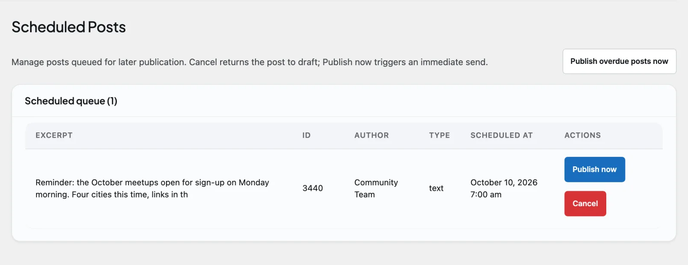

# Scheduled posts

Scheduled posts let a member write something now and have it publish automatically at a future date and time. The post stays out of every feed until its moment arrives, then goes live on its own. Scheduled posts are a **free BuddyNext feature**. Pro adds an admin queue where you can review, publish early, or cancel anything that is waiting, and lets you make scheduling a membership plan perk.

## Why use it

People rarely have time to write at the exact moment something should go out. A community manager prepares the week's announcements on Monday morning. A creator drafts three posts in one sitting but wants them spaced across the week so the feed does not get a burst followed by silence. Someone wants a welcome message to land first thing in the morning, not at midnight when they finished writing it. Scheduling solves all of these: write when you have the time, publish when it has impact.

For an owner, scheduling is what makes a community feel consistently active without anyone having to be online around the clock. Content can be planned ahead, queued, and trusted to appear on time, so the feed keeps a steady rhythm instead of going quiet for days and then flooding. It also gives the people who run your spaces a way to coordinate launches, events, and recurring updates the way they would on any mainstream platform.

In free BuddyNext, the composer shows a "Schedule for later" clock, holds the post until its time, and publishes it on its own. Pro adds the management layer on top: an admin page that lists everything waiting across the whole community, owner-checked schedule and cancel endpoints, and the plan perk.

## How it works (for members)

### Schedule a post for later

In the post composer, open the schedule tool (the clock marked "Schedule for later") and pick a date and time. Write your post as normal and submit. Instead of going live, the post is parked with a scheduled status and is held back from every feed until the time you chose. You get a confirmation that the post has been scheduled.

The time you pick is the moment it publishes. Until then, nobody sees the post in the home feed, a space feed, or anywhere else, and the usual "new post" notifications do not fire. Those only go out when the post actually publishes, so followers and space members are notified at the right time, not when you queued it.

### When the post publishes

At the scheduled time, the post publishes on its own and behaves like any post made at that moment: it appears in the feed, counts toward the author, and triggers the normal new-post notifications. No further action is needed from the member.

### Change the time, or cancel

A member sees their own queued posts in the **Scheduled** tab on their own profile (only they can see it). From there they can move a post to a different time.

- **Reschedule.** Edit a post that is still waiting and the edit form offers a date and time control, prefilled with the slot it currently holds. Pick a new one and save. The post keeps its place in the queue at the new time. You can only move a post that has not published yet; once it is live, it is a normal post and the control is gone.
- **Cancel.** Cancelling a scheduled post does not delete it. It reverts the post to a draft and clears its scheduled time, so the content is preserved and can be scheduled again or edited later. There is no Cancel button on the member screens yet: the author's cancel is the Pro schedule endpoint (`DELETE /buddynext-pro/v1/posts/{id}/schedule`), and an owner or admin can cancel from the admin queue.

Only the author of a scheduled post can reschedule or cancel it.

> **Note:** Times are shown and entered in **your site's timezone**, not the timezone of whoever happens to be looking. The schedule controls name the zone in their label, so the time an author types is the time the post card shows back to them - no mental arithmetic, wherever in the world they are.

## Setting it up (for owners)

### The scheduled posts queue

Pro adds a **Scheduled Posts** admin page (BuddyNext > Campaigns > Scheduled Posts) that lists every post waiting to publish across the community, ordered by the soonest scheduled time first. For each post you see its ID, author, type, an excerpt, and the scheduled time shown in your site's timezone.

The queue gives owners three actions.

| Action | What it does |
| --- | --- |
| Publish now | Publishes that single post immediately, ahead of its scheduled time. It goes live and triggers the normal new-post signals. |
| Cancel | Reverts that post to a draft and removes it from the queue. The content is kept, not deleted. |
| Publish overdue posts now | Publishes every post whose scheduled time has already passed, in one click. Useful if you want to flush anything that is due right away rather than wait for the next automatic run. |

The only switch is **Scheduled posts** in the Features catalogue (BuddyNext > Platform > Features), which is on by default. Turn it off and the composer's clock is hidden, new posts can no longer be scheduled, and the Pro queue page and routes are removed. Posts already scheduled still publish. There is nothing else to configure.

The queue is **paginated at 50 posts a page**, with a prev/next pager and the full count in the heading, so the screen stays usable on a community with thousands of posts waiting.

> **Note:** Scheduling is a plan perk. If you have turned Memberships on **and** chosen a default plan, a member can schedule a post only if their plan grants Scheduled Posts (the shipped Free plan does not). With Memberships off (the default), every member can schedule. See Membership Plans.

### How posts publish on time

The community checks for due posts automatically and publishes any whose scheduled time has arrived, then fires the normal new-post notifications for each one. This runs in the background on its own, so a correctly scheduled post goes live on time without anyone touching the admin page. The "Publish overdue posts now" button is there for the moments you want to publish what is due immediately rather than wait for the next automatic check.

## Good to know

- A scheduled time must be in the future. If a member tries to schedule a post for a time that has already passed, the request is rejected and the post is not queued.
- Only the author of a scheduled post can cancel it. A member cannot cancel someone else's queued post. Owners and admins can still publish or cancel any post from the admin queue.
- Cancelling never destroys content. A cancelled scheduled post becomes a draft with its scheduled time cleared, so it can be rescheduled or edited.
- While a post is scheduled, it is hidden from every feed and its new-post notifications are suppressed. Both happen the moment it publishes, so members are not notified about a post that is not yet visible.
- Scheduled times are stored in UTC. The admin queue converts each one to your site's timezone, so you read it as a local time rather than raw UTC.
- If the queue is empty, the admin page shows a clear "No scheduled posts found" message rather than a blank table.

## Free vs Pro

Free BuddyNext includes the composer's schedule clock, the owner-only **Scheduled** profile tab, rescheduling from the post's edit form, and automatic publishing when the time arrives.

Pro adds:

- The admin **Scheduled Posts** queue listing every waiting post community-wide, paginated, with Publish now, Cancel, and Publish overdue posts now.
- Owner-checked schedule, reschedule, and cancel endpoints, with clear errors for a past date, a non-owner request, or a post that is already published.
- The plan perk described above.

## Related

- [Post Composer](../community/02-post-composer.md) - the schedule clock in the composer this builds on.
- [Activity Feed](../community/01-activity-feed.md) - where a scheduled post lands when it publishes.
- [Membership Plans](01-membership-plans.md) - scheduling can be a plan perk.
