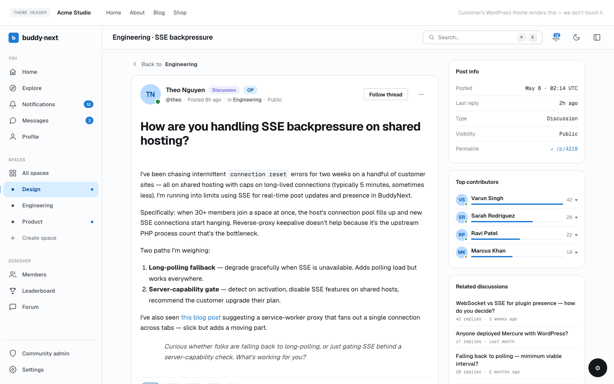
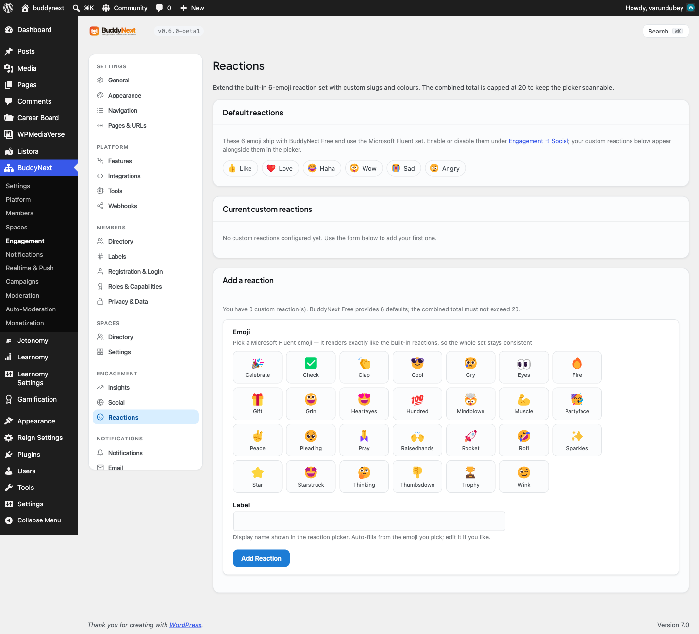

# Custom Reactions

Custom Reactions let you add your own emoji to the six reactions that ship with BuddyNext Free. You pick an emoji, give it a label, and it appears in the reaction picker right alongside the built-in set.

> **Before you start:** Custom Reactions come with BuddyNext Pro. With Pro active, you add and manage them from the Reactions settings screen described below.

## Why use it

Reactions are how members respond to a post without writing a comment, and the default six (the standard set every community starts with) cover most of what people want to say. But every community has its own personality and its own moments. A study group reacts differently than a gaming guild or a customer forum.

Adding a couple of well-chosen reactions lets your members express the things that matter in your space. A "celebrate" emoji for milestone posts, a "lightbulb" for a clever idea, a "thank you" for help freely given. These small touches make the feed feel like it belongs to your community rather than a generic template. Because every custom reaction uses the same Microsoft Fluent emoji set as the defaults, the whole picker stays visually consistent. Members do not see a jarring mix of mismatched icon styles.

Reactions are owner-curated on purpose. You decide which emoji are available, so the picker stays short, scannable, and on-brand instead of turning into an endless emoji keyboard.

## How it works (for members)

Members do not configure anything. Once you add a custom reaction, it shows up automatically in the reaction picker on every post:

1. A member opens the reaction picker on a post.
2. The picker shows the enabled default reactions plus every custom reaction you have added, each rendered as a Fluent emoji with its label.
3. The member selects a reaction, and the count for that reaction increments. Selecting a different one switches their reaction.

Custom reactions behave exactly like the built-in ones for counting, switching, and removal. They also work the same way in connected apps, so a member reacting from a mobile app gets the same custom set.

## Setting it up (for owners)

Open **BuddyNext** in wp-admin and go to **Settings - Reactions** (listed under the Advanced group). The screen has three parts: the default reactions, your current custom reactions, and the form to add a new one.

### Add a reaction

1. In the **Add a reaction** section, choose an emoji from the picker grid. The grid shows every available Fluent emoji minus the six defaults and any you have already used.
2. The **Label** field auto-fills from the emoji name you picked. Edit it if you want a different display name (for example, label the "party-popper" emoji as "Celebrate").
3. Select **Add Reaction**. The new reaction appears in the current custom reactions table and is live in the picker immediately.

### Manage existing reactions

The **Current custom reactions** table lists each reaction with its emoji and label. Each row has a **Remove** button (with a confirmation prompt) that deletes that reaction. There is no edit-in-place or drag-to-reorder. To change a reaction, remove it and add it again.

### The default reactions

The **Default reactions** section shows the six emoji that ship with BuddyNext Free, dimmed if they are currently turned off. These are managed in BuddyNext Free, not on this screen. To enable or disable them, follow the link to **Engagement - Social**. Your custom reactions appear alongside whichever defaults are enabled.

### Settings reference

The Add a reaction form has these inputs:

| Setting | What it does | Default |
|---|---|---|
| Emoji | The Fluent emoji shown in the picker. Chosen from a grid of available emoji (defaults and already-used emoji are excluded). | None - you must pick one |
| Label | The display name shown next to the emoji in the picker. Max 80 characters. | Auto-fills from the chosen emoji's name |

> **Note:** The total number of reactions (the six Free defaults plus your custom ones) is capped at 20. That leaves room for up to 14 custom reactions. The cap keeps the picker scannable so members are not faced with a wall of choices.

## Good to know

- **The cap is enforced.** Once the combined total reaches 20, no more custom reactions are merged into the picker. The Add a reaction hint always shows your current count and the limit.
- **You pick from a built-in emoji set.** The picker offers the Microsoft Fluent emoji that ship with BuddyNext. If every available emoji is already in use, the form tells you so. There is no free-text emoji or image upload.
- **No duplicates.** You cannot add an emoji that is already a built-in reaction, and you cannot add the same custom emoji twice. The form blocks both with a clear message.
- **Label is required.** An empty label is rejected, and so is a label over 80 characters.
- **Removing a reaction does not erase past reactions.** Reactions members already left are kept. Removing a custom reaction simply takes it out of the picker for future use.
- **Only admins can manage reactions.** Adding and removing custom reactions is limited to site administrators.

## Free vs Pro

The six default reactions, the reaction picker, and reaction counting are all part of BuddyNext Free. Enabling or disabling the defaults is also handled in Free under Engagement - Social.

Custom Reactions - adding emoji beyond the default six - is a Pro feature. Pro adds your custom reactions to Free's reaction list, so everything stays consistent across the website and any connected app.
