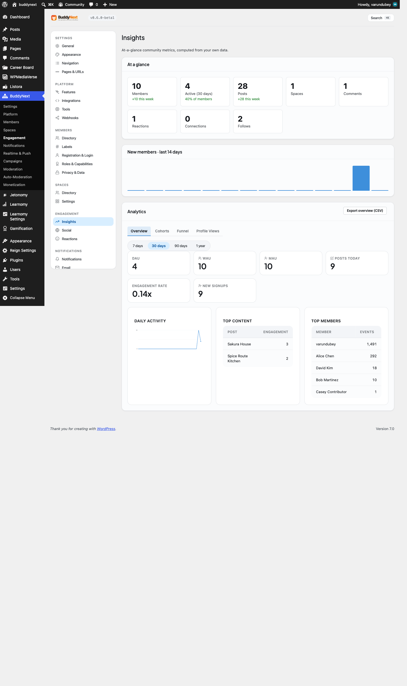

# Analytics Dashboard

The analytics dashboard is a Pro admin area that turns your community's activity into numbers you can read at a glance: how many people show up, what content lands, who your most active members are, and how your spaces are doing. It also gives each member a private "who viewed your profile" count, with an opt-out for people who would rather not be tracked.

## Why use it

Running a community without analytics means guessing. You can't tell whether last month's changes brought people back, which posts pulled comments and reactions, or which spaces are quietly dying. The dashboard answers those questions with real data from your own site, so your decisions about content, spaces, and outreach are grounded in what actually happened.

A few concrete situations it solves:

- You launched a new space and want to know whether anyone is posting in it or whether joins are stalling.
- You want to reward your most active members but don't know who they are.
- You changed your onboarding flow and want to see whether daily active users went up afterward.
- A member wants to know who has been looking at their profile, the way they would on a professional network.

The dashboard is read-only insight, not a control panel. It tells you what is happening so you can decide what to do next.

## How it works (for members)

Most of the dashboard is admin-only, but one piece is member-facing: profile views.

### Who viewed your profile

When Pro is active, a "who viewed your profile" panel appears on a member's own profile page. It is visible only to the profile owner - other people viewing the profile never see it.

The panel shows:

- A count of views in the last 7 days.
- A total view count.
- A short list of recent viewers, with a link to see the full list.

### Opting out of profile-view tracking

Any member can turn off profile-view tracking for themselves. When a member opts out, their visits are no longer counted toward other people's "who viewed your profile" totals, and they are excluded from the recent-viewers lists other members see.

> **Note:** The member opt-out is honored everywhere a member can see another member's viewers. Site administrators viewing the same data from the admin dashboard can still see the underlying counts, because that view is for site management rather than member-to-member visibility.

## Setting it up (for owners)

The dashboard lives under the BuddyNext admin menu as the Analytics page. It requires BuddyNext Free to be active, because the Analytics page is a sub-page of the Free admin menu and reads activity that Free records. Only users who can manage options (administrators) can open it.

### The views

The dashboard is organized into views you switch between at the top of the page.

| View | What it shows |
|---|---|
| Overview | Daily, weekly, and monthly active users (DAU / WAU / MAU) as stat cards, plus a member-growth table of new registrations over the last 30 days. |
| Content | Top content ranked by engagement (reactions plus comments). |
| Members | The most active members, ranked by how many tracked actions they have taken. |
| Spaces | Per-space health: joins, leaves, posts, and net member change over a recent window. |
| Cohorts | Retention grouped by when members joined, so you can see whether newer or older cohorts stay engaged. |
| Funnel | Step-by-step conversion through a sequence of actions (for example, register, then join a space, then post). |
| Profile Views | Profile-view data, including the administrator view that can look up any member's profile views. |

> **Note:** DAU, WAU, and MAU stand for daily, weekly, and monthly active users - the count of distinct members who took at least one tracked action in that window.

### Exporting to CSV

The Overview view has an Export CSV button. It downloads the member-growth data (date and new registrations) as a spreadsheet-friendly file, so you can keep records, chart it elsewhere, or share it with your team.

### Settings

The dashboard has no required configuration. It starts collecting and displaying data as soon as Pro is active. The only member-level control is the per-member profile-view opt-out described above, which members manage themselves.

| Setting | What it does | Default |
|---|---|---|
| Profile-view tracking (per member) | Each member can opt out of having their profile visits counted. Set by the member, not the owner. | On (visits counted) |

## Good to know

- **Empty state shows zeros.** On a brand-new site, or before any activity has happened, the stat cards read 0 and the tables show "no data" rows. This is expected, not a fault. Seed some activity (members logging in, posting, joining spaces) and the numbers populate.
- **Admin-only for site-wide views.** Every view except the member's own profile-view panel requires administrator access. Non-admins who try to reach the analytics data are refused.
- **Counts are distinct actors.** Active-user counts measure distinct members, so one member taking ten actions in a day still counts as one daily active user.
- **CSV export covers growth data.** The Export button downloads the member-growth series. It is a focused export of registrations over time rather than a dump of every view's table.
- **Data depends on activity being recorded.** Analytics is built from the events your community generates over time. The longer Pro has been active, the richer the history. It does not backfill activity from before it was installed.

## Free vs Pro

Analytics is a Pro feature in full. BuddyNext Free records community activity and powers the live surfaces members use, but the analytics dashboard - the DAU/WAU/MAU cards, content and member rankings, space health, cohorts, funnel, CSV export, and the member-facing profile-views panel - is part of Pro.
