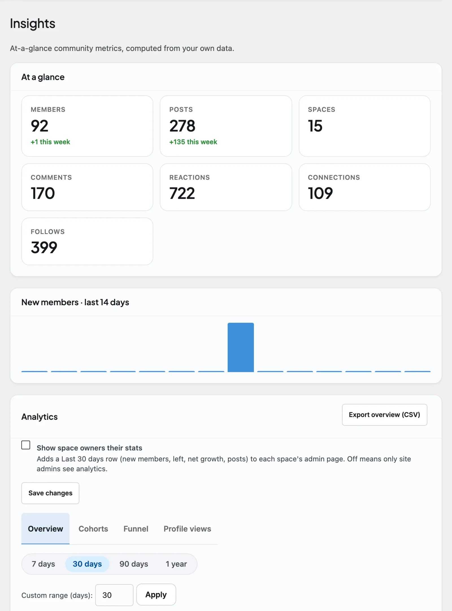

# Analytics Dashboard

The analytics dashboard is a Pro admin area that turns your community's activity into numbers you can read at a glance: how many people show up, what content lands, who your most active members are, and how your spaces are doing. It also gives each member a private "who viewed your profile" count, with an opt-out for people who would rather not be tracked.

## Why use it

Running a community without analytics means guessing. You can't tell whether last month's changes brought people back, which posts pulled comments and reactions, or which spaces are quietly dying. The dashboard answers those questions with real data from your own site, so your decisions about content, spaces, and outreach are grounded in what actually happened.

A few concrete situations it solves:

- You launched a new space and want to know whether anyone is posting in it or whether joins are stalling.
- You want to reward your most active members but don't know who they are.
- You changed your onboarding flow and want to see whether daily active users went up afterward.
- A member wants to know who has been looking at their profile, the way they would on a professional network.

The dashboard is read-only insight, not a control panel. It tells you what is happening so you can decide what to do next.

## How it works (for members)

Most of the dashboard is admin-only, but one piece is member-facing: profile views.

### Who viewed your profile

When Pro is active, a "who viewed your profile" panel appears on a member's own profile page. It is visible only to the profile owner - other people viewing the profile never see it.

> **Note:** This member-facing panel is a plan perk (Personal Analytics). If you have turned Memberships on **and** chosen a default plan, a member sees it only if their plan grants it. With Memberships off (the default), every member gets it. The admin analytics dashboard below is unaffected either way - it is yours, not a member perk. See Membership Plans.

The panel sits under the profile header and shows:

- A count of views in the last 7 days ("views this week").
- A total view count (the last 365 days).
- A row of up to five recent viewer avatars.

The panel stays hidden until the member has at least one view, so a new profile does not show an empty card. The "See all" link is not shown by default because there is no front-end page for the full list yet.

### Opting out of profile-view tracking

Any member can switch on **Hide my profile views** in their privacy settings (hint: "When on, your visits to other profiles are not recorded."). In practice the visit is still counted in the other member's totals, but the member's name and avatar are hidden: they show as "Someone" in the viewer list.

> **Note:** The opt-out is honored everywhere a viewer's identity could be shown, including the admin Profile views screen. Administrators see the counts, but never the name of a member who has opted out.

## Setting it up (for owners)

The dashboard lives inside the BuddyNext admin menu, on the Engagement → Insights tab - the analytics suite renders below the at-a-glance summary there. Analytics also has its own switch in the Features catalogue (on by default). Turning it off stops collecting events and hides both the dashboard and the member profile-views panel. It requires BuddyNext Free to be active, because the page is part of the Free admin menu and reads activity that Free records. Only users who can manage options (administrators) can open it. (The older standalone Analytics URL still works but redirects to the Insights tab.)

### The views

The dashboard is organized into views you switch between at the top of the page.

| View | What it shows |
|---|---|
| Overview | A time-window picker (7 days, 30 days, 90 days, 1 year) and stat cards: Active today (DAU), Active this week (WAU), Active this month (MAU), Posts today, Engagement rate, and New signups, each with a change against the previous period. Below them are a daily-activity chart and Top content (ranked by engagement - reactions plus comments) and Top members (ranked by tracked actions) tables. The figures refresh at most every few minutes. |
| Cohorts | Weekly cohort retention for the last 8 weeks: the share of each signup week that returned in later weeks. |
| Funnel | Step-by-step conversion over the trailing 30 days: Sign up, First post, Reaction received, First follow. Each step shows how many reached it, the drop-off, and the conversion. |
| Profile views | Daily profile views, top viewed profiles, top viewers, and how many members have opted out of being listed as viewers. |

> **Note:** Top content and top members appear as tables inside the Overview view, not as separate views. Per-space health metrics are not a dashboard view; they show as the "Last 30 days" row on a space's admin page when you switch on **Show space owners their stats**, and are also available through the REST API.

> **Note:** DAU, WAU, and MAU stand for daily, weekly, and monthly active users - the count of distinct members who took at least one tracked action in that window.

### Exporting to CSV

The exportable views each have an export button in the section header: **Export overview (CSV)**, **Export cohorts (CSV)** or **Export funnel (CSV)**. Overview exports the headline numbers, the daily active users, the new registrations per day, and the top content and top members for the selected time window. Cohorts exports the retention matrix, and Funnel exports the step-by-step conversion report. Profile views is not exportable. Each file is spreadsheet-friendly, so you can keep records, chart it elsewhere, or share it with your team.

### Settings

The dashboard has no required configuration. It starts collecting and displaying data as soon as Pro is active.

| Setting | Where | What it does | Default |
|---|---|---|---|
| Analytics | Features catalogue | Master switch for collecting events, the dashboard and the profile-views panel. | On |
| Show space owners their stats | Engagement → Insights, above the view tabs | Adds a "Last 30 days" row (new members, left, net growth, posts) to each space's admin page, for the people who manage that space. Off means only site admins see analytics. | Off |
| Hide my profile views | Each member's privacy settings | Hides the member's name from other people's viewer lists. Set by the member, not the owner. | Off |
| Data retention (days) | Free settings, Data retention section | How long analytics events are kept. | 365 |

## How long analytics data is kept

Analytics events are an append-only log, so they need pruning or they grow without limit. A background job trims them against the same **Data retention (days)** setting the rest of the suite honours (the default is 365 days), and it covers both the analytics events and the AI signal log. Switch off "Delete records after a set time" to keep everything forever, and the job stands down.

The job is always armed otherwise, including on sites that never switched on AI moderation - retention belongs to the data, not to whichever feature happens to read it.

**On a large community it now catches up (1.1.5).** Each run deletes in bounded batches, so no single statement holds a long table lock, but the per-run ceiling used to sit below the rate at which busy sites wrote new events - so the backlog grew every night and the prune could never reach it. A site with ten million aged rows would have needed years of nightly runs while still writing faster than it deleted. The ceiling is now high enough that a backlog drains in a few nights.

You do not need to do anything for this; it is a background job. It matters only if you were watching the analytics table grow and wondering why the nightly prune never seemed to help.

## Good to know

- **Empty state shows zeros.** On a brand-new site, or before any activity has happened, the stat cards read 0 and the tables show "no data" rows. This is expected, not a fault. Seed some activity (members logging in, posting, joining spaces) and the numbers populate.
- **Admin-only for site-wide views.** Every view except the member's own profile-view panel requires administrator access. Non-admins who try to reach the analytics data are refused. The space stats row is the one exception, and only when you opt in.
- **Counts are distinct actors.** Active-user counts measure distinct members, so one member taking ten actions in a day still counts as one daily active user.
- **CSV export is per view.** The export button downloads the active view's dataset - the overview figures for the selected time window, the retention matrix on Cohorts, or the funnel report on Funnel. Profile views is not exportable.
- **Data depends on activity being recorded.** Analytics is built from the events your community generates over time. The longer Pro has been active, the richer the history. It does not backfill activity from before it was installed.

## Free vs Pro

Analytics is a Pro feature in full. BuddyNext Free records community activity and powers the live surfaces members use, but the analytics dashboard - the DAU/WAU/MAU cards, content and member rankings, the space-owner stats row, cohorts, funnel, CSV export, and the member-facing profile-views panel - is part of Pro.

## Related

- [Community Insights](../getting-started/06-community-insights.md) - the free at-a-glance summary the dashboard renders below.
- [Membership Plans](01-membership-plans.md) - the member profile-views panel can be a plan perk.
