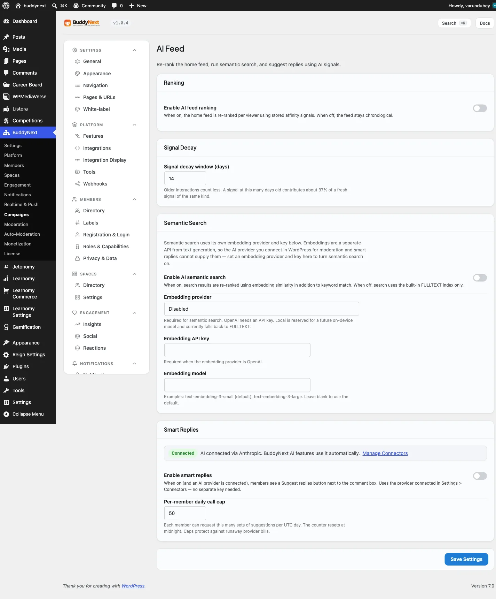
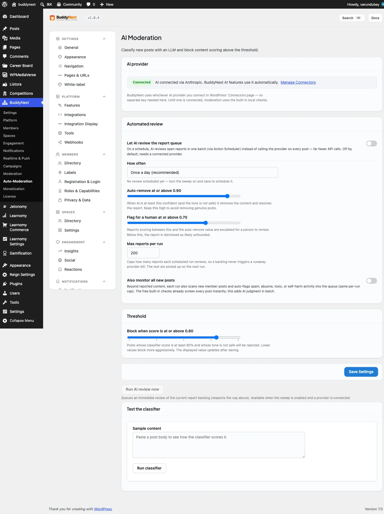

# AI Feed and Moderation

BuddyNext Pro adds three AI-assisted features that share one connection: AI feed ranking re-orders the home feed by how relevant each post is likely to be for the person viewing it, AI moderation scores new content for risk before it goes live, and smart replies offer a member ready-to-edit responses to a conversation. All three are off by default and need to be turned on and configured before they do anything. A fourth feature, AI semantic search, re-ranks search results by meaning. It is configured on the same screen as feed ranking.

## Why use it

A community feed in strict newest-first order buries good posts under whatever was published most recently. AI feed ranking looks at what a member has actually engaged with - the people they follow, the posts they react to, comment on, and bookmark - and lifts the posts they are most likely to care about toward the top, while still showing recent activity. Members see a feed that feels tuned to them instead of a firehose.

AI moderation helps you catch bad content earlier. Instead of waiting for a member to report spam, harassment, or toxic posts, the classifier scores new content as it arrives and can block the worst of it at submission time. That shortens the window where harmful content is visible and reduces the load on your human moderators.

Smart replies lower the barrier to participating. A member who is not sure how to respond gets a few short, on-topic suggestions next to the comment box, picks one, edits it if they want, and posts. This is most useful in larger communities where the conversation moves fast.

A few honest points before you enable any of this:

- AI is off by default. None of these features do anything until you turn on its switch in the Features catalogue and, for all but feed ranking, connect a provider.
- AI augments your team, it does not replace it. The classifier blocks or flags content based on a score, but it is not a substitute for human judgment, an appeals process, or your community guidelines. Treat it as a first filter.
- Feed ranking needs engagement history. On a brand-new community with no reactions, comments, or follows yet, there is little signal to rank with, so the ranked feed will look close to chronological until members start interacting.

## How it works (for members)

### A feed ranked for each member

When AI feed ranking is on, the home feed is re-ordered per viewer. BuddyNext records lightweight signals each time a member interacts - a reaction, a comment, a follow, or a bookmark - and weights them by how strong the signal is and how recent it is. A post the member is likely to care about, based on those signals, moves up the feed. Members do not configure anything; the ranking happens automatically and the feed still shows recent posts, just in a more relevant order.

Older interactions count for less over time. This is controlled by the signal decay window (see the settings table) so that a member's feed reflects their current interests, not what they engaged with months ago.

### Smart reply suggestions

When smart replies are on and a provider is connected, members see a "Suggest replies" button next to the comment box on a post. Selecting it returns up to three short suggestions based on the post and the most recent replies in the thread. The member picks one, edits it freely, and posts it like any other comment. Suggestions are advisory - nothing is posted automatically.

To keep usage and costs predictable, each member has a daily limit on how many times they can request suggestions. Once they reach it, the button reports that the daily limit is reached and resets the next day.

### Moderation that runs in the background

AI moderation is not something members interact with directly. When a provider is connected, new posts are scored for risk as they are submitted. Content that scores above your block threshold and is judged unsafe is stopped at submission, and the member is told their post could not be published - the same experience as hitting any other content rule. Everything else posts normally.

## Setting it up (for owners)

### Step 1: turn on the features and connect an AI provider

In the Features catalogue, turn on **AI suite** (feed ranking, semantic search and smart replies) and, separately, **AI moderation**. Both are off until you turn them on.

Smart replies and AI moderation use the AI provider you connect on WordPress' built-in Settings > Connectors page. You add your provider and API key there once; there is no separate API key field for them on the BuddyNext screens. The provider list is whatever WordPress offers there, not something BuddyNext chooses.

Semantic search is the exception: it needs its own embedding provider and key, set on the AI Feed screen (see below). Today OpenAI is the only working embedding provider.

> **Note:** The Connectors page is part of WordPress 7.0. Until you connect a provider there, smart replies stay hidden and AI moderation does not act on its own - new posts are not AI-blocked at submission and the scheduled review does not run - so it fails open and your community stays protected by the free Content Safeguards and your Auto-Moderation rules until a provider is connected. Feed ranking does not need a provider - it runs on your own community's engagement signals.

### Step 2: configure the AI Feed page

Open **Campaigns > AI Feed**. This page covers ranking, semantic search, and smart replies. The screen only appears when **AI suite** is on.

| Setting | What it does | Default |
|---|---|---|
| Enable AI feed ranking | When on, the home feed is re-ranked per viewer using stored affinity signals. When off, the feed stays chronological. | Off |
| Signal decay window (days) | How fast older interactions lose weight. A signal this many days old contributes about 37 percent of a fresh signal of the same kind. Clamped to 1-365. | 14 |
| Enable AI semantic search | When on, search results are re-ranked using embedding similarity in addition to keyword match. When off, search uses the built-in full-text index only. | Off |
| Embedding provider | The provider that powers semantic search: Disabled, OpenAI, or "Local (reserved: falls back to FULLTEXT)". OpenAI needs an API key. Local is reserved for a future on-device model and currently falls back to standard keyword search. | Disabled |
| Embedding API key | The key for your embedding provider. Required when the provider is OpenAI. Stored masked - leave the dots in place to keep the existing key. | (empty) |
| Embedding model | Which model to use, if you want a specific one. Leave blank to use the default, text-embedding-3-small. | (empty) |
| Enable smart replies | When on, and a provider is connected, members see a "Suggest replies" button by the comment box. | Off |
| Per-member daily call cap | How many sets of suggestions each member may request per UTC day before the button reports the limit is reached. Resets at midnight UTC. Clamped to 1-10000. | 50 |

> **Note:** Semantic search is a related AI feature on this same page. It re-ranks search results by meaning, not just keywords, and its settings live here on the AI Feed screen alongside the feed-ranking controls. Embedding calls go to OpenAI with your own key. (For the everyday, non-AI search filters members use, see Advanced Search.)

### Step 3: configure the AI Moderation page

Open **Moderation > AI Moderation**. This page controls how the classifier scores and acts on content. It only appears when **AI moderation** is on.

| Setting | What it does | Default |
|---|---|---|
| Block when score is at or above | A post scoring at or above this value, and judged unsafe, is blocked at submission. A slider from 0 to 1 in steps of 0.05. | 0.80 |
| Let AI review the report queue | When on, AI reviews open reports on a schedule in one batch instead of calling the provider on every post, which means far fewer provider calls. Needs a connected provider. | Off |
| How often | How often the scheduled review runs: "Once a day (recommended)", "Twice a day", or "Every hour (higher cost)". | Once a day |
| Auto-remove at or above | In a scheduled review, a report scoring at or above this (and not judged safe) is removed and the report resolved. Keep it high. | 0.90 |
| Flag for a human at or above | In a scheduled review, a report scoring between this and the auto-remove value is escalated for a person to review. Below this, the report is dismissed as likely unfounded. | 0.70 |
| Max reports per run | Caps how many reports each scheduled run reviews, so a backlog never triggers a runaway provider bill. The rest are picked up next run. | 200 |
| Also monitor all new posts | When on, the scheduled review also scans new member posts - not just reported content - and auto-flags risky ones (spam, abusive, toxic, self-harm) into the moderation queue in batch, using the same per-run cap. This is part of the scheduled review, not a separate real-time submission scan. | Off |

A **Run AI review now** button queues an immediate review of the current report backlog. It is available only when the scheduled review is on and a provider is connected.

> **Tip:** Start with the scheduled review (Automated review) rather than also scanning every new post. A daily batch keeps provider costs low and predictable, and the batch cap protects you from a sudden spike. Turn on "Also monitor all new posts" only once you are comfortable with how the classifier behaves on your content. (Real-time blocking at submission is governed separately by the block threshold and is active whenever **AI moderation** is on and a provider is connected.)

### Testing your settings

Both the AI Feed and AI Moderation screens show a live connection status for your AI provider, so you can confirm it is connected before relying on it. The AI Moderation page also includes a **Test the classifier** box: paste in some text, select **Run classifier**, and see the provider, score, tone, and whether it would be blocked at your current threshold - useful for tuning the block threshold before you turn scanning on.

## Good to know

- Fail-open by design. If the AI provider is unreachable, returns an error, or sends back something the system cannot read, smart replies simply hide the suggestions panel and AI moderation returns a safe verdict. A provider outage never blocks a legitimate post from being published.
- Ranking degrades gracefully. With AI feed ranking off, or on a community with little engagement history, the feed is the same dependable newest-first order. Ranking only ever re-orders posts a member could already see - it does not hide or reveal anything based on permissions.
- The classifier runs after your other content rules. AI moderation checks content after the standard safeguards (banned words, rate limits, link rules). If an earlier rule already blocked a post, the classifier does not run on it.
- Smart-reply suggestions are cached briefly. Repeated clicks on the same thread within about five minutes reuse the same suggestions rather than calling the provider again, which keeps usage down.
- Signals stay warm even when ranking is off. BuddyNext keeps recording engagement signals whether or not ranking is enabled, so when you do turn it on there is already history to rank with.

> **Note:** If you have turned Memberships on **and** chosen a default plan, AI feed ranking and semantic search become a plan perk: a member gets them only if their plan grants it. Everyone else keeps the normal newest-first feed and keyword search. With Memberships off (the default) they work for every member. See [Membership Plans](01-membership-plans.md).

## Free vs Pro

AI feed ranking, AI moderation, smart replies, and semantic search are Pro features. In the free plugin the home feed is newest-first, search uses the built-in full-text index, and moderation is reactive (members report content, moderators review it) plus the standard content safeguards. The Pro moderation rules engine that the classifier runs alongside is described under Auto-Moderation. Acting on many reports or members at once is covered in Bulk Moderation.

## Related

- [Auto-Moderation Rules](14-auto-moderation.md) - the rules engine the classifier runs alongside.
- [Bulk Moderation](16-bulk-moderation.md) - action many AI-flagged reports at once.
- [Activity Feed](../community/01-activity-feed.md) - the feed AI ranking re-orders.
- [Advanced Search](10-advanced-search.md) - the everyday non-AI search filters.
