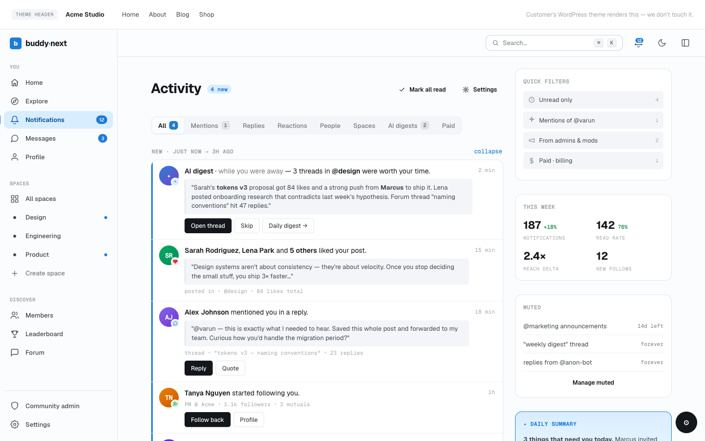
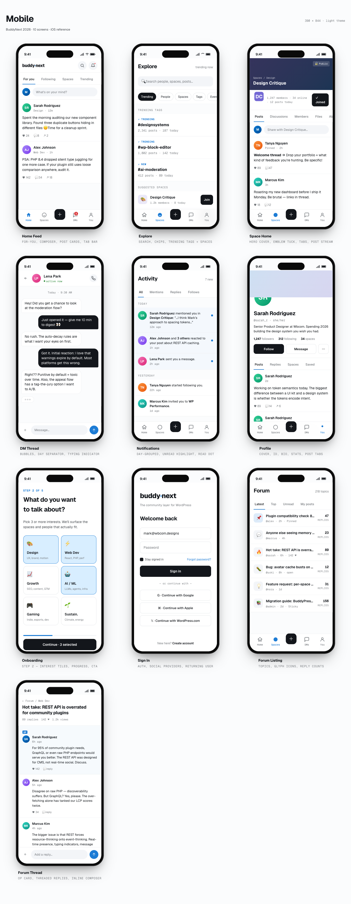
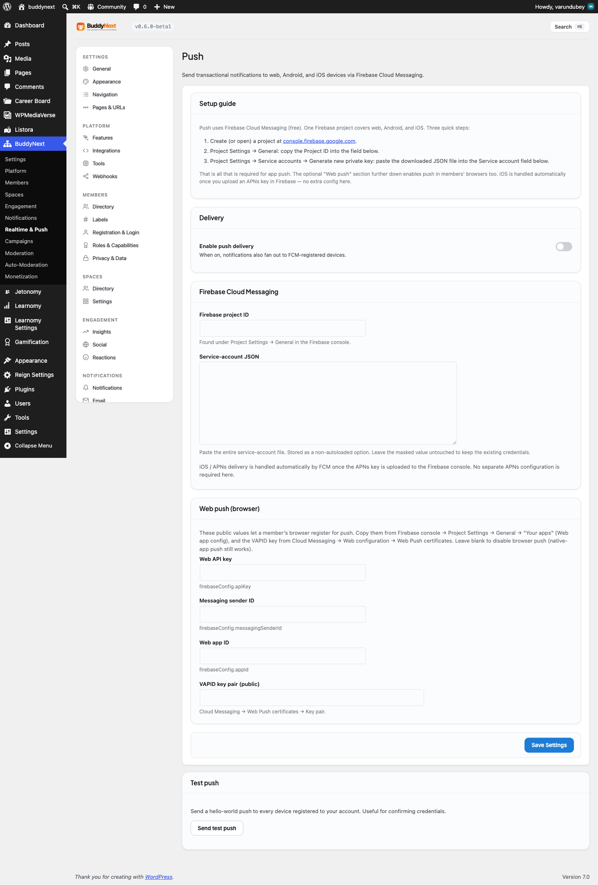

# Push Notifications

Push Notifications (Pro) delivers your community's notifications to a member's browser or mobile device through Firebase Cloud Messaging, so a member sees a banner even when they are not on the site. It covers web push (desktop and mobile browsers) and native iOS and Android push from a single Firebase project.

## Why use it

Most members do not keep a community tab open. Without push, a new follow, a reply, or a space invite waits silently until the member happens to come back, which can be hours or days. By then the moment to respond has passed and engagement drops.

Push closes that gap. The instant a notification is created for a member, it can land as a banner on their phone or laptop, the same way a message from a mainstream social app would. That is the single most effective way to pull lapsed members back into the conversation and keep a community feeling active.

For the site owner this is a one-time setup: create a free Firebase project, paste a few values, and every existing notification type can reach members off-site. For the member it is opt-in and granular - they choose to allow browser push, then mute the notification types they do not care about.

> **Note:** Push needs a Firebase project and the member granting their browser permission. It is off until both are in place. If a member has not allowed notifications, nothing is sent to them - this is expected, not a fault.

## How it works (for members)

The member-facing controls live on the notification preferences page (Notifications, then Preferences). Push appears there as a "Browser push" panel below the standard preferences.

### Opt in to browser push

1. Open your notification preferences page.
2. In the Browser push panel, select **Enable browser push**.
3. Your browser asks for permission to show notifications. Choose Allow.

That registers this browser or device. From then on, notifications created for you can arrive as banners even when the BuddyNext tab is closed.

If your browser blocks notifications, the panel tells you so and explains that you need to allow them in your browser settings before trying again. On a browser that does not support push at all, the panel says so and the enable button is not shown.

### Choose which notifications push

Below the enable control is a list of notification types with a toggle each - new follower, connection request, reaction on your post, comment, mention, space activity, moderation notices, and the rest. Turn a type off and that type stops pushing to your devices while still showing in your in-app notifications. Each toggle saves on its own the moment you change it.

### Mute or turn off push on a device

To stop push on the current browser, use the panel's turn-off control. You can re-enable it later from the same place. Muting a single type uses the per-type toggles above.

> **Tip:** Push preferences are per member and per device. Muting a type on your phone does not change your in-app notifications or your email preferences - those are separate.

## Setting it up (for owners)

Push settings live under the BuddyNext admin, on the Push tab (Realtime and Push section). The page opens with a short setup guide.

### Requirements

- A Firebase project. Firebase Cloud Messaging is free, and one project covers web, Android, and iOS.

### Firebase setup steps

1. Create or open a project at the Firebase console.
2. In Project Settings, General, copy the **Project ID**.
3. In Project Settings, Service accounts, generate a new private key and download the JSON file.
4. Paste the Project ID and the full JSON into the fields described below, then save.

That is all that native app push needs. iOS delivery works automatically once you upload an APNs key inside the Firebase console - there is no separate APNs configuration in BuddyNext.

To also enable push in members' browsers, fill in the Web push fields. Copy the web app values from Firebase console, Project Settings, General, under "Your apps" (the web app config), and copy the Web Push certificate key from Cloud Messaging, under Web Push certificates.

### Settings

| Setting | What it does | Default |
|---|---|---|
| Enable push delivery | Master switch. When on, notifications also fan out to registered devices. When off, nothing is sent even if credentials are present. | Off |
| Firebase project ID | Your Firebase project's ID, from Project Settings, General. | Empty |
| Service account JSON | The contents of the private-key file you downloaded from Firebase. This is what lets your site authenticate with Firebase to send. A saved value is masked, so leave the mask untouched to keep existing credentials. | Empty |
| Web API key | Your web app's API key, copied from the Firebase web app config. Lets a member's browser register for push. | Empty |
| Messaging sender ID | Your web app's messaging sender ID, from the same Firebase web app config. | Empty |
| Web app ID | Your web app's app ID, from the same Firebase web app config. | Empty |
| Web Push certificate key | The public Web Push certificate key from Firebase Cloud Messaging, under Web Push certificates. Required for browser push. | Empty |

> **Note:** The Web API key, sender ID, web app ID, and Web Push certificate key are public values meant for the browser - they are not secrets. The service account JSON is a secret and is never sent to the browser. Leave the four web fields blank to disable browser push; native-app push still works.

### The self-test

The Push page has a **Send test push** button. It sends a hello-world push to every device registered to your own admin account, which is the fastest way to confirm your credentials work.

The result message tells you what happened:

- Delivered to a number of devices - your setup is working; check the device for the banner.
- Sent, but you have no registered devices - credentials are fine, but you have not enabled web push on your own preferences page yet, so there is nowhere to deliver. Enable browser push for yourself first, then test again.
- Push is not configured - set the Firebase project ID and service-account JSON first.
- Push delivery is currently disabled - turn on Enable push delivery and save, then test.

> **Tip:** The "delivered to N devices" count is the metric to watch during setup. It is the count from your last test send, not a long-term log. If it reports zero devices, enable browser push on your own preferences page and re-run the test.

## Good to know

- Push is layered on top of your existing notifications. It does not create new notification types - it delivers the ones you already have to off-site devices.
- Delivery respects each member's per-type push preferences. A member who muted a type will not get a push for it, even though it still appears in their in-app notifications.
- Registered devices that have gone stale (uninstalled, permission revoked) are pruned automatically when Firebase reports them as gone, so the device list stays clean over time.
- Web push requires the site to be served over HTTPS, because browsers only allow push on secure origins.
- If a member already enabled push in a browser, returning to the preferences page may show the panel in its idle state until they interact with it again. Re-enabling is harmless - it does not create a duplicate device.
- All push delivery is per member: each member only ever receives pushes for their own notifications, on their own registered devices.

## Free vs Pro

Push Notifications are a Pro feature. The free plugin shows in-app notifications and can send notification emails, but it cannot deliver to a browser or mobile device when the member is off-site. Pro adds the Firebase delivery layer, the web push enrollment panel, the per-type push toggles, and the admin self-test.

For the related real-time transport that updates the notification bell and feed live while a member is on the site, see Real-time WebSocket.
