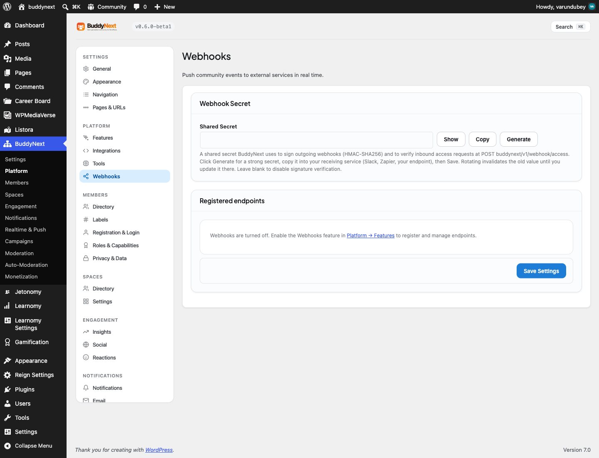

# Unlimited webhooks

Outbound webhooks let your community send a signed message to an outside service every time something happens - a member registers, a post is created, someone follows another member, a report is filed. Free BuddyNext includes the full webhook engine but limits you to one registered destination. Pro removes that limit so you can connect as many outbound destinations as you need.

## Why use it

Webhooks are how a community talks to the rest of your stack without anyone writing custom code. One endpoint can fire a Zapier, Make, or n8n automation. Another can add every new member to your CRM or email tool. A third can drop a message into Slack or Discord when a post goes up. A fourth can feed your own internal dashboard or data warehouse. Each of those is a separate destination, and each needs its own endpoint URL and signing secret.

With the free one-endpoint cap, you have to choose: notify Slack, or sync your CRM, or trigger an automation - not all three. That forces people into brittle workarounds, like pointing the single endpoint at a router script they have to host and maintain themselves. Pro lifts the cap entirely, so each integration gets its own clean endpoint. You can wire your CRM, your chat tool, your automation platform, and your analytics pipeline at the same time, each subscribed to only the events it cares about, each verifiable with its own secret.

For an owner running one of thousands of installs, this is what makes BuddyNext fit into an existing toolchain instead of becoming an island. Real communities rarely have exactly one external system to talk to. Unlimited endpoints means you never have to rip out one integration to add another.

## How it works (for members)

Webhooks have no member-facing surface. They are an owner and developer feature: members go about posting, following, and joining spaces as usual, and the events their actions generate are what get delivered to your endpoints behind the scenes. Nobody in the community sees or manages webhooks.

## Setting it up (for owners)

The setup, the events, the signing, the retries, and the delivery log are all part of free BuddyNext and work exactly the same with Pro active. The only thing Pro changes is how many endpoints you are allowed to register. For the full how-to - registering an endpoint, choosing events, verifying the signature, reading the delivery log - see the free Outbound Webhooks page. This page covers only what Pro adds.

### What stays the same as Free

Everything about how a single webhook behaves is unchanged:

- Each endpoint is a secure (https) address plus an optional signing secret. Insecure addresses are rejected.
- BuddyNext sends a small message to your address within seconds of each matching event, carrying the event name, a timestamp, and the event's details.
- Every delivery is signed with your secret so your receiving service can confirm the message genuinely came from your community and was not tampered with.
- An endpoint can subscribe to specific events or to all events.
- Every attempt is recorded in a delivery log, failed deliveries are retried, and an endpoint that fails three times in a row is switched off automatically.

### What Pro changes

| Setting | What it does | Default |
|---|---|---|
| Maximum registered endpoints | The number of outbound webhook endpoints you can register at once. Free allows one; Pro lifts the limit so you can register as many as you need. | Free: 1. Pro: unlimited |

There is nothing extra to switch on. Once Pro is active, the "Register endpoint" form on the Webhooks settings tab simply stops blocking you after the first endpoint - add a second, a third, and beyond, each with its own URL, events, and secret.

## Good to know

- The cap is the only thing Pro touches. If you register a second endpoint while only free BuddyNext is active, you get a "webhook limit reached" error. With Pro active, that error never fires.
- Each endpoint is fully independent: its own URL, its own event subscriptions, its own secret, and its own entries in the delivery log. Deleting one endpoint removes that endpoint and its log rows only; the others keep delivering.
- Retries, auto-deactivation after three consecutive failures, and the delivery log all operate per endpoint, so a misbehaving destination does not affect your other integrations.

## Free vs Pro

| | Free | Pro |
|---|---|---|
| Webhook engine (sign, POST, retry, log, auto-deactivate) | Yes | Yes |
| Registered endpoints | 1 | Unlimited |
| Per-endpoint events, secret, and delivery log | Yes | Yes |

The engine is entirely free. Pro is the upgrade you reach for the moment your community needs to talk to more than one external system at a time.
