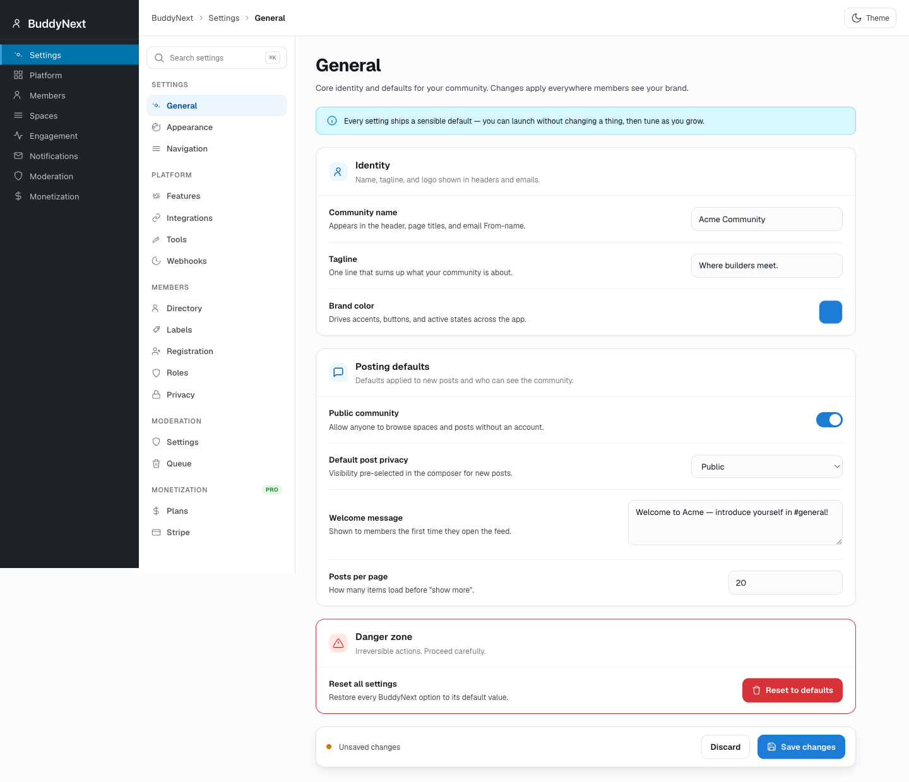

# White-label branding

White-label branding lets you replace BuddyNext's identity with your own across the community. Set a brand name, a logo, a brand color, the fonts, and your own custom CSS, and the whole interface - front-end and wp-admin - takes on your look instead of the default. You can also override the branding for individual spaces, so a single community can carry more than one identity.

> **Note:** White-label branding is part of the Agency and Unlimited license tiers. On other Pro tiers the feature is not offered.

## Why use it

For an agency building communities for clients, white-labeling is the difference between handing over "a BuddyNext site" and handing over "your client's own platform." The client logs into wp-admin and sees their brand in the menu and on the plugin row, not the name of a plugin they have never heard of. Members see the brand's color and logo, not BuddyNext's indigo. The product becomes invisible, and what is left is the community the client actually paid for.

The same logic applies to any business running a community as part of its own product. A SaaS company adding a member community wants it to feel like one continuous experience, not a bolt-on with someone else's branding showing through. Matching the community's color to your brand, swapping in your fonts, and dropping in a few lines of custom CSS to align the spacing or the corners is what makes it feel native rather than borrowed.

Per-space overrides take this one step further. A single install can host several communities under one roof - a partner program, a customer forum, and an internal team space - each with its own color and logo, while sharing the same members, the same engine, and the same admin. You re-skin a space without standing up a separate site.

The brand color flows through a single hue. BuddyNext's interface colors are all derived from one value, so changing the brand color rotates the entire palette at once - buttons, links, highlights, and accents all shift together and stay in harmony, with no per-element editing.

## How it works (for members)

White-labeling has no controls for ordinary members. They simply see the community in your brand: your color and fonts on every screen, your logo where one is set, and any layout tweaks your custom CSS applies. Branding is configured by the site owner (and, for a single space, by that space's owner), then rendered automatically for everyone.

## Setting it up (for owners)

The site-wide White-label settings live under the BuddyNext menu in wp-admin. Set your values, save, and the brand is applied immediately to both the front-end and the admin chrome.

### Site-wide brand settings

| Setting | What it does | Default |
|---|---|---|
| Brand name | The name shown in place of "BuddyNext" in wp-admin - the top-level menu item, the plugin row on the Plugins screen, dashboard widget titles, and admin page titles. Maximum 60 characters. Leave it blank to keep the BuddyNext name. | Empty (shows "BuddyNext") |
| Logo URL | A URL to your logo image, used in branded surfaces. Must be a valid `http://` or `https://` URL. | Empty |
| Brand hue | The single color value (0-360) that the whole interface palette is derived from. A swatch picker offers a set of preset hues, or you can enter your own. Changing it rotates every accent color in the UI at once. | 252 (BuddyNext indigo) |
| UI font family | The font used for the interface, entered as a CSS font-family value. Leave blank to keep BuddyNext's default fonts. | Empty (BuddyNext default fonts) |
| Custom CSS | Your own CSS, injected into every page so you can fine-tune the look beyond the standard settings. Maximum 10,000 characters. HTML tags and script-style URLs are stripped on save for safety. | Empty |

When at least one of these differs from the default, BuddyNext injects a small style block early on each page so your brand color, font, and custom CSS take effect before the rest of the interface paints. When everything is left at the defaults, nothing extra is emitted, so a community that is not white-labeled pays no cost.

### Live preview

The settings screen includes a live preview so you can see your brand color, font, and custom CSS rendered together before you save, rather than saving blind and reloading to check the result.

### Per-space branding overrides

Pro can brand an individual space differently from the rest of the site. A space carries its own logo, hue, font, and custom CSS; any field you leave empty falls back to the site-wide brand, so you only override what you want to change. When a member views that space, its branding layers on top of the site brand.

A per-space brand can be managed by a site administrator or by that space's owner - no one else. This is what lets a single install present several distinctly branded communities while sharing one set of members and one admin.

## Good to know

This section is honest about what renders today and where the current edges are, so you can plan around them.

- **Where the settings live.** The site-wide White-label tab is reachable from its own URL under the BuddyNext admin, but it is not surfaced as a visible tab in the current settings layout. Open it directly to configure site branding; the per-space Brand controls appear within a space's own settings.
- **The admin name swap needs a brand name.** The "BuddyNext" name in wp-admin is replaced only when you set the Brand name field. If you set a color and logo but leave the name blank, admin surfaces still read "BuddyNext."
- **Sent emails already use your site name.** Outgoing community emails are built around your WordPress site name, so they do not carry a "Powered by BuddyNext" line. One place still shows it as current scope: the email editor's preview footer reads "Powered by BuddyNext" until you set a Brand name, at which point the admin name swap rewrites it. Real emails your members receive are not affected by this - only the in-admin preview.
- **Custom domains are not part of this release.** Mapping a separate domain to a white-labeled space is not available. White-labeling covers name, logo, color, fonts, custom CSS, and per-space overrides; it does not change the site's URLs.
- **Custom CSS is sanitized.** To keep the feature safe to expose to space owners, custom CSS has HTML tags and script-style URLs stripped on save, and is capped at 10,000 characters. Write plain CSS rules and they apply as expected.

## Free vs Pro

White-label branding is a Pro feature in its entirety - free BuddyNext always runs under the BuddyNext name and default theme. Within Pro, it is offered on the Agency and Unlimited license tiers.

| | Free | Pro (Agency / Unlimited) |
|---|---|---|
| Brand name, logo, color, fonts, custom CSS | No | Yes |
| Live preview before saving | No | Yes |
| Per-space branding overrides | No | Yes |
