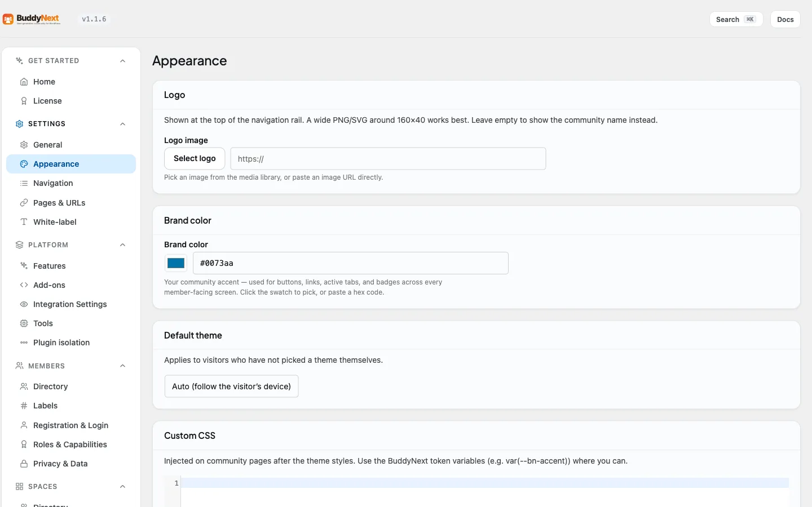

# White-label branding

White-label branding replaces BuddyNext's identity with your own across the WordPress admin - a brand name and a logo in place of "BuddyNext." Your team (or your client, if you run an agency) sees their own name in the menu and their own logo in the admin header and in every BuddyNext email, not the name of a plugin they have never heard of.

> **Note:** White-label branding is part of the Agency and Unlimited license tiers. On other Pro tiers the feature is not offered.

> **Changed in 1.0.7:** White-label is now backend-only - a brand name and a logo. Brand color, fonts, custom CSS, and per-space branding overrides have been removed; the community front end always follows your active theme. See Per-space branding for what changed there.

## Why use it

For an agency building communities for clients, white-labeling is the difference between handing over "a BuddyNext site" and handing over "your client's own platform." The client logs into wp-admin and sees their brand name in the menu and on the plugin row, and their own logo in the admin header - not BuddyNext's. The product becomes invisible in the parts of the site only an admin sees.

The same logic applies to any business running a community as part of its own product internally. Whoever manages the site day to day works inside an admin that carries their own name, and the automated emails BuddyNext sends carry their logo instead of BuddyNext's.

## How it works (for members)

White-labeling has no effect on the community front end at all. Members see the site exactly as your active theme presents it - no admin-only branding leaks through to them. Branding is configured by the site owner and applies only inside wp-admin and in outgoing emails.

## Setting it up (for owners)

The White-label settings live under the BuddyNext menu in wp-admin, in a single **Brand identity** section. Set your values and save.

| Setting | What it does | Default |
|---|---|---|
| Brand name | The name shown in place of "BuddyNext" in wp-admin - the top-level menu item, the plugin row on the Plugins screen, dashboard widget titles, and admin page titles. Maximum 60 characters. Leave it blank to keep the BuddyNext name. | Empty (shows "BuddyNext") |
| Logo | Pick an image from the media library, or paste an image URL directly. Shown in the admin header and used as the logo in every BuddyNext email. Leave it blank to fall back to the Settings > Appearance logo. | Empty |

The logo field uses the standard WordPress media picker, so you can select, preview, and remove a logo the same way you would anywhere else in wp-admin.

## Good to know

- **The admin name swap needs a brand name.** The "BuddyNext" name in wp-admin is replaced only when you set the Brand name field. If you set a logo but leave the name blank, admin surfaces still read "BuddyNext."
- **Emails already use your site name.** Outgoing community emails are built around your WordPress site name. The white-label logo, when set, replaces the default logo in the email header; without one, emails fall back to your Settings > Appearance logo.
- **The front end is never touched.** No brand name, no logo, and no color change from this screen ever reaches the community front end - it always follows your active theme.

## Free vs Pro

White-label branding is a Pro feature in its entirety - free BuddyNext always runs its admin under the BuddyNext name. Within Pro, it is offered on the Agency and Unlimited license tiers.

| | Free | Pro (Agency / Unlimited) |
|---|---|---|
| Admin brand name and logo | No | Yes |
| Branded email header | No | Yes |
