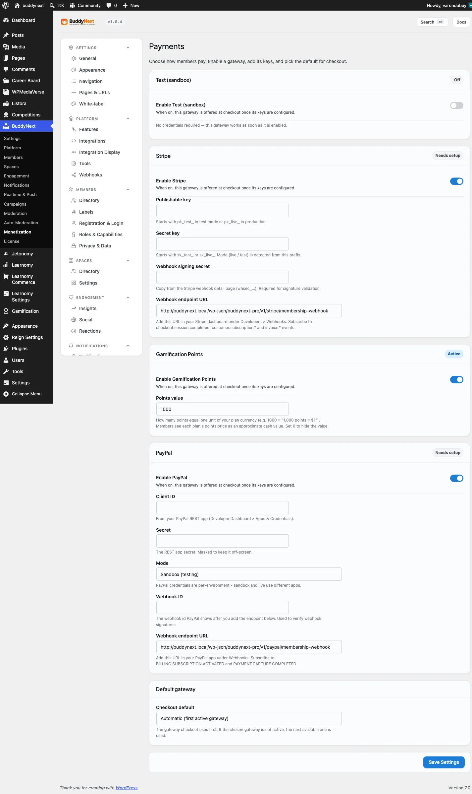
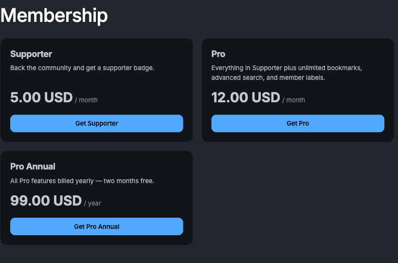

# Payment Gateways

BuddyNext Pro is built to work with whichever payment gateway you connect, not just one. You enable the gateways you want on a single Payment Gateways tab, each shows its own status, and checkout routes members to your preferred gateway. Alongside the built-in Stripe integration, Pro ships a PayPal gateway, a Gamification Points gateway, and a Test sandbox - all configured in the same place.

> **Before you start:** These gateways come with BuddyNext Pro. You need Pro active and the Monetization layer turned on (Platform → Features, "Memberships & monetization"), then open BuddyNext settings, Monetization section, Payment Gateways tab. This page covers the shared gateway model plus PayPal, Points, and the Test sandbox. Stripe has its own page - see Stripe Payments.

## Why use it

Different communities take money in different ways. Some members will only pay through PayPal; some owners already run a points economy and want to let members spend those points on membership; and everyone wants a way to try the checkout flow before switching on real charges. Rather than lock you into one processor, BuddyNext lets you offer more than one and pick which comes first.

You gain the choice when you want to:

- Accept PayPal as well as, or instead of, card payments through Stripe.
- Let members redeem a membership tier with Gamification points instead of money.
- Exercise the full checkout flow with no real charge while you set things up.
- Add a third-party gateway a developer registers, which appears on this tab automatically.

Whichever gateway a member uses, BuddyNext charges the same final amount for the same plan, because any coupon or tax is worked out by BuddyNext before the gateway is called (see Coupons and Tax). The gateway handles the payment; BuddyNext keeps the member's subscription and access in sync.

## How the Payment Gateways tab works

The Payment Gateways tab lists every registered gateway. Each one renders its own enable toggle and the credential fields it needs, so a newly added gateway shows up the moment it is registered - there is no separate screen to edit. Three things are shared across all of them.

### The status badge

Every gateway shows a status badge. For gateways that can verify their credentials (Stripe and PayPal), the badge does not just check that you typed something in - it actually asks the provider whether the keys work.

| Badge | What it means |
|---|---|
| Connected | The credentials work. The provider answered. |
| Not working | The credentials are filled in but the provider rejected them. The reason is shown next to the field that is wrong. |
| Needs setup | Required fields are still empty. |
| Off | The gateway is switched off. |

Trust the badge over the fact that the fields look full - a typo in a secret looks exactly like a correct one.

### The default gateway

A single Default gateway picker chooses which active gateway checkout routes members to first. If you offer more than one, this is the one members meet by default. If a gateway is switched off or loses its credentials, checkout falls back to another active gateway rather than breaking.

### The same final amount, every gateway

Coupons and tax are computed by BuddyNext, not by a provider's own coupon or tax feature. That means a discount code or a tax line produces the same final charge no matter which gateway processes it, and your reporting stays consistent across gateways.

## PayPal

PayPal lets members pay with their PayPal balance or a card through PayPal's hosted checkout. It mirrors the Stripe flow: the member approves the payment on PayPal and returns to your site, where access opens.

### Set up PayPal

Open the Payment Gateways tab, find the PayPal section, and fill in:

| Setting | What it does | Default |
|---|---|---|
| Client ID | Your PayPal app's Client ID, from your PayPal developer dashboard. | Empty |
| Secret | Your PayPal app's Secret. Kept masked on screen. | Empty |
| Mode | Sandbox (testing) or Live. Credentials are per-environment - your sandbox app and your live app use different keys, so switching mode needs the matching credentials. | Sandbox |
| Webhook ID | The ID of the webhook you create in PayPal, so BuddyNext can confirm updates genuinely came from PayPal. | Empty |
| Webhook endpoint URL | The address to paste into PayPal when you create the webhook. Read-only - copy it, do not type over it. | (shown) |

Recurring plans use a PayPal billing subscription on a product and plan BuddyNext provisions for you; one-time plans use a PayPal order captured when the member returns. Either way, fulfilment is idempotent - the member is never granted access twice even if both the return and the webhook arrive.

> **Warning:** Set up the PayPal webhook before you go live. Like Stripe, the webhook is how renewals, cancellations, and failed payments reach your members. There is a safety net for the moment of purchase (the return from PayPal is captured directly), but it does not replace the webhook for the life of the subscription.

## Gamification Points

The Points gateway lets members redeem a membership tier with WB Gamification points instead of paying money. Spending goes through WB Gamification's own audited points ledger, so the points balance stays the single source of truth and BuddyNext never edits points directly.

### Set up Points

The Points gateway appears on the Payment Gateways tab only when WB Gamification is active, and it is off by default - charging points for paid plans is a deliberate choice, so you switch it on yourself.

| Setting | What it does | Default |
|---|---|---|
| Points value | How many points equal one unit of your plan currency. For example, 1000 means "1,000 points = 1 unit". Members see each plan's points price as an approximate cash value next to the redeem button. Set 0 to hide the cash value. | 1000 |

A tier is redeemable with points only when you give it a points price greater than zero (set on the tier - see Membership Tiers). Redemption is instant: the points are debited and access is granted in the same request, with no webhook involved.

> **Note:** A money coupon cannot reduce a points redemption. Points are not a cash rail, so there is no amount for a percentage or fixed discount to come out of. Tax is likewise a money concept and does not apply to a points redemption.

## Test sandbox

The Test gateway lets you walk the entire checkout flow without any real charge, so you can confirm the paywall, checkout, and access grant all work before you connect a live gateway.

It is opt-in and off by default in every environment - you must switch it on explicitly. This is deliberate: a live member's payment is never silently routed to a no-charge sandbox. Use it to try things out, then switch it off and enable Stripe or PayPal for real payments.

## Good to know

- **You can offer more than one gateway at once.** Enable Stripe and PayPal together, set your default, and members can pay whichever way suits them. The final amount is the same on both.
- **A gateway only appears when it can work.** The Points gateway shows only when WB Gamification is active; a third-party gateway shows only once it registers. You never see a gateway you cannot use.
- **An expired Pro license never blocks payments.** A Pro license controls update downloads only; every gateway keeps working regardless.
- **Credentials are masked.** Secrets for every gateway are kept masked on screen once saved.
- **Misconfiguration warns you, not the member.** A gateway that is enabled but missing credentials says so in its status badge, and a paywall with no working gateway falls back to a plain call-to-action rather than a broken checkout.

## Free vs Pro

Taking real payments is part of BuddyNext Pro. BuddyNext Free has no checkout or gateway layer. Within Pro, the gateway-agnostic Payment Gateways tab, the PayPal and Points gateways, and the Test sandbox are all included alongside the built-in Stripe integration. See Membership Tiers and Gated Spaces for how access is defined, Stripe Payments for the Stripe setup, and Coupons and Tax for how discounts and tax are applied before any gateway is charged.

## Requirements

- BuddyNext Pro active alongside BuddyNext, with the Monetization layer turned on.
- For PayPal: a PayPal app (Client ID and Secret) and a PayPal webhook.
- For Points: WB Gamification active, and the gateway switched on.
- At least one membership tier with a price (or a points price) set on it.
