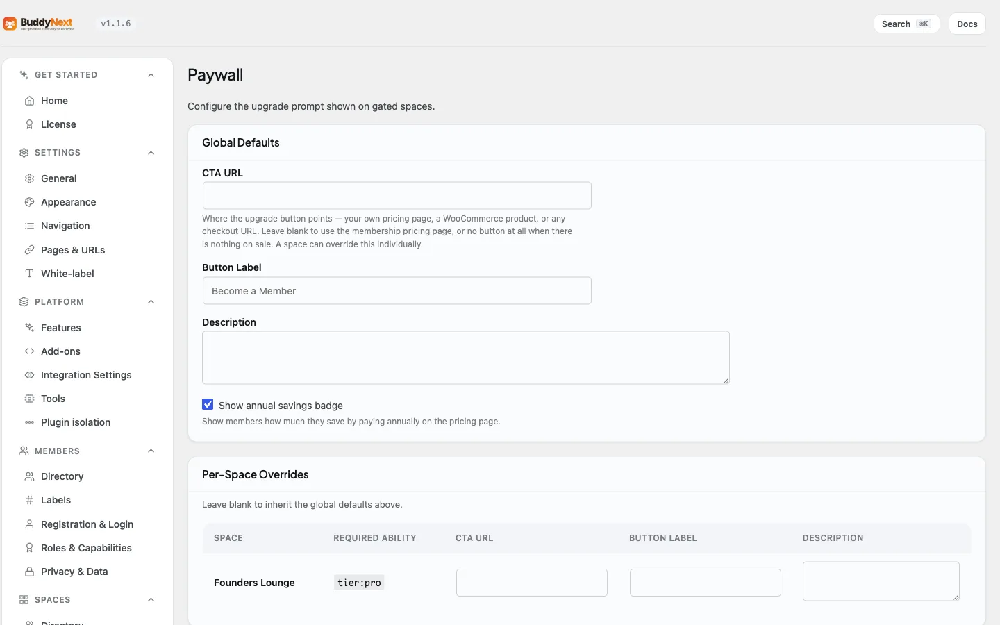

# Coupons and Tax

BuddyNext Pro lets you run discount codes and apply a flat tax to membership purchases. Both are worked out by BuddyNext itself before any payment gateway is called, so a coupon or tax line produces the same final charge whichever gateway a member uses, and both appear as clear lines on the member's checkout and invoice.

> **Before you start:** Coupons and tax come with BuddyNext Pro. You need Pro active and the Monetization layer turned on (Platform → Features, "Memberships & monetization"). Both are configured in the Monetization section, but on two different tabs: coupons have their own **Coupons** tab, and tax settings live on the **Payment Gateways** tab. Neither is on Paywall, which is about the upgrade prompt.

## Why use it

Discounts and tax are the two most common things owners need on top of a plain price. A coupon runs a launch offer, rewards a group, or wins back a lapsing member. Tax keeps you compliant where you have to charge it, and shows members a price they can trust.

Because BuddyNext computes both before calling the gateway, you get one consistent behaviour across every gateway you offer - the discount and the tax are BuddyNext's, not Stripe's or PayPal's, so switching gateway never changes the maths. The member sees the discount and the tax spelled out, and the gateway is charged the final figure.

## Coupons

A coupon is a code a member enters at checkout to reduce the price. You create and manage codes on the **Coupons** tab, which is its own screen under Monetization because the list grows.

### Create a coupon

Each coupon has these settings:

| Setting | What it does | Default |
|---|---|---|
| Code | The code the member types. Case-insensitive, so "SAVE20" and "save20" are the same code. | (empty - required) |
| Discount | Whether the discount is a Percent (%) or a Fixed amount off, plus the value. | Percent, 10 |
| Max redemptions | How many times the code can be used in total across all members. Set 0 for unlimited. | 0 (unlimited) |
| Expires | An optional date after which the code stops working. Leave blank for no expiry. | (none) |
| Plan scope | Which plans the code applies to. Leave every plan unchecked to apply it to all paid plans, or tick specific plans to limit it to those. | All plans |
| Active | Whether the code can be used right now. Uncheck to switch a code off without deleting it. | On |

The Coupons table lists each code with its discount, scope, how many times it has been redeemed against its limit, its expiry, and whether it is active. Delete removes a code permanently.

### How members use a coupon

At checkout, a member enters the code. If it is valid - active, not expired, within its redemption limit, and in scope for the plan they are buying - the discount is applied to the price and the reduced amount carries through to the gateway. An invalid or out-of-scope code is simply not applied, and the member sees the normal price.

> **Note:** A money coupon cannot reduce a Gamification Points redemption. Points are not a cash rail, so a percentage or fixed amount-off has nothing to come out of. Coupons apply to money purchases (Stripe, PayPal). See Payment Gateways.

## Tax

Tax adds a flat charge on top of the plan price at checkout, shown as its own labelled line. It is designed to be simple to run, not to be a full tax engine.

### Configure tax

The Tax section on the **Payment Gateways** tab has these settings:

| Setting | What it does | Default |
|---|---|---|
| Enable tax | Turns the flat tax on at checkout. While off, no tax is applied or shown. | Off |
| Default rate (%) | The site-wide tax percentage applied when no country override matches. | 0 |
| Label | The name the tax line shows, for example VAT or GST. | Tax |
| Prices include tax | Whether your plan prices already contain the tax (inclusive) or the tax is added on top (exclusive). | Off (exclusive) |
| Country overrides | Optional per-country rates. Add a country code (for example DE), a rate, and a label to charge a different rate to members in that country. | (none) |

Tax is applied to the price after any coupon discount, so a member who uses a code is taxed on the discounted amount, not the original. The tax line shows on both the checkout summary and the printable invoice.

> **Note:** This is a deliberately simple flat tax. It does not validate VAT IDs, handle compound or multi-jurisdiction rates, or call a provider's tax API. If you need those, the tax step exposes developer filters your site's developer can hook - see the developer guide.

## How a member experiences it

1. The member picks a plan and reaches checkout.
2. If they have a code, they enter it and the discount is applied to the price.
3. If tax is enabled, a labelled tax line is added on the discounted amount.
4. The gateway is charged the final figure, and both the discount and the tax appear on the member's invoice in their Settings → Membership area.

## Good to know

- **One consistent result across gateways.** Because BuddyNext computes the discount and tax before the gateway is called, the same code and the same tax rate produce the same final charge on Stripe, PayPal, or any other gateway.
- **Coupons switch off without deleting.** Uncheck Active to pause a code and keep its redemption history; delete only when you want it gone for good.
- **Redemption limits are total, not per member.** Max redemptions counts every use of the code across your whole community.
- **Tax follows the discount.** Tax is always calculated on the post-discount price, never the list price.
- **Both show on the invoice.** The discount and the tax line appear on the printable invoice the member can save or print (see Membership Tiers).

## Free vs Pro

Coupons and tax are part of BuddyNext Pro's Monetization layer. BuddyNext Free has no checkout, so it has no discount or tax layer. Within Pro, both apply to money purchases through any connected gateway. See Membership Tiers for plans and invoices, Payment Gateways for the gateways they apply to, and Stripe Payments for the Stripe setup.

## Requirements

- BuddyNext Pro active alongside BuddyNext, with the Monetization layer turned on.
- At least one paid membership tier for a coupon to discount or tax to apply to.
- A connected payment gateway to take the final charge (see Payment Gateways).
