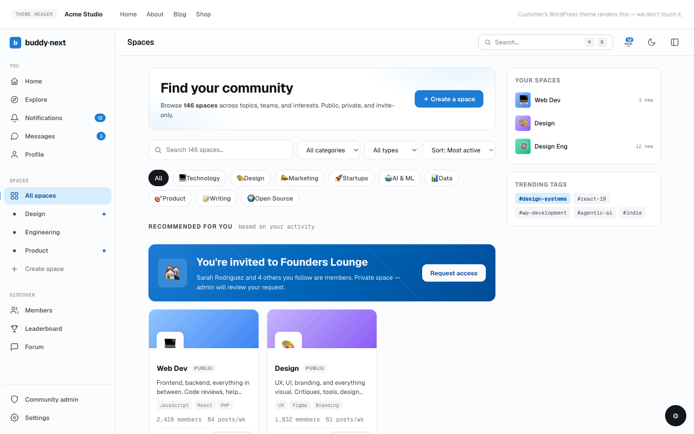

# Creating and Managing a Space

A space is a community area inside your site - a place with its own feed, members, and rules. Members create and run spaces from the front end; owners and moderators manage them in place. This page covers creating a space, editing it, archiving and restoring it, deleting it, transferring ownership, and building sub-spaces.

## Why use it

A single shared feed works when everyone is interested in everything. As a community grows, that stops being true. Spaces let people gather around a topic, a team, a course cohort, a region, or any other shared interest, so conversation stays focused and members only see what they signed up for.

Letting members create spaces is what makes a community grow. When a member can spin up a space for their book club, their city, or their project in a few seconds, the community fills itself with active corners you never had to plan. Each new space brings its creator's friends and followers in with it. This is how the large social platforms scale - the platform supplies the tools, the members supply the communities.

There are times to restrict creation. If you run a curated or brand-controlled community where every space should be official, or you are fighting low-effort or duplicate spaces, you can limit creation to admins only and cap how many spaces each member may own. Start open to grow, tighten later if you need to. Both controls live in the owner settings below.

## How it works (for members)

### Creating a space

Members create a space from the Spaces directory using the Create button. The create form collects:

- **Name** - the display name, up to 100 characters. Required.
- **Slug** - the URL-safe identifier used in the space address. Leave it blank and it is generated from the name. A slug must be unique; if it is already taken, you are asked for a different one.
- **Description** - a short summary shown on the space card and home, up to 160 characters.
- **Type (visibility)** - how people find and join the space. See the three types below.
- **Category** - the directory category the space is filed under, so people browsing by topic can find it. Optional.

After the space is created, the creator becomes its owner and the first member, and can open the space settings to add an avatar and a cover image.

### Space types

The type sets who can see the space and how people join it.

| Type | Who can see it | How people join |
|------|----------------|-----------------|
| Open | Anyone, listed in the directory | Join instantly |
| Private | Anyone, listed in the directory | Request to join, owner or moderator approves |
| Secret | Hidden from the directory and non-members | Invite only |

A member joining an open space becomes active immediately. Joining a private space creates a pending request the owner or a moderator approves or declines. A secret space does not appear in the directory at all and can only be joined through an invite.

### Avatar and cover

From the space settings, the owner uploads:

- **Avatar** - the square image that represents the space across the directory and feed.
- **Cover** - the wide banner image shown at the top of the space home.

Both replace the previous image when re-uploaded.

### Editing a space

The owner (and site admins) edit a space from its own settings screen. Settings are grouped into general, privacy, members, moderation, notifications, integrations, and a danger zone. From here you can rename the space, change its description, change its type, move it to a different category, swap the avatar or cover, set who can post, and reach the ownership transfer and delete actions.

### Archiving and restoring

Archiving freezes a space without destroying it. An archived space stays viewable to its members but is closed to new posts and other write actions. This is the safe option for a community that has gone quiet but whose history you want to keep. The owner or a site admin can restore an archived space back to active at any time, which reopens it for posting.

> **Tip:** Archive before you delete. Archiving is reversible and keeps every post and member; deletion is permanent.

### Deleting a space (what cascades)

Deleting a space is permanent and removes everything tied to it. When a space is deleted, BuddyNext removes:

- Every post in the space, and each post's reactions, comments, bookmarks, shares, hashtag links, poll data, and feed entries.
- Every membership record, including the owner.
- The space's reports, moderation log entries, and member bans.
- The space itself.

Only the owner or a site admin can delete a space.

> **Warning:** Deletion cannot be undone. There is no trash or restore for a deleted space. Use archive if you might want it back.

### Transferring ownership

A space has exactly one owner. The current owner (or a site admin) can transfer ownership to another member of the space. After the transfer, the new member is the owner and gains the owner's full control over the space; the previous owner stays a member unless they leave. Transfer is the right tool when a founder steps back or hands a space to a new lead.

### Sub-spaces

A space can contain sub-spaces - child spaces nested one level under a parent. This suits a parent community that needs dedicated rooms, for example a "Design" parent with "UI", "Research", and "Branding" sub-spaces under it. Only someone who manages the parent space can add a sub-space to it. Nesting is limited to two levels (a parent and its direct children); a sub-space cannot itself have sub-spaces. The owner settings below control whether sub-spaces are allowed at all and how many a single parent may have.

## Setting it up (for owners)

> **Note:** Space creation is a front-end action by design. The admin Spaces page (Community > Spaces) is for managing and moderating existing spaces and categories - listing, deleting, and category management - not for creating spaces. Members create spaces from the Spaces directory.

These settings live under the plugin's Spaces settings. They set the platform-wide rules and the defaults that every new space starts with.

| Setting | What it does | Default |
|---------|--------------|---------|
| Who can create spaces | Limits space creation to all members or to site admins only. Set to admins to run a curated, official-spaces-only community. | All members |
| Maximum spaces per member | The cap on how many active spaces one member may own. Archived spaces do not count toward the cap. Set to 0 for no limit. | 0 (unlimited) |
| Allow sub-spaces | Whether members may nest a space under a parent space. Turn off to keep every space top-level. | On |
| Maximum sub-spaces per parent | The cap on how many sub-spaces a single parent space may contain. Set to 0 for no limit. | 0 (unlimited) |
| Default visibility for new spaces | The type a new space starts with (Open, Private, or Secret). Owners can still change it per space. | Open |
| Default category for new spaces | The category a new space is filed under when the creator does not pick one. | None |
| Space directory columns (desktop) | How many space cards appear per row in the directory on desktop. A fixed value (2, 3, or 4) caps the row and still steps down on tablet and mobile; Auto fits as many as the width allows. | 3 columns |

### Managing spaces in the admin

The admin Spaces page has two sections: a Spaces list and Categories. The Spaces list shows every space with its type, member count, and archived state, and lets you delete spaces (individually or in bulk) and open a space's own settings to manage it. The Categories section is where you build and order the directory categories - see Space Categories.

## Good to know

- A space always has at least one owner; the owner is also the first member.
- A member who hits their per-member space cap cannot create another until they delete or archive one (or you raise the cap).
- Slugs must be unique across all spaces. The create form rejects a taken slug and asks for a new one.
- Names are capped at 100 characters and descriptions at 160 characters.
- Secret spaces never appear in the directory and are unreachable except by invite, so a secret space with no invites stays invisible.
- Archiving and deleting are separate actions: archive freezes, delete destroys. Only archive is reversible.

## Free vs Pro

Creating, editing, archiving, restoring, deleting, transferring, sub-spaces, and all the settings above are part of the free plugin. Space membership tiers and paid access to a space are part of the membership and monetization features in Pro.
