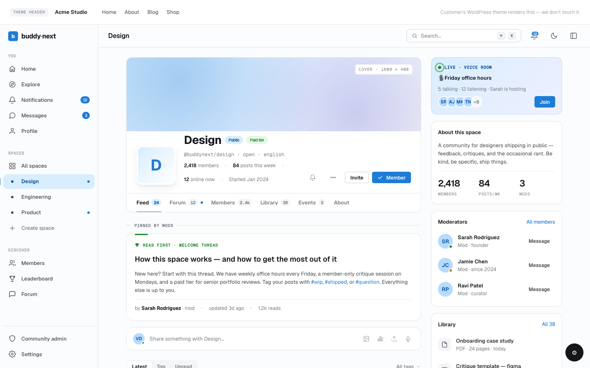
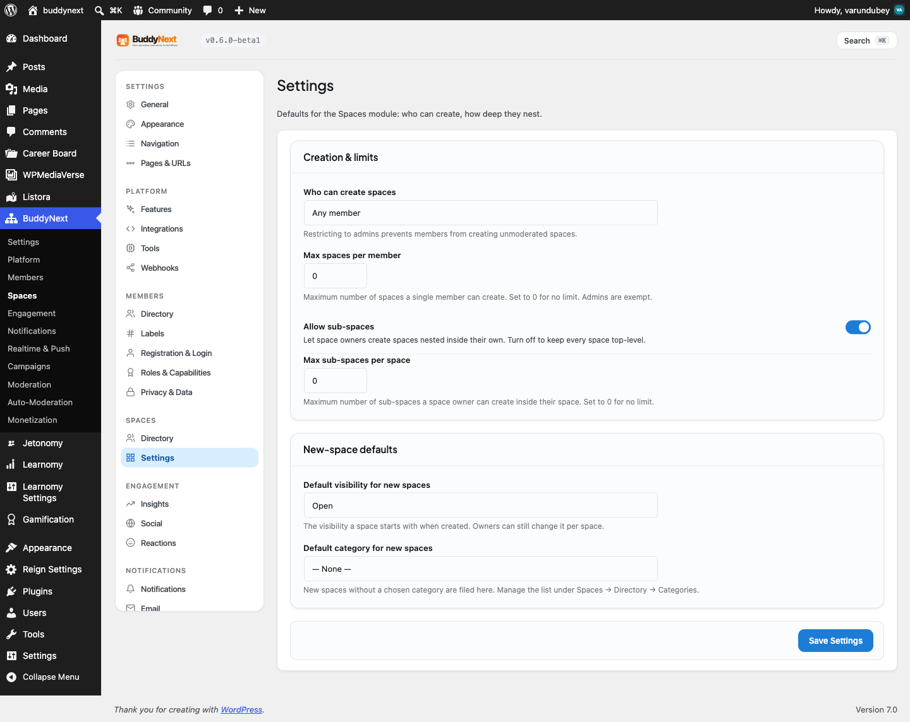

# Managing Space Members

Every space has a member roster you control: who is in, who is waiting to join, and who you have invited. Managing that roster is how owners and moderators keep a space on-topic, active, and safe.

## Why use it

A space is only as good as the people in it. Left alone, a busy space fills with stale members who never return, join requests that pile up unanswered, and the occasional person who does not belong. Active member management fixes all three.

For owners and moderators, the member tools let you:

- See exactly who belongs to the space and what role each person holds.
- Bring the right people in directly, with an invite, instead of waiting for them to find the space.
- Keep private spaces curated by approving the requests you want and declining the ones you do not.
- Remove a member who is disruptive or off-topic without deleting their account anywhere else.

For members, good roster management means the space stays relevant: the people posting are people who chose to be there, and join requests are answered instead of ignored. A space whose owner reviews its members weekly stays healthy. A space nobody tends drifts.

## How it works (for members)

### Viewing members

Open a space and go to its Members tab to see the roster. Each member shows their avatar, name, and space role (owner, moderator, or member). The list is paginated, so it stays fast even on a space with thousands of members.

### Joining a space

How you get in depends on the space type:

- **Open space:** Joining is immediate. You become an active member as soon as you click Join.
- **Private space:** Clicking Join sends a request. You stay in a pending state until an owner or moderator approves you.
- **Secret space:** You cannot find or request a secret space on your own. The only way in is to be invited by an owner or moderator.

You can leave any space you belong to from the space, with one exception covered in Good to know below.

### Inviting members

If you are an owner or moderator (and in spaces where members are allowed to invite, any member), you can invite someone directly from the space. Choose the person to invite and send it. They receive an invite and appear in the roster with an "invited" state until they accept.

> **Note:** Who is allowed to send invites is a space setting. By default only moderators and the owner can invite, but the owner can open invites to all members. See Setting it up below.

### Approving and declining join requests

In a private space, every Join click becomes a request that needs a decision. Owners and moderators see these in the pending-requests queue:

- **Approve** turns the request into an active membership. The person becomes a full member and can take part.
- **Decline** removes the request. The person is not added, and the request leaves the queue.

Review the queue regularly. A request left pending is a member you have neither let in nor turned away.

### Removing a member

Owners and moderators can remove a member from the roster. Removal takes the person out of this space only. It does not affect their account, their membership of other spaces, or anything else on the site. A removed member can rejoin or request to join again later unless you also ban them (see Roles, Moderators, and Permissions for the difference between removing and banning).

## Setting it up (for owners)

The settings that shape member management live on the space's Permissions settings panel.

| Setting | What it controls | Default |
|---|---|---|
| Who can invite new members | Whether all members, only moderators and the owner, or the owner alone can send invites | Moderators and owner |
| Require approval for new members | When on, every join becomes a request that an owner or moderator must approve before the person is added | Off (open spaces); private spaces always require approval by type |

> **Tip:** Turning on Require approval for new members gives an otherwise open space a review step without making it fully private. Use it when you want anyone to be able to find and ask, but you still want the final say on who gets in.

## Good to know

- **Invited vs requested are different states.** An invited person was added by you and is waiting to accept. A requested person asked to join and is waiting for you to approve. Both sit outside the active roster, but the direction is opposite: an invite is yours to send, a request is theirs to make.
- **Secret-space invites are not auto-accepted.** When you invite someone to a secret space, they receive the invite but are not a member yet. They have to accept it before they appear as an active member. Until they do, they hold the invited state.
- **Removing is not banning.** Removing a member lets them come back; banning blocks them from rejoining. Choose removal for a routine cleanup and banning for someone who should stay out.
- **A banned member cannot rejoin.** If you ban someone from the space, any later attempt to join is refused until you lift the ban.
- **The owner is part of the roster too.** The space owner always appears in the member list with the owner role and is counted as an active member.

## Free vs Pro

Viewing members, inviting, the pending-requests queue, approving and declining, and removing members are all part of BuddyNext Free. Pro layers additional moderation tooling (such as bulk moderation and rule-based auto-moderation) on top of the same roster, but the core member-management flow described here needs nothing beyond Free.
