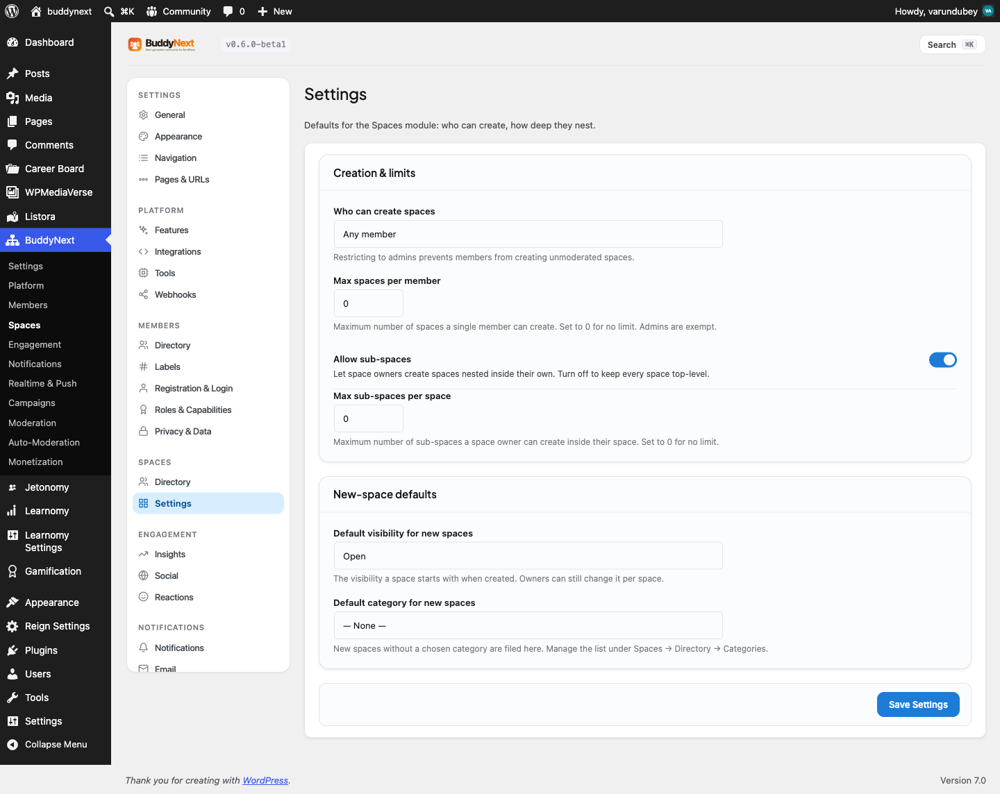

# Space Categories

Space categories organize the Spaces directory by topic. Each space can belong to a category, and members browsing the directory can filter to one category to narrow what they see. Categories are managed by site admins.

## Why use it

A directory with ten spaces is easy to scan. A directory with two hundred is not. Categories turn a flat, growing list into something a member can navigate - "show me only the Sports spaces," "show me only the Local groups." That single filter is often the difference between a member finding the right space and giving up.

Categories also shape how your community presents itself. The set of categories you create is a statement about what the community is for. A learning community might use Courses, Study Groups, and Alumni; a city community might use Neighborhoods, Events, and Marketplace. Good categories make the directory feel curated rather than chaotic, and they make new members feel like there is a place for them before they have even joined a space.

## How it works (for members)

Members do not create categories. They use them. In the Spaces directory, members filter the listing by category to see only the spaces in that category, alongside the directory's search, type, and sort controls. A space's category badge also appears on its card, so a member browsing can tell at a glance what kind of space each one is.

When a member creates a space, they pick its category from the categories you have defined. If they do not pick one, the space is filed under the default category you set (see Creating and Managing a Space for the new-space defaults).

A category marked as not shown in the directory still exists and can be assigned to spaces, but it does not appear as a filter option for members - useful for internal or staging categories you do not want members browsing by.

## Setting it up (for owners)

Categories are managed in the admin under Community > Spaces, in the Categories section. From there you create, edit, reorder, and delete categories. Each category has these fields:

| Field | What it does | Default |
|-------|--------------|---------|
| Name | The display name shown on the filter and on space cards. Required. | (none) |
| Slug | The URL-safe identifier for the category. Generated from the name when left blank, and must be unique. | Derived from name |
| Description | A short note describing the category, for your own reference. | Empty |
| Color | The badge background color for spaces in this category. | A blue badge |
| Text color | The badge text color, paired with the background for contrast. | White |
| Icon | An optional inline icon shown with the category. | None |
| Sort order | A number that sets where the category appears in the list; lower numbers come first. | 0 |
| Show in directory | Whether the category appears as a filter option for members in the directory. | On |

### Setting a default category

In the Spaces settings, you choose a default category that new spaces fall into when their creator does not pick one. This keeps every space filed somewhere instead of leaving uncategorized spaces floating in the directory. See Creating and Managing a Space for that setting.

### Deleting a category

You can delete a category from the Categories section. Deleting a category removes it from the directory filters; spaces that were in it remain, simply without that category. Reassign those spaces to another category if you want them to stay filterable.

## Good to know

- Slugs must be unique. The editor rejects a slug that another category already uses and asks you to change it.
- A category with Show in directory turned off is hidden from the member-facing filter but can still be assigned to spaces.
- Sort order controls the listing position; categories with the same sort order fall back to alphabetical by name.
- The color and text color are a pair - choose values with enough contrast that the badge text stays readable.
- Categories are a free feature with no per-category limit.

## Free vs Pro

Space categories, including the directory filter, the default-category setting, and category colors and icons, are part of the free plugin.
